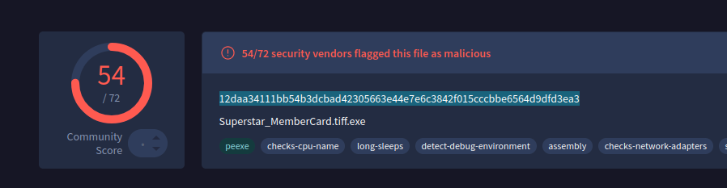

# Malware Analysis


## Heartbreaker-Continuum


### T1 - To accurately reference and identify the suspicious binary, please provide its SHA256 hash.

```bash
sha256sum Superstar_MemberCard.tiff.exe
```

Another option - VirusTotal

<figure><figcaption></figcaption></figure>

### T2 - When was the binary file originally created, according to its metadata (UTC)?

```bash
stat Superstar_MemberCard.tiff.exe

or 

readpe Superstar_MemberCard.tiff.exe
```

Another option - VirusTotal

<figure><figcaption></figcaption></figure>

### T3 - Examining the code size in a binary file can give indications about its functionality. Could you specify the byte size of the code in this binary?

* code size = **.text sectio**n size

```bash
sudo apt install radare2

rabin2 -S Superstar_MemberCard.tiff.exe
printf "%d\n" 0x1400

OR

readpe Superstar_MemberCard.tiff.exe
```

<figure><figcaption></figcaption></figure>

Another option - VirusTotal

* Details -> PE info -> Sections -> .text Raw Size

<figure><figcaption></figcaption></figure>

### T4 - It appears that the binary may have undergone a file conversion process. Could you determine its original filename?

```bash
strings Superstar_MemberCard.tiff.exe
```

<figure><figcaption></figcaption></figure>

